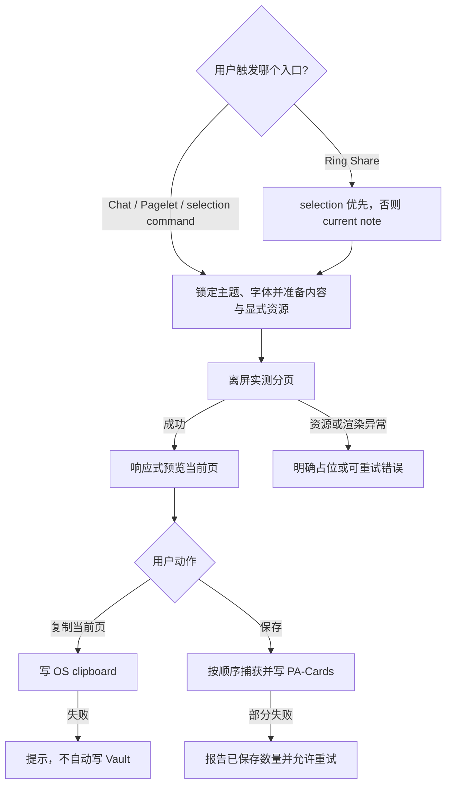

# PA Share Card Product Spec

Document status: Approved
Updated: 2026-08-06
Work item: B-124
Decision: [DEC-026 — Share Card 采用本地、显式导出的完整渲染卡片](../decisions/dec-026-local-share-card.md)
Authority: Share Card 的入口、可分享内容、视觉、分页、导出、失败、数据与兼容性边界。

> [!note] Owner decision 2026-08-05
> 用户选择完整渲染保真（方案 C）与 SnapDOM 窄例外（方案 A）。REQ-04、REQ-05、
> REQ-09 已据此修订；执行状态与验证证据仅以 Active Package Tracker 为准。

> [!note] Owner amendment 2026-08-06
> 用户新增 Pagelet Action Ring 的第四项 Share，并锁定 selection-first / current-note
> fallback、有效 YAML frontmatter 剥离、basename、图形 logo、`Personal Assistant`、
> Ring 可见中英本地化标签、local-only Source Han Serif、端侧 Ring 几何与整批自适应字号。REQ-01..04、
> REQ-09/10 与对应 AC 已据此修订；2026-08-05 证据只证明修订前基线。

## Problem And Product Outcome

- User problem: 用户想复用一段 PA 回复或洞察时，需要手工排版或截取带 UI chrome 的
  屏幕内容，难以得到安静、清晰且一致的分享图片。
- Product outcome: 用户从当前内容自然地打开一张可预览、可分页、可复制或保存的
  本地品牌卡片，不引入发布流程或新的管理负担。
- North Star fit: 让已返回的有价值内容更容易被用户带走和复用；入口由用户主动触发、
  无队列、无 provider 调用、无意外写入，保持“安静且可信”。

## Scope

### In Scope

- B-124/REQ-01: 四个入口使用同一 `ShareCardData` 契约。Chat 仅为已完成、非空的
  assistant 回复显示低优先级 action；Pagelet 仅提交当前 visible findings，Prepared
  read-only Panel 不可分享；编辑器命令仅在 selection trim 后非空时可执行，但 payload
  保留原始 selection 的空白、缩进与 Markdown；Pagelet Action Ring 的第四项 Share 在
  点击时优先采用当前 active Markdown editor 的非空 selection，否则采用当前 Markdown
  note。用户 Chat 消息、生成中内容、dismissed finding、隐藏缓存与空内容不进入卡片。
  `completed_with_warning` 只有在 warning 不代表 provider error、assistant idle timeout
  或 wall-clock interruption 时才属于已完成；带部分文本的上述中断必须 fail closed。
- B-124/REQ-02: Chat/Pagelet 卡片保留稳定产品来源文案。Ring 的 selection payload 原样
  保留且永不显示文件名或 Vault path；note fallback 只在 leading frontmatter 被 Obsidian
  识别且其中 YAML 语法有效时剥离该 frontmatter，其余正文原样保留，并显示 active file
  的 basename，不显示目录或 `.md`。无 active Markdown note 或有效正文时 Share 不打开
  Modal，并显示本地化可恢复提示。Pagelet findings 只组合当前可见的 title、description、
  insight text；重复字段只输出一次，不加入隐藏 diagnostics、action、provider metadata
  或来源路径。
- B-124/REQ-03: v1 卡片固定为 `540×720` CSS px、DPR 2 PNG（`1080×1440`），提供 warm
  light 与 warm dark 两个由 Modal 打开时当前主题选定的样式。每页有一致内容区、细
  divider、PA 图形 logo + `Personal Assistant` 品牌和必要页码；预览响应 modal/viewport，
  导出尺寸不受预览缩放影响。非代码文字以 Source Han Serif 为主字体，并只能从随插件提供的
  本地字体字节生成的 `data:` URL 加载；不得引用外部字体 URL/CDN 或发起字体网络请求。
  固定子集未覆盖的 Unicode 字符使用同字号的设备本地 serif glyph fallback；这不允许
  外部字体发现或请求，也不替代主字体加载。主字体加载/就绪失败必须显示可重试错误，
  不得静默换成系统/外部字体后冒充固定设计。
- B-124/REQ-04: 渲染型 Markdown 支持 headings、paragraphs、emphasis、lists、quotes、
  links、inline/fenced code 及可捕获的视觉内容。分页必须使用最终 card CSS 的实际 rendered height，优先语义
  块边界；超高单块可继续拆分但不得丢字、重排页序或产生空页。原始内容不得因
  frontmatter-like 开头或 thematic break 被静默删除。v1 最多处理 50,000 characters / 24
  pages；超限明确提示缩短内容，不产生截断卡片。正文从 `16px` 开始；只有完整 batch
  重分页确实减少页数时才按 `15px`、`14px` 的顺序接受更小字号，并选择最大的有效值。
  候选还须通过同一套 no-loss、overflow 与 24-page 安全门；15px 未减页时才评估 14px，
  两个候选都不减页则保持 16px。选定字号必须在同一 batch 的全部页面、preview、copy
  与 save 中一致。
- B-124/REQ-05: 远程图片、Vault 图片与 Markdown note embed、Mermaid/Canvas/SVG 图表及
  浏览器可捕获的静态视觉结果应尽量进入预览和 PNG。Markdown note embed 支持整篇、
  heading 与 block anchor，只沿显式 embed 有界递归；通过去重缓存、resource/byte/time/depth
  budget、32 MiB localized-output budget、cycle guard 与取消信号限制读取。只解析输入明确
  引用的资源，不扫描无关 Vault
  内容；直接网络请求、引用内容读取、超时与 CORS/解码失败必须可观察。失败资源显示
  明确占位或使 capture 可重试失败，不得静默删除并声称完整保真；不使用未批准的 proxy。
- B-124/REQ-06: `Copy current page` 只写 OS clipboard；API 不可用、permission/gesture
  失败或 capture 失败时显示本地化错误，并保持 Modal 可重试，不自动保存。`Save image`
  单页保存当前页；`Save all pages` 按页捕获并按顺序写入 `PA-Cards/`，最终只汇总一次。
- B-124/REQ-07: 保存使用 timestamp batch name 和确定性 page suffix，整批避让 Vault
  已有 path，不覆盖旧文件。完整成功提示数量和目录；部分失败提示已保存数量，不把
  partial success 冒充完整成功，也不删除已经成功创建的本轮文件。
- B-124/REQ-08: preview loading、render fallback、pagination/export failure 与 busy state
  都有可读状态。前后页按钮具备本地化 accessible name、disabled state 和页码；action
  在导出期间 exactly once，关闭 Modal 后不得继续写 UI。
- B-124/REQ-09: Share Card 从调用方已经持有的内容开始，只能解析该内容明确引用的
  远程或 Vault 资源；不调用 AI provider、不上传、不扫描无关 Vault、不使用未批准的
  CORS proxy，也不新增设置/ledger。capture 精确锁定 `@zumer/snapdom@2.23.2`，使用
  `scale:2`、`dpr:1`、`type:"png"`、`useProxy:""`、`embedFonts:false`、
  `reconcile:false`、`outerShadows:false`、`resolvePicturePlaceholders:false` 与
  `cache:"disabled"`。PA 必须在交给它之前用 Obsidian/Vault API 本地化显式资源并生成
  完整性报告；Source Han Serif 同样必须在 capture 前成为本地 `data:` font，SnapDOM
  不得直接请求剩余 HTTP(S) 资源或任何外部 font。只有用户点击 Save 才产生 Vault PNG；
  失败后重试仍由用户决定。
- B-124/REQ-10: Desktop、iOS 与 Android 共享核心逻辑；clipboard capability 按当前
  Modal window 运行时检测。Modal lifecycle 使用 Obsidian `Component` owner 和 owner
  document/window；plugin unload/Modal close 清理 render owner、离屏 DOM 与 pending token。
  Action Ring 顺序固定为 `Capture / Review / Discover / Share`，前三项行为不变；Desktop
  与 iPad 朝内容区形成内向弧；iPhone 在可用宽度能完整容纳四项时横向排列，否则整组
  纵向排列，不混排。四项均保持至少 `44×44px` 并在当前 UI locale 显示文字标签：英文
  `Capture / Review / Discover / Share as card`，中文 `随手记下 / 审阅 / 发现关联 /
  分享为卡片`；视觉方向不改变逻辑、键盘或焦点顺序。

### Non-goals

- NG-01: 不做通用笔记/页面截图、整段 Chat transcript、Bubble/Pet 或 Obsidian UI 捕获。
- NG-02: 不提供模板编辑器、比例/字体/品牌/保存目录设置、无品牌导出或历史卡片库。
- NG-03: 不把图片上传到社媒、云盘或外部服务，不接入 account/system share flow。
- NG-04: 不保证任意第三方插件交互视图、DRM/跨域受限资源或持续动画都能无损捕获；
  但必须提供明确失败/占位，不能静默降级为 text-only 后声称完整成功。
- NG-05: 不修改原始 Markdown、Chat history、Pagelet finding、Memory 或 Review Queue。
- NG-06: 不分享 Prepared read-only raw background cache；若该内容未来需要导出，必须以
  独立 `shareable` capability 重新批准，不能复用 read-only 推断写权限。

## User Flow And States

| State | Visible behavior | Allowed action |
| --- | --- | --- |
| Preparing | 显示本地化准备状态；export disabled | Close |
| Ready, single page | 预览 + Copy current page + Save image | Copy / Save / Close |
| Ready, multiple pages | 预览 + page nav + Copy current page + Save all pages | Navigate / Copy / Save all / Close |
| Exporting | 当前动作 busy，其余 export/navigation disabled | Close；异步结果不得回写已关闭 UI |
| Clipboard unavailable/failed | 保留预览并给出可恢复提示 | 用户可显式 Save 或 retry |
| Capture/save failed | 保留预览；报告完整或 partial failure | Retry / Close |

## Trust, Data And Authority

- Source evidence: 起点只使用当前 assistant response、Pagelet 当前可见投影、原始 editor
  selection，或 Ring fallback 的当前 active Markdown note；selection 与 note 的优先级、
  frontmatter/basename 投影遵守 REQ-01/02。允许解析其中明确引用的远程/Vault 资源，不
  扫描无关笔记，也不把隐藏 metadata 当作分享内容。
- Data sent / stored: 远程资源可产生面向其原始地址的直接网络请求，Vault Embed 可读取
  被明确引用的本地内容；不调用 AI provider、不上传卡片。Copy 写 OS clipboard，Save
  写 `PA-Cards/*.png`。
- Capture exception: 用户批准 SnapDOM 在离屏图片文档中所需的 runtime style 与已审计
  dependency 模式；该例外不适用于 Obsidian live UI，不豁免固定版本、资源预本地化、
  no-proxy、bundle/community scan 或 Desktop/mobile runtime gate。
- User disclosure / confirmation: 打开 Modal 无 durable effect；Copy/Save 按钮就是当前
  低后果动作的明确授权，不增加阻断确认。Copy 失败不升级为 Save 权限。
- Reversibility / recovery: 保存的 PNG 是普通 Vault 文件，可由用户通过 Obsidian 管理；
  原始内容不变，现有文件不覆盖。失败可在同一 Modal 重试。

## Acceptance Criteria

- B-124/AC-01: 历史和新完成的 assistant 回复出现可访问的 Share Card action；用户消息、
  生成中空回复和 terminal error 不出现该 action，点击使用最新 `copyContent/sourcePath`。
- B-124/AC-02: Pagelet 只导出当前 visible findings；dismissed/hidden finding、Prepared
  read-only content、diagnostics/action/source path 不进入 payload，空 payload 不执行分享。
- B-124/AC-03: editor selection command 只在 trim 后非空时可执行，payload 保留原始
  Markdown/空白且不自动暴露文件名。Ring Share 在同样的 nonblank selection 存在时优先
  生成 `source:"selection"` payload；否则从 active Markdown note 生成 `source:"note"` payload，
  只剥离有效 YAML frontmatter 并显示 basename；invalid/frontmatter-like 开头原样保留，
  无 active Markdown 或空正文时不打开 Modal。
- B-124/AC-04: light/dark 预览和 PNG 均显示图形 logo 与 `Personal Assistant`；Source Han
  Serif 只由本地 data URL 提供，font network request 为 0。窄桌面/
  移动 viewport 可完整查看预览与 44px actions，导出 blob 为 `1080×1440`。覆盖
  `16/15/14px` 的分页 fixture 证明只在页数减少时缩小、选择最大有效字号且整批一致。
- B-124/AC-05: 覆盖中英文、列表、引用、代码块、长段落与 50+ 行内容的测试证明顺序
  保持、无丢字/空页；运行时测量 smoke 证明每页 body 无 vertical overflow。
- B-124/AC-06: remote image、Vault image、Markdown note embed（整篇、heading/block anchor、
  嵌套、cycle/depth）与 Mermaid/Canvas/SVG fixtures 能进入预览和 PNG，且只请求/读取
  显式引用资源；网络/CORS/解码/processor 失败产生明确占位或可重试 capture error，
  不调用未批准 proxy、不扫描无关 Vault，也不冒充完整成功。
- B-124/AC-07: clipboard success 只复制当前页；clipboard API 缺失/拒绝/capture 失败不
  创建 Vault 文件，错误后可继续显式保存或重试。
- B-124/AC-08: 单页与多页保存数量、顺序、suffix、unique batch 与 partial failure 有
  focused tests；同名文件永不覆盖，成功/失败 notice 与真实结果一致。
- B-124/AC-09: 快速切页、重复点击、导出中 close 与 Modal reopen 不产生并发写、stale
  preview、遗漏 cleanup 或 unhandled rejection。
- B-124/AC-10: focused Jest、typecheck、docs/community scan、lint/build/bundle audit 通过；
  依赖精确为 SnapDOM 2.23.2，测试锁定 REQ-09 的完整选项（包括 `cache:"disabled"`）、
  无剩余 HTTP(S) resource/external font 进入 capture，并在已部署 Obsidian test vault 观察
  四个入口、Ring selection/note 两条分支、可见中英本地化 action 标签、Desktop/iPad
  内向弧、iPhone 可容纳时横排/不可容纳时整组竖排、两种主题、分页、clipboard/save 与
  preview/PNG 一致性。2026-08-06 owner 明确允许本轮 iPhone 验证使用 Obsidian mobile
  emulation + `393x852` phone viewport；证据必须标为模拟，不得冒充真实 iPhone/iPad
  触控、WKWebView、safe-area 或设备性能。真实设备作为后续 release residual，不阻断
  本轮 T-09 validated implementation。

## Open Decisions

内容/媒体方案 C 与 capture runtime 方案 A 均已于 2026-08-05 确认；Action Ring、来源、
视觉、字体、布局和分页字号修订，以及 iPhone 可用 Obsidian mobile emulation 的本轮
验证边界，已于 2026-08-06 确认。模板自定义、系统分享和外部发布仍不在 v1；当前无产品
阻断决定，执行与验证状态只看 Active Package Tracker。

## Delivery Handoff

- Active Package: [Share Card Development Track](../../development/active/share-card/README.md)
- Architecture contracts: [Approved Share Card SDD](../../development/active/share-card/sdd.md)
- Release / rollout boundary: 本工作项只完成 validated implementation；commit、closeout、
  beta/stable packaging、push 与 release 均需独立授权。
