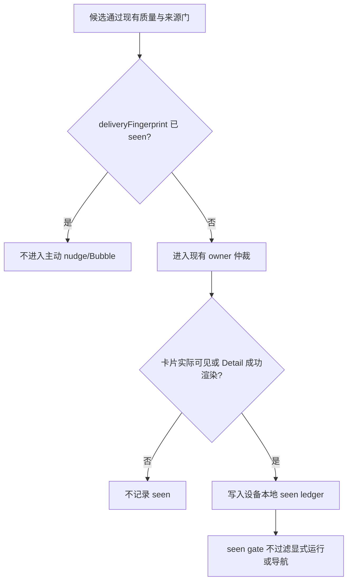

# Pagelet Attention-Aware Delivery Product Spec

Document status: Approved
Updated: 2026-07-27
Work item: B-121
Decision: [DEC-025 — Pagelet 采用消费感知的主动交付与空态 Action Ring](../decisions/dec-025-consumption-aware-pagelet-delivery.md)
Authority: Pagelet 已看去重、空态 acknowledgement、Pet 短点分流与 Action Ring 的用户行为、范围、非目标及验收标准。

## Problem And Product Outcome

- User problem: 相同来源、相同内容的 Recall/Recap 在用户已通过 Bubble 或 Detail
  看过后仍可能再次主动出现；没有 nudge 时，短点 Pet 又会反复显示同一个
  `Find related old notes` 空态。
- Product outcome: PA 只主动交付真正未看过的内容；空态只解释一次，之后让 Pet
  提供 Capture、Review、Discover 三个主动动作。
- North Star fit: 让值得返回的笔记自然浮现一次，在价值已消费后保持安静；不制造
  待处理队列，也不让用户反复确认同一状态。

## Scope

### In Scope

- B-121/REQ-01: 为主动 Recall 与主动 Recap 分别建立稳定、versioned 的
  `deliveryFingerprint`。`kind` 必须进入 canonical projection，两个类型不跨 kind
  抑制；不得使用 timestamp、run id、score、临时 candidate id、provider/model、
  action route 或评估缓存 key 作为“新内容”依据。
- B-121/REQ-02: 每个可记 seen 的当前卡或 Detail 目标必须携带单一 transient
  `deliveryReceipt { version, kind, fingerprint }`。Bubble 首卡实际可见及每次切到新卡
  时只提交当前 receipt；Detail 只在 receipt 指向的目标成功渲染后提交，不能因 payload
  含多个候选而批量标记。隐藏卡、预取、Pet nudge、无 receipt 的普通 Detail 与失败
  导航均不记录。
- B-121/REQ-03: seen fingerprint 是主动资格的硬门：transient receipt 提交后，只在
  seen ledger 持久化对应 entry；该 entry 保留期间不得再次产生 Pet nudge、成为主动
  Bubble owner 或因 reload/context rerun 恢复。Seen ledger 不过滤或阻断显式
  Discover/Review 运行、当前可用的 Recap/Detail 入口与来源导航；它不新增历史生成内容
  仓库，也不保证 reload 后恢复同一张生成卡。
- B-121/REQ-04: seen ledger 按当前设备和 Vault identity 隔离，只保存 schema/fingerprint
  version、kind、opaque fingerprint、seenAt 与 presentation surface；不保存路径明文、
  正文、标题、excerpt、why-now 或 provider 输出，不进行跨设备同步。v1 无时间 TTL，
  最多保留 2,000 条，达到上限时只按 oldest-seen 淘汰。
- B-121/REQ-05: Ready Empty 与 Intentionally Quiet 的说明分别按语义/copy version
  一次性展示。只有说明 Bubble 真正可见后才 acknowledgement；候选出现、渲染失败或
  Pet 被点亮不消耗该机会。
- B-121/REQ-06: 当没有未看交付，且当前空态已 acknowledgement，Pet 短点打开
  `Capture / Review / Discover` Action Ring。有未看交付时短点打开 Bubble；需要 setup、
  progress 或 boundary 解释时仍打开相应 Bubble。`Recap Needs Retry` 只在显式 Recap
  入口已使它 eligible 时优先于空态；后台 Recap 失败本身保持安静，不占用普通 Pet
  Bubble。当前 Scope Recap command 在 Detail 渲染等价的本地定向状态。
- B-121/REQ-07: 520ms 长按继续在现有可交互状态下打开同一 Action Ring，并继承 B-118
  完整手势边界：仅单指/单 pointer、全轨迹移动超过 12px、第二指、touch/pointer cancel、
  pointer leave、leaf 切换或 unmount 都取消；一次取消在本次 gesture 内永久失效。短点、
  长按、touch 后 synthetic click 与 action button 必须保持 callback exactly once、Pet
  root toggle zero，并在 teardown 清理 timer/listener。
- B-121/REQ-08: Ring 以 Pet 为锚点向可用区域展开：桌面四角使用内向弧形；iPhone
  toolbar 从 Pet 下方向右水平排列，空间不足时整行左移，极窄 viewport 才退化为紧凑
  纵列。三个真实 button 均至少 44×44px，保持固定逻辑顺序和可读标签，不因视觉方向
  改变 callback 或键盘顺序。
- B-121/REQ-09: Bubble 与 Ring 互斥。任何 Bubble 入口先关闭 Ring；任何 Ring 入口先
  关闭 Bubble；保留既有约 3 秒 inactivity auto-dismiss 与 outside press，Ring 已开时
  再次长按只刷新该 timer。Ring 可见期间到达的新 nudge 保持 pending、不抢焦点，Ring
  关闭后再恢复对应 Pet 状态。Escape、outside press、timeout 等被动关闭恢复 Pet focus；
  执行 action 时先关 Ring，再由目标 Modal/Panel/Detail 接管焦点。
- B-121/REQ-10: Pet 的 Enter/Space 使用短点分流；Shift+F10 与 Context Menu key 无条件
  打开 Ring 且不消费 pending nudge。Pet 公开 `aria-expanded` 与 `aria-controls`；Ring
  使用带可访问名称的 button group，打开后聚焦首项，Tab/Shift+Tab 遍历，Escape 关闭并
  返回 Pet。三个 action 均有清晰 focus-visible；`prefers-reduced-motion` 下取消展开位移
  动画但保留完整功能。
- B-121/REQ-11: Capture、Review、Discover 复用现有动作、provider disclosure、Data
  Boundary、成本、写入与错误处理；Action Ring 本身不调用 provider、不读取新来源、
  不自动写入，也不新增设置、badge 或队列。
- B-121/REQ-12: 本地 ledger 缺失时从空状态开始；损坏或运行期不可用时降级为会话内
  去重并记录 content-free diagnostics。不得通过写入 Vault/Markdown 或同步 settings
  来补偿设备本地状态失败。现有 settings 内的 Recap suppression 不导入新 seen ledger；
  升级后允许一次过渡性重现，以保持严格设备本地语义。

### Non-goals

- NG-01: 不对不同文字但语义相近的内容追加一次 AI 去重调用；v1 只处理稳定规范化后
  相同的交付身份。
- NG-02: 不让 Recall 与 Recap 跨 kind 互相抑制；跨类型近似重复需要新的产品决定。
- NG-03: 不在 Mac、iPhone、iPad 或多个 Vault 间同步已看状态。
- NG-04: 不从显式 Discover/Review/Recap/Detail 或来源导航中过滤已看内容，也不新增
  已看历史 UI 或持久生成卡仓库。
- NG-05: 不改变 Recall/Recap 的候选生成、质量门、排序、provider 预算或来源边界。
- NG-06: 不增加 Pet 状态，不把 Ring 变成第五层内容 surface，也不重做 Panel/Tab IA。
- NG-07: 不在本范围新增或更换 Capture、Review、Discover 动作。

## User Flow And States

### Delivery fingerprint v1

`deliveryFingerprint` 使用 deterministic serialization 后再 hash：

| Kind | Canonical fields |
| --- | --- |
| Recall | `version + kind=recall + locale + normalized visible title/body/why-now/excerpt + sorted opaque current/recalled source identities` |
| Recap | `version + kind=recap + locale + normalized visible title/body/why-it-matters + normalized scope identity + sorted opaque source identities` |

文本先做 Unicode NFKC、统一换行、trim 并折叠连续空白；来源路径先用现有 Obsidian
path normalization，再只参与 hash，不写入 ledger。UI chrome、action label/route、
generatedAt、rank/score、provider/model、prompt/evaluator version 与 run/candidate id
不进入 projection。任何字段缺失时使用显式空值，不能回退到不稳定临时 id。

### 主动交付



Seen 与其他反馈相互独立：

| State | Meaning | Effect |
| --- | --- | --- |
| Seen | 用户已实际看到这项交付 | 只阻止相同内容再次主动浮现 |
| Dismiss | 用户明确不想继续看当前候选 | 保留现有 exact-candidate 弱反馈边界 |
| Later | 用户明确希望稍后返回 | 保留现有 Review Queue handoff |
| Passive close | 用户结束本次查看 | 不形成偏好，但已可见的卡仍保持 seen |

### Pet 短点分流

Pet surface 已关闭时，按以下顺序解析一次短点：

| Current state | Short click / tap |
| --- | --- |
| 存在未看、仍 current 的 DeliveryCandidate | 打开 Bubble，显示最高质量当前卡 |
| Needs Setup / Preparing / Context Limited | 打开对应解释 Bubble |
| Ready Empty / Intentionally Quiet，尚未看过本版本说明 | 打开一次简短说明 Bubble；仍可保留一个 `Discover` 下一步 |
| Ready Empty / Intentionally Quiet，说明已看过 | 打开 Action Ring |

若 Bubble 或 Ring 已打开，短点 Pet 只关闭当前 surface。长按约 520ms 直接打开 Ring；
若存在未看 nudge，该候选保持待交付，下一次短点仍可打开 Bubble。
后台 Recap 失败不改变上述普通 Pet 分流；用户显式打开 Recap 且没有 valid artifact 时，
由现行 Recap 入口立即显示带本地 scope/source、`Retry` 与 `View sources` 的等价
Detail explanation。
Pet 获得键盘焦点时，Enter/Space 使用同一短点解析。`Pagelet: Quick review` 与其
hotkey 仍是显式 Bubble 入口：它先关闭 Ring 再打开 Bubble。若空态说明已经
acknowledgement 且没有 delivery/必要解释，Quick Review 只显示简短、非教学的空结果，
不得重播一次性文案、重置 acknowledgement 或改开 Ring。

首次 Ready Empty 建议文案只承担一次性解释和教学，不长期占位：

```text
暂时没有新发现。
下次轻点拾页，可随手记、回顾或查找关联。

[从这篇笔记查找关联]
```

Surface 转换必须确定且无叠层：

| From / event | Result |
| --- | --- |
| Bubble 可见 + Pet 长按 / Shift+F10 / Context Menu key | 先关 Bubble，再开 Ring |
| Ring 可见 + Pet 短点 | 关闭 Ring，焦点返回 Pet |
| Ring 可见 + 再次长按 | Ring 保持打开，只刷新 inactivity timer |
| Ring 可见 + Quick Review/hotkey 或其他 Bubble 入口 | 先关 Ring，再开目标 Bubble |
| Ring 可见 + 新 nudge 到达 | nudge 保持 pending；不抢焦点、不自动关闭 Ring |
| Ring 可见 + Escape / outside press / inactivity timeout | 关闭 Ring，焦点返回 Pet；若有 pending nudge，此时恢复对应 Pet 状态 |
| Ring action | 先关 Ring；目标 Modal/Panel/Detail 接管后续焦点 |

### Action Ring

Ring 保持三个既有动作：

| Action | Product role |
| --- | --- |
| Capture | 随手记一笔；打开既有 Quick Capture |
| Review | 主动回顾当前笔记；遵守既有 provider 与并发边界 |
| Discover | 主动查找相关旧笔记；结果继续进入 Panel/Detail |

视觉形态依据可用空间展开：桌面从 Pet 所在角落朝内容区形成 action halo；iPhone 从
toolbar Pet 下方起点向右水平排列三个动作，避免对角线向下侵入正文。横向空间不足时可
整体向左收拢，只有极窄 viewport 才退化为紧凑 column；不得为了保持形状而遮挡编辑器、
滚动条、侧栏或 safe area。Ring 使用带本地化 accessible name 的 button group，不假装
成内容卡或系统菜单；Pet 通过 `aria-controls` / `aria-expanded` 表达其开关关系。

## Trust, Data And Authority

- Source evidence: 去重只消费现有 `DeliveryCandidate` 的可见字段与 source identity，
  不扩大笔记读取范围。
- Data sent / stored: 不新增 provider call；设备本地只保存 opaque hash、版本和时间，
  不保存用户内容明文。相同 Vault 在另一台设备上可再次出现，这是已选择的产品边界。
- User disclosure / confirmation: seen 与空态 acknowledgement 是低后果、本地、可重建的
  UI 状态，不增加阻断确认；Ring 内动作继续使用各自已有披露与确认。
- Reversibility / recovery: 清除本地站点/插件运行数据会重置 ledger，之后同一内容可能
  再主动出现一次；不修改 Markdown、Memory 或 Review Queue。

## Acceptance Criteria

- B-121/AC-01: 同一 kind 内，规范化后的来源/scope 与可见内容在 run id、timestamp、
  score、插件 reload 或重跑后仍得到同一 fingerprint；即使其他字段相同，Recall 与
  Recap 也必须得到不同 fingerprint。
- B-121/AC-02: kind、locale、来源、scope 或实际可见内容改变时产生新 fingerprint；
  只改变 UI chrome、action route/label、隐藏 diagnostics、provider/model、评估缓存或
  run/candidate identity 不产生新 fingerprint。
- B-121/AC-03: 只有当前目标 receipt 的 Bubble 卡实际可见或对应 Detail 成功渲染后
  才提交 seen；Bubble 首卡与每次切到的卡各自独立提交。
- B-121/AC-04: Pet nudge、预取、隐藏 stack 卡、无 receipt 的普通 Detail、失败导航或
  渲染均不提交 seen；包含多个候选的 payload 永不批量标记。
- B-121/AC-05: transient receipt 提交后不被持久化；对应 seen ledger entry 保留期间，
  该 fingerprint 不再 nudge 或进入主动 Bubble。Seen gate 不过滤显式 Discover/Review
  运行、当前可用的 Recap/Detail 入口或来源导航，但不承诺 reload 后恢复同一张生成卡。
- B-121/AC-06: ledger 按设备本地 Vault identity 隔离，序列化内容不含路径明文、标题、
  正文、excerpt、why-now 或 provider 输出；v1 无 TTL、最多 2,000 条，只按 oldest-seen
  淘汰。
- B-121/AC-07: Ready Empty 与 Intentionally Quiet 各自只在本语义/copy version 首次
  短点显示说明 Bubble；实际可见后完成 acknowledgement，之后同状态短点直接显示 Ring。
- B-121/AC-08: 新的未看 delivery 或 setup/progress/context 状态始终优先于已确认
  空态 Ring；显式 Recap 入口中已 eligible 的 retry explanation 同样不得被 Ring 替代，
  但后台失败不会使普通 Pet 获得该状态。显式 Quick Review/hotkey 在已确认空态只显示
  简短非教学空结果，不重播说明、重置 acknowledgement 或改开 Ring。
- B-121/AC-09: Bubble/Ring 的全部入口与关闭路径保持互斥；Ring 可见期间的新 nudge
  pending 且不抢焦点，关闭后恢复 Pet 状态；被动关闭与 action handoff 遵守各自焦点
  归属。
- B-121/AC-10: mouse、single-touch 与 keyboard 的三个 action 各执行一次，Pet root
  toggle 为零；移动超过 12px、第二指、cancel、pointer leave、leaf 切换与 unmount 均
  永久取消本次 gesture，并清理 timer/listener。
- B-121/AC-11: 四角桌面、iPhone toolbar、safe area、窄/浅 viewport 下三个动作均不
  溢出且至少 44×44px；Shift+F10/Context Menu key、`aria-expanded`/`aria-controls`、
  首项 focus、Tab/Shift+Tab、Escape 返回 Pet 与 reduced motion 全部可用。
- B-121/AC-12: storage 缺失从空 ledger 开始；损坏或不可用时会话内去重且不写 Vault。
  旧 settings suppression 不导入；diagnostics 区分 persisted/session-only。淘汰、清除
  或损坏允许旧内容过渡性再出现，不能被表述为永久去重。

## Open Decisions

None. 用户于 2026-07-22 选择首次空态解释后显示 Ring、已看内容只禁止主动再推送、
已看状态仅当前设备生效；并于 2026-07-27 确认 Intentionally Quiet 在说明看过后也使用
同一 Ring。

## Delivery Handoff

- Active Package: [B-121 Development Track](../../development/active/pagelet-attention-aware-delivery/README.md)；
  用户已授权按本 spec 完成设计、开发、测试与验证。source-verified SDD 已批准。
- Architecture contracts: 复用 Pagelet device-local Vault storage identity；实现应把
  delivery identity/ledger、owner admission、Bubble/Detail visibility commit 与 Pet
  interaction resolver 分层，避免把 seen 混入 evaluator cache 或 RHP。
- Release / rollout boundary: 需要 focused Jest、type-check、community DOM scan、
  `make deploy` 后桌面 Obsidian smoke；Ring 触控与布局需要 iPhone real-device smoke。
  测试与实现不授权 commit、push、tag、publish 或 release。
