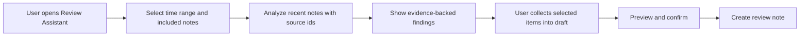
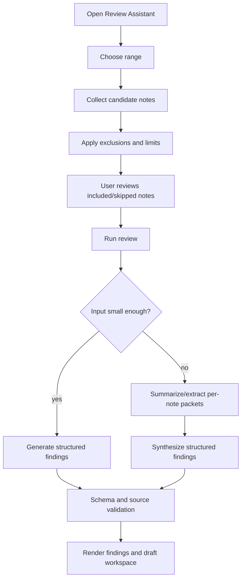

# Review Assistant Product Design

## Status

| Field | Value |
| --- | --- |
| Feature name | Review Assistant |
| Mascot nickname | 拾页 / Pagelet |
| Status | Beta/Labs product design |
| Last revised | 2026-05-31 |
| Primary surface | Independent structured review workspace opened from a pet-like entry |
| Runtime relationship | Product UI is independent; read-only analysis should reuse PA Agent/capability boundaries where practical |
| Write boundary | The only v1 write action is creating one independent review note after user preview and confirmation |

This document defines the first product version of Review Assistant. It is a product and UX contract, not an implementation tracker. If implementation work changes runtime capability boundaries, write-action rules, Memory behavior, telemetry, packaging, or release process, update the relevant architecture docs in the same reviewed change.

## Product Promise

Review Assistant helps users revisit recent notes, collect evidence-backed insights, and turn selected findings into a draft note.

中文产品承诺：

> 复盘助手帮你回看最近的笔记，整理有来源依据的洞察，并把你选中的内容沉淀成一篇复盘草稿。

The promise must stay intentionally narrow:

- It reviews recent notes, not the whole vault by default.
- It produces evidence-backed findings, not free-form inspiration.
- The user selects what matters, not the model.
- It creates a draft note only after preview and confirmation.
- The pet-like UI is a memorable entry and status surface, not the product's core value.

## Positioning

Review Assistant is a note-review workflow with a pet-like entry. It is not a screen pet, task manager, automatic background analyst, or general write agent.

The product value is the review loop:



The memorable UI line is:

> A recognizable little note companion rests quietly in the workspace, wakes when opened, expands a review workspace from its position, then helps the user collect useful findings into a draft note.

## Target Users

Primary users:

- Users who keep daily notes, work logs, research notes, project journals, or meeting notes in Obsidian.
- Users who already write enough material that periodic review can surface patterns, missing follow-ups, research gaps, and idea threads.
- Users who use Obsidian as a thinking system or personal knowledge base rather than only as file storage.
- Users already comfortable with PA Agent/Memory reading their notes after explicit action.

Secondary users:

- Users who periodically prepare weekly reviews, project retrospectives, newsletters, research summaries, or planning notes.
- Users who need a low-friction way to transform scattered recent notes into a working draft.

Non-target users for v1:

- Users who rarely write notes.
- Users who expect a task manager with completion tracking and due dates.
- Users who want an autonomous assistant to monitor notes and act in the background.
- Users who want a highly playful pet, growth, emotion, feeding, or decoration system.

## Problems To Solve

Review Assistant addresses practical note-work problems:

- Review cost is high. Users know they should revisit recent notes, but manually scanning yesterday, the last three days, or the last week is tedious.
- Ideas and follow-ups get buried. Notes often contain "look this up later", "maybe turn this into...", TODOs, partial insights, and unresolved questions that never become next steps.
- Blank-prompt friction is real. Users may not know what to ask an AI assistant. A structured review starts from recent notes rather than from a blank chat box.
- Insight-to-note handoff is weak. A good AI answer is not enough if the user must manually copy, edit, cite, and organize it.
- Trust depends on provenance. Users need to know which notes were read, which were skipped, and why a recommendation was made.

Review Assistant should not try to solve:

- Habit formation for users who do not record notes.
- Full task management.
- Automatic rewriting of source notes.
- Whole-vault intelligence by default.
- Autonomous long-running agent work.

## Product Principles

1. Review first, pet second.
   The mascot exists to make the entry recognizable and the state legible. It must not pull scope toward decoration or pet-care mechanics.

2. User-triggered by default.
   The assistant does not analyze notes in the background. It may show lightweight reminders based on local activity thresholds, but the user must open or run the review before note text is read or sent to a model.

3. Evidence over fluency.
   Every suggestion must point back to source evidence. Suggestions without sources should be discarded, downgraded, or shown as "needs review".

4. Collect, then write.
   The model generates candidates. The user chooses candidates, edits a draft, previews the final Markdown, and confirms note creation.

5. Fewer better findings.
   The assistant may output only a few findings or no strong finding. It should not pad all categories for completeness.

6. Vault-local and transparent.
   Settings, pending review drafts, and feedback state are scoped to the current vault. Included and skipped notes should be inspectable.

7. Narrow write boundary.
   v1 creates only one independent review note after explicit confirmation. It must not modify source notes, append to daily notes, change tasks, or update frontmatter.

## Naming

Formal feature name:

- `Review Assistant`

Mascot nickname:

- Chinese: `拾页`
- English: `Pagelet`

Rationale:

- `拾页` suggests picking up scattered ideas from recent pages.
- `Pagelet` feels like a small page/bookmark companion rather than a generic robot or animal pet.
- The nickname gives the UI a memorable identity without changing the formal product promise.

User-facing copy should call the feature `Review Assistant`. The mascot may be referred to as `拾页 / Pagelet` in onboarding, UI flavor text, or accessibility labels when useful.

## Scope

### V1 Includes

- `Review Assistant (Beta)` as the product surface.
- Pet-like mascot entry using `拾页 / Pagelet`.
- Pet click as the primary entry after the user enables the pet.
- Obsidian command palette command and configurable hotkey as reliable official entries.
- Double Ctrl as an experimental enhancement only.
- Time ranges: yesterday, last 3 days, last 7 days, and a path toward custom ranges.
- Candidate note selection from modified time plus daily note date, with created time as auxiliary context.
- Included/skipped note summary and expandable details.
- Manual included/skipped adjustment before running.
- Configurable exclusion rules.
- TODO-like line extraction as evidence for action suggestions.
- Structured review output with four categories.
- Short overall summary.
- Evidence links and confidence labels on suggestions.
- Fixed refinement actions plus an optional custom follow-up input bound to one suggestion.
- WebSearch only after the user clicks a research-gap action.
- Suggestion collection into a structured draft.
- Draft block editing in the UI.
- Preview and confirmed creation of one independent Markdown review note.
- Pending review/draft restore if the user closes the panel before creating the note.
- Content-free, local/opt-in usage metrics for product validation.

### V1 Excludes

- Background automatic analysis.
- Automatic WebSearch during review generation.
- Automatic Memory/VSS writes for review findings.
- Direct note edits to source notes.
- Appending to daily notes by default.
- Applying suggestions back into source notes.
- Task management, task completion, or due-date systems.
- Full Codex-like notification tray.
- Drag, resize, custom pets, pet selection, pet growth, feeding, emotions, or decoration.
- Whole-vault review by default.
- Cross-vault review.
- Cross-device review state sync as a product feature.
- Full multi-turn chat workspace per suggestion.

## First-Run And Enablement

The feature should be available as part of the product, but the pet should not appear for existing users without consent.

Default behavior:

- Review Assistant is available through command palette and settings.
- Pet entry is opt-in for existing users.
- New users may be invited to enable the pet during onboarding.
- Users can disable the pet while keeping command/hotkey access.
- First use explains reading scope, provider cost, write boundary, and no background analysis.

First-use notice must cover:

- The assistant reads notes from the selected time range.
- Relevant note excerpts may be sent to the configured AI provider.
- AI credits/API calls may be used.
- The assistant does not automatically modify or delete source notes.
- WebSearch only runs after the user explicitly clicks a research action.
- A review note is created only after preview and confirmation.

After first use:

- The panel should still show the current read scope before each run.
- It should not repeat a large confirmation modal every time.

## Entry Points

Official entries:

- Pet click, after pet is enabled.
- Obsidian command palette command, for example `Open Review Assistant`.
- User-configurable Obsidian hotkey.

Experimental entry:

- Double Ctrl can be explored but must not be the only entry.
- It should be configurable and easy to disable if it conflicts with platform, input method, or Obsidian shortcuts.

## Mascot UX

### Role

The mascot is an ambient entry and status widget:

- It makes Review Assistant visible and memorable.
- It opens the review workspace.
- It communicates simple state.
- It shows lightweight reminders.

It is not a full pet-care product or complex notification system.

### Visual Direction

Mascot metaphor:

- A note, page, bookmark, or small paper-like work companion.
- It should feel like it woke from the user's notes to help gather useful pieces.

Visual tone:

- Quiet work partner.
- Lightly personified but professional.
- Low saturation and small footprint.
- Strong silhouette and product recognition.
- Pixel-art or simple mascot style is acceptable if it fits Obsidian and does not feel childish.

Avoid:

- Animal-pet-first framing.
- Generic AI robot iconography.
- Feeding, mood, levels, clothes, collectibles, or pet-care loops.
- Strong animations that compete with editing.
- Cute or clingy language.

### States

The v1 mascot needs only a small state model:

| State | Meaning | UX |
| --- | --- | --- |
| `idle` | No active review and no unread result | Quiet static or very light idle animation |
| `running` | Review generation or refinement is running | Thinking/working state, paired with panel progress |
| `review` | Review results or pending draft await attention | Badge or subtle highlight |
| `failed` | Last review or action failed | Error state with retry path in panel |

`reduced-motion` users should get static state changes instead of animated loops.

### Codex Pets Inspiration Boundary

The mascot should borrow the useful product pattern from Codex pets: an ambient status widget that doubles as a low-friction action entry. It should not copy the full notification or desktop-overlay system in v1.

Borrow in v1:

- Ambient presence: the assistant is visible enough to be remembered, but calm enough to live beside writing.
- State animation: idle, running, review, and failed should be visually distinct.
- Badge language: reminders and unread review results can use a small badge/dot.
- Spatial relationship: the review workspace should open from or near the mascot, with transform origin and motion that make the panel feel attached to it.
- Motion restraint: non-idle states can animate briefly, then settle; `prefers-reduced-motion` should show static frames.
- Interaction boundary: if implemented as a floating overlay, transparent space should not block the editor. Only mascot, badge, panel, and controls should be interactive.

Defer from v1:

- Full notification tray.
- Multi-notification inbox.
- Inline approval controls in a tray.
- Dragging and momentum.
- Resize handle.
- Custom pets.
- Independent native transparent desktop window.
- Complex spritesheet animation requirements.

If a pixel-art spritesheet is used, keep the implementation small and state-driven. Do not let sprite engineering become the release blocker for the review workflow.

### Reminders

Light reminders are allowed, but they must not analyze notes.

Reminder rule:

- Use local activity threshold plus cooldown.
- Example signals: several notes modified recently, or enough weekly activity since the last review.
- Show only a small badge/dot.
- Do not open the panel automatically.
- Do not read note bodies or call AI before user action.
- If ignored, enter cooldown for the day or configured interval.

### Memory Points

The memorable UX should come from three places:

- The distinctive `拾页 / Pagelet` mascot.
- The workspace unfolding from the mascot's position.
- The collection interaction when suggestions are added to the draft.

Do not rely on intrusive animation or pet emotions for memorability.

## Review Workspace UX

The review workspace is a structured workbench, not a chat transcript.

### Surface

Desktop:

- Medium floating/side panel that expands from the mascot area.
- It should preserve a spatial relationship with the pet.
- It needs enough width for suggestions and draft work, roughly panel/workbench scale rather than small popover scale.
- It should not take over the whole Obsidian workspace by default.

Mobile or narrow layout:

- Use a stepped layout:
  - Step 1: Review findings.
  - Step 2: Edit draft.
  - Step 3: Preview and create note.
- Avoid forcing a dense two-column layout on small screens.

### Desktop Layout

Preferred desktop layout:

- Header:
  - Time range.
  - Included/skipped summary.
  - Run/Cancel/Retry controls.
  - Beta and scope indicators where needed.
- Main findings area:
  - Overall summary.
  - Four fixed sections.
  - Suggestion cards.
- Draft area:
  - Collected blocks.
  - Editable block text.
  - Source links attached to blocks.
  - Preview/create controls.

The layout should let users see suggestions and the draft forming at the same time.

### Suggestion Categories

The model output and UI use four fixed categories:

| Category | Purpose |
| --- | --- |
| Insights | Themes, patterns, contradictions, recurring ideas, or promising threads in recent notes |
| Action suggestions | Evidence-backed next steps such as clarify, follow up, organize, or develop |
| Research gaps | Missing information, external references to look up, or search queries the user may run |
| Related old notes | A small number of older notes that connect to current findings |

The model should not invent extra categories in v1.

### Overall Summary

The review result should include a short orientation summary:

- 2-4 sentences.
- Describes the reviewed range and main thread.
- Notes if evidence is thin.
- Does not replace the structured findings.
- Does not need per-sentence citations, but should be grounded in the included source set.

### Suggestion Card

Each suggestion card should include:

- Category.
- Title.
- Short explanation.
- Confidence label: `较明确`, `可能线索`, or `待确认`.
- Source links.
- Primary action: add to draft.
- Secondary actions:
  - Ignore.
  - Open source.
  - Expand.
  - Actionize.
  - Find related notes.
  - Search, for research gaps.
  - Optional custom follow-up input.

Hover/focus-only controls are acceptable for dense desktop UI, but core actions must remain accessible by keyboard and touch.

### Collection Interaction

Adding a suggestion to the draft should have a visible collection feel:

- Use a clear add button or icon.
- Highlight or mark the source card as added.
- Add a corresponding editable block in the draft area.
- Update draft count or subtle pet/badge state.
- Provide undo/remove.
- Respect `prefers-reduced-motion`.

Do not implement drag-to-draft in v1. The interaction should feel collected without taking on drag/drop complexity.

### Refinement

V1 supports bounded refinement of individual suggestions.

Fixed refinement actions:

- Expand: explain why the suggestion exists.
- Actionize: turn it into 2-3 possible next steps.
- Find related: look for a few more related old notes.
- Search: available for research gaps and explicit user-triggered WebSearch.

Custom follow-up:

- Optional and secondary.
- Bound to the current suggestion and its sources.
- The answer may be added to the draft.
- It should not become a persistent independent chat thread in v1.

Refinement must stay tied to the suggestion's source evidence. It should not freely branch into a general chat workspace.

## Note Selection

### Time Range

V1 range presets:

- Yesterday.
- Last 3 days.
- Last 7 days.
- Custom range can be designed after the presets are stable.

Default note inclusion logic:

- Include Markdown notes modified in the selected range.
- Include daily/periodic notes whose note date falls in the selected range, if recognizable.
- Use created time as auxiliary context, not the primary selector.
- Show why each note was included: `modified in range`, `daily note`, `created in range`, or `manually included`.

Reasoning:

- Modified time better reflects what the user recently worked on.
- Daily note date better reflects the actual day being reviewed.
- Created time can be unreliable after sync, import, migration, or copy.

### Candidate Limits

The assistant must use bounded, transparent reading.

Behavior:

- Show candidate count and estimated scale before running.
- Select a limited included set by recency, relevance, daily-note status, and size constraints.
- When not all candidates are included, show `included / found` count.
- Let the user expand included/skipped details.
- Let the user adjust the included set before running.
- Do not claim to have analyzed skipped notes.

Product rule:

> Prefer fewer, more reliable notes over slow, expensive, vague all-in review.

### Manual Adjustment

Before running:

- Users can include or exclude candidate notes.
- Excluded notes do not enter model input.
- Manually included large notes may be truncated with explanation.
- Notes excluded by privacy rules require an explicit warning before manual inclusion.

After running:

- Inputs are locked for that review result.
- Changing included/skipped notes requires `Adjust notes and rerun`.

### Exclusion Rules

V1 must support configurable exclusion rules and conservative defaults.

Default exclusions:

- `.trash`.
- Hidden/system folders.
- Templates folder, if identifiable.
- Plugin-generated directories.
- Empty files.
- Non-Markdown files.
- Extremely large files beyond the review budget.

Configurable exclusions:

- Excluded folders.
- Excluded tags, such as `#private`, `#no-ai`, and `#no-review`.
- Excluded filename/path patterns.

Rules:

- `#no-ai` and `#no-review` should be skipped by default.
- Excluded note bodies must not enter model input.
- Skipped details should show rule-based skip reasons.

### TODO-like Signals

The local preprocessor should identify TODO-like lines as evidence:

- Markdown task items such as `- [ ]`.
- `TODO`.
- `待办`.
- `next`.
- Similar configurable or conservative patterns can come later.

These lines may inform action suggestions, but Review Assistant must not become a task manager in v1:

- Do not create tasks.
- Do not edit task completion state.
- Do not set due dates.
- Do not aggregate a task database.

## Model Input

Review Assistant should send bounded source packets, not raw unbounded files.

For each included note, provide:

- Source id.
- Path/title.
- Created/modified time when available.
- Inclusion reason.
- Headings.
- Frontmatter summary when useful.
- TODO-like lines.
- Bounded body excerpts or extracted key sections.

Input rules:

- Short daily notes may include more body text.
- Long notes should be truncated or summarized first.
- Prefer headings, lists, recent edits when available, TODO-like lines, and dense content.
- Skipped note content must not be sent.
- All excerpts need source ids so findings can cite them.

## Processing Flow

Review generation should be on-demand and phased when needed.



Rules:

- Small inputs may use one structured generation call.
- Large inputs should first create bounded summaries/extractions, then synthesize.
- No persistent background summary index in v1.
- No automatic analysis before user action.

## Structured Output Contract

The output should be schema-first, not text-first.

Required top-level fields:

- `range`.
- `summary`.
- `includedSources`.
- `findings`.
- `warnings` or `limitations`.

Each finding should include:

- Stable local id.
- Category: `insight`, `action`, `research_gap`, or `related_note`.
- Title.
- Body.
- Confidence: `high`, `medium`, or `low`.
- Source references.
- Suggested draft block text.
- Optional refinement actions.

Validation rules:

- Drop or downgrade findings without source references.
- Enforce category set.
- Enforce quantity limits.
- Enforce source id validity.
- Keep related old notes limited and tied to a current finding or theme.
- Keep research gaps as questions/queries; do not include WebSearch results unless a search has been explicitly run.
- Permit empty or sparse results.

UI labels for confidence:

| Schema | UI label | Meaning |
| --- | --- | --- |
| `high` | 较明确 | Multiple sources or a direct strong source support it |
| `medium` | 可能线索 | Some evidence exists, but it needs judgment |
| `low` | 待确认 | Worth checking, not a conclusion |

## Evidence And Sources

Every suggestion must be evidence-backed.

Rules:

- Insights need at least one source note.
- Action suggestions need a source note or a specific TODO-like line/context.
- Research gaps need the source note that raised the gap.
- Related old notes need the old note and the current note/theme that connects to it.
- WebSearch results must be visually and structurally separate from note-derived evidence.
- Created review notes must preserve source links.

If evidence is weak:

- Use lower confidence.
- Use careful language.
- Prefer "possible thread" over strong claims.
- Omit low-value suggestions rather than padding.

## Related Old Notes

Related old notes are a supplement, not the main review scope.

Rules:

- Generate themes/keywords from included recent notes first.
- Use Memory or vault metadata to find a few older notes.
- Limit to roughly 3-5 related notes per review.
- Explain why each old note relates.
- Do not let old notes dominate or rewrite the recent review conclusion.
- Hide the section if no high-relevance old note exists.

## WebSearch

Review generation must not automatically search the web.

Research gap flow:

1. The review suggests a research gap with sources and possible queries.
2. The user clicks `Search` for a specific gap.
3. Builtin WebSearch runs through the existing network-read capability boundary where practical.
4. Results appear under the gap.
5. The user may add selected results to the draft as research leads.

Rules:

- Web results must be marked as web sources, not note sources.
- WebSearch queries are user-triggered, not automatic.
- Search results should not silently rewrite original note-derived findings.
- If the user asks to update a finding based on search results, show that provenance clearly.
- V1 does not need deep webpage reading, bibliography management, or automatic citation formatting beyond clear source links.

## Draft And Note Creation

### Draft Model

The UI uses structured editable blocks. The created file is plain Markdown.

Draft blocks:

- Come from selected findings, refinements, and manually selected WebSearch results.
- Can be edited.
- Can be removed.
- Can be reordered if a simple control is available; drag is not required in v1.
- Keep source links attached.

The draft is a working draft, not a polished report.

### Default Markdown Shape

Default file naming:

- `Review - YYYY-MM-DD.md` for one-day review.
- `Review - YYYY-MM-DD to YYYY-MM-DD.md` for range review.

Default target folder:

- Configurable.
- Candidate default: `Reviews/` or `PA Reviews/`.
- Exact default folder can be finalized during implementation.

Default note structure:

```markdown
# Review - YYYY-MM-DD to YYYY-MM-DD

## Summary

...

## Insights

- ...
  Sources: [[...]]

## Possible next actions

- ...
  Sources: [[...]]

## Research gaps

- ...
  Sources: [[...]]

## Research leads

- ...
  Web source: ...

## Related notes

- [[...]] - ...

## Sources

- [[...]]
```

Tone:

- Plain, concrete, and editable.
- Avoid overclaiming.
- Avoid "you must" language.
- Avoid overly polished weekly-report voice.

### Write Boundary

The only v1 write action:

- Create one independent review note after preview and explicit confirmation.

Allowed:

- User edits draft.
- User previews Markdown.
- User confirms note creation.
- On success, open the new review note.
- On failure, preserve draft and show retry/repath options.

Not allowed in v1:

- Modify source notes.
- Append to daily notes by default.
- Update frontmatter.
- Create or update tasks.
- Move or rename files.
- Apply suggestions back into old notes.
- Automatically write WebSearch results into notes.

Conflict handling:

- If a note already exists, offer cancel, rename, or append a suffix.
- Do not overwrite without explicit user choice.

Completion behavior:

- After creation, open the new review note.
- Clear pending draft state for that review.
- Return mascot to quiet state after a brief success indication.
- Do not immediately push more next-step suggestions.

## Persistence

V1 should persist unfinished work but avoid turning all intermediate model outputs into permanent records.

Persist locally per vault:

- Pending review result.
- Selected draft blocks.
- User edits to pending draft.
- Included/skipped choices for the pending review.
- Basic state needed to restore the panel.

Clear:

- Pending draft after successful note creation or explicit discard.

Do not:

- Automatically create review history notes.
- Persist every full AI intermediate result as long-term product history.
- Store pending review state across vaults as a product feature.

If Obsidian Sync or a user's sync setup syncs plugin data, settings should make clear that pending drafts may exist in plugin data until discarded or created.

## Feedback And Metrics

Product success is measured by adoption of useful findings, not pet interaction volume.

Primary success signal:

- Users select and write at least some findings into a review note.

V1 metrics should be local, content-free, and opt-in or tied to the existing content-free telemetry posture.

Allowed metrics:

- Review triggered.
- Time range type.
- Candidate note count.
- Included note count.
- Skipped note count.
- Number of generated findings.
- Number of findings added to draft.
- Number of findings ignored.
- Number of findings refined.
- Whether a review note was created.
- Whether WebSearch was user-triggered.
- Runtime duration.
- Failure category.
- Pet enabled/hidden status.

Disallowed metrics:

- Prompt text.
- Note text.
- Note titles or paths.
- Suggestion body.
- User follow-up text.
- WebSearch query text.
- Created review note content.

Use feedback data first for product evaluation and coarse ranking. Do not implement complex personalization or long-term preference learning in v1.

## Privacy And Trust

Trust requirements:

- No background analysis.
- No hidden note reads before user action.
- No sending skipped note bodies to the model.
- Clear included/skipped details.
- Source-backed suggestions.
- Preview before write.
- User-confirmed note creation.
- Content-free telemetry only.

Per-run scope indicator should show:

- Selected time range.
- Candidate count.
- Included count.
- Skipped count.
- Whether related old notes may be searched.
- Whether WebSearch has not run yet unless explicitly triggered.

Example:

> Reviewing last 3 days: 14 notes found, 10 included, 4 skipped. Related old notes may be suggested from Memory/vault metadata. WebSearch will only run when you choose a research gap.

## Progress, Cancellation, And Failure

Review runs should show transparent stages:

- Collecting candidate notes.
- Applying exclusion rules and limits.
- Preparing bounded excerpts.
- Analyzing notes.
- Finding related old notes.
- Validating sources.
- Preparing draft workspace.

Controls:

- Cancel run.
- Retry failed run.
- Adjust notes and rerun.

Failure behavior:

- Preserve selected range and included/skipped state.
- Keep any available candidate-note information.
- Show a clear failure category.
- Do not discard user-edited draft unless explicitly discarded.
- Mascot enters `failed` state until the user retries, dismisses, or starts a new review.

## Copy And Tone

The assistant's voice should be:

- Warm.
- Specific.
- Careful.
- Research-assistant-like.
- Lightly personable only through the mascot, not through exaggerated wording.

Prefer:

- "These notes all mention X, so it may be worth collecting into a theme."
- "This looks like a research gap: you mention Y but do not cite a source."
- "Evidence is thin, so this is marked as a possible thread."

Avoid:

- "主人，我发现啦！"
- "You must do this."
- "This is a major breakthrough."
- "I already handled it for you."

Product copy should use user-facing language:

- `Review Assistant`
- `Review recent notes`
- `Create review note`
- `Add to draft`
- `Sources`
- `Research gaps`

Avoid exposing internal terms in ordinary UI:

- VSS.
- RAG.
- chunks.
- embeddings.
- backend.
- stale.

Internal docs and diagnostics may use technical terms when necessary.

## Relationship To PA Agent And Memory

Product shape:

- Review Assistant has its own structured workspace.
- It is not a PA Chat bubble.
- It should not be implemented as a free-form prompt wrapper whose text is later parsed.

Capability reuse:

- Reuse existing PA Agent/capability boundaries for Memory, vault read-only context, and builtin WebSearch where practical.
- Preserve source bucket separation: note/Memory context and web sources must remain distinct.
- Use structured schemas and validation for review output.

Memory behavior:

- Review may read Memory or vault metadata for related old notes.
- Review-created notes are ordinary Markdown notes.
- Do not directly inject review findings into Memory/VSS.
- Existing Memory maintenance can later process the created Markdown note according to the user's existing Memory policy.
- Avoid immediate special Memory refresh after note creation in v1.

Write behavior:

- Creating the review note is a narrow write workflow with preview and confirmation.
- It should not weaken PA Agent read-only tool policy.
- Any broader write/action capability belongs to a separate action-mode design.

## Settings

Recommended settings:

- Enable Review Assistant pet entry.
- Hide pet temporarily or disable pet entirely.
- Review note target folder.
- Excluded folders.
- Excluded tags.
- Excluded path/name patterns.
- Reminder enablement.
- Reminder activity threshold.
- Reminder cooldown.
- Maximum included notes or review budget.
- Enable experimental double Ctrl.
- Enable content-free usage metrics if not already covered by an existing opt-in setting.

Defaults:

- Feature available.
- Pet not shown automatically to existing users.
- No background analysis.
- WebSearch off until clicked per gap.
- Conservative exclusions on.
- Reminder low intensity.

## Release Posture

Ship v1 as Beta/Labs:

- Experience quality should feel complete.
- Product claims should stay conservative.
- Do not claim automatic discovery of all ideas.
- Do not claim background analysis.
- Do not imply it will manage tasks.
- Watch adoption, creation rate, failure rate, and pet disable rate.

Suggested label:

- `Review Assistant (Beta)`.

Suggested description:

> Review recent notes, collect evidence-backed findings, and create a draft review note.

## Success Criteria

V1 should be considered successful if:

- A review can be run for yesterday, last 3 days, and last 7 days.
- The panel clearly shows what will be read before the run.
- The user can adjust included/skipped notes before running.
- The output includes a short summary and fixed-category findings.
- Findings without valid sources are not shown as strong suggestions.
- Users can add selected findings to a draft without leaving the panel.
- The draft can be edited and previewed.
- The created note is plain Markdown in the configured folder.
- Creating the note never modifies source notes.
- Pet states correctly reflect idle, running, review, and failed.
- WebSearch only runs from explicit user action.
- Pending drafts survive panel close/reopen until created or discarded.
- Content-free metrics can estimate adoption and sedimentation rate.

Product validation target:

- In at least one real weekly test window, the user creates review notes from the assistant at least twice and keeps some selected findings as useful content.

Performance targets to refine during implementation:

- Last 3 days should usually complete within a tolerable interactive window.
- Last 7 days should remain bounded and transparent rather than all-consuming.
- If a review is too large, the UI should explain limits instead of pretending to analyze everything.

## Decision Record

| # | Decision | Confirmed direction |
| --- | --- | --- |
| 1 | Core value | Review assistant first; pet is entry/status |
| 2 | Trigger model | User-triggered with light reminders; no background analysis |
| 3 | Result shape | Suggestion list plus user-selected draft and confirmed note creation |
| 4 | Review scope | Time-range notes first; small old-note supplement |
| 5 | Output emphasis | Insight first, action second |
| 6 | Pet v1 role | Entry, status, light reminders only |
| 7 | Note destination | Independent review note in configurable folder |
| 8 | Research flow | Suggest research gaps; user-triggered WebSearch |
| 9 | Evidence | Every suggestion needs sources |
| 10 | Success measure | Adoption/sedimentation, not animation metrics |
| 11 | MVP boundary | Review loop plus light pet entry |
| 12 | Workspace shape | Structured workbench, not chat |
| 13 | Categories | Insights, actions, research gaps, related old notes |
| 14 | Refinement | Allow per-suggestion expansion/follow-up |
| 15 | Refinement UI | Fixed buttons plus optional custom input |
| 16 | Pet visibility | Default quiet pet after opt-in; can hide/disable |
| 17 | Shortcuts | Pet click and Obsidian command/hotkey official; double Ctrl experimental |
| 18 | Consent | First-use strong notice; per-run range display |
| 19 | Large ranges | Transparent limits with included/skipped details |
| 20 | Old notes | Small connection supplement, not main evidence base |
| 21 | Draft format | Structured UI blocks, plain Markdown output |
| 22 | Note voice | Working draft, not polished report |
| 23 | Sparse evidence | Allow sparse or no output |
| 24 | Feedback | Lightweight local adoption feedback; no complex personalization |
| 25 | Persistence | Temporarily persist unfinished review/draft |
| 26 | Reminders | Activity threshold plus cooldown |
| 27 | Visual tone | Quiet work partner with strong recognition |
| 28 | Mascot metaphor | Note/page/bookmark helper |
| 29 | Panel surface | Medium floating/side panel from pet |
| 30 | Layout | Desktop dual-area; mobile stepped |
| 31 | Collection | Click-to-add with visible collection feedback, no drag v1 |
| 32 | Copy tone | Warm, concrete, restrained research assistant |
| 33 | Architecture relationship | Independent Review UI, reuse PA Agent/capability boundaries |
| 34 | Write action | Only confirmed independent review-note creation |
| 35 | Runtime UX | Show stages, allow cancel/retry |
| 36 | Quality boundary | Structured schema plus validation |
| 37 | Processing | Small input one-shot; large input staged extraction/synthesis |
| 38 | Model input | Bounded excerpts and structure, not full files by default |
| 39 | Read transparency | Summary plus expandable included/skipped details |
| 40 | Input control | Adjust notes before run; rerun after changes |
| 41 | Exclusions | Configurable exclusions with conservative defaults |
| 42 | Time basis | Modified time plus daily-note date; created time auxiliary |
| 43 | TODOs | Use TODO-like lines as evidence only |
| 44 | Confidence | Show simple confidence labels |
| 45 | Summary | Short orientation summary |
| 46 | Web results | User-added to draft, separate from note findings |
| 47 | Completion | Open created note; pet returns quiet |
| 48 | Memory write | No special Memory/VSS write |
| 49 | Vault scope | Current vault only, vault-local state |
| 50 | Default exposure | Feature available; pet opt-in for existing users |
| 51 | Metrics | Content-free local/opt-in metrics |
| 52 | Release | Beta/Labs with polished UX |
| 53 | Product promise | Review recent notes, evidence-backed insights, draft note |
| 54 | Name | `Review Assistant`; mascot `拾页 / Pagelet` |

## Open Implementation Decisions

These should be settled during implementation planning, not product discovery:

- Exact default review note folder name: `Reviews/` vs `PA Reviews/`.
- Exact note inclusion budget by count, token estimate, and file size.
- Exact activity threshold and cooldown for reminders.
- Exact pet asset style and implementation format.
- Whether the medium panel is implemented as a floating DOM panel, Obsidian view overlay, or hybrid.
- How to detect daily/periodic notes across user configurations.
- Whether draft block reordering is included in v1 or deferred.
- Exact wording for first-use notice and settings copy.
- Exact schema fields and test fixtures for source validation.
- Exact conflict behavior labels for duplicate review-note names.

## Future Phases

Phase 2 candidates:

- Drag or resize pet.
- More mascot customization.
- Better note-range presets and custom ranges.
- Richer related-note controls.
- Optional recurring review schedules with clear consent.
- Better refinement history.
- More advanced draft reordering.
- User-tuned review templates.

Phase 3 or separate action-mode candidates:

- Append to daily/periodic note after preview.
- Apply a selected suggestion back to a source note with diff preview.
- Convert selected suggestions into tasks.
- Deeper Web research workflows.
- More durable personalization after a separate privacy and product review.

Do not promote any future write or automation behavior into v1 without updating the write/action safety boundary.
