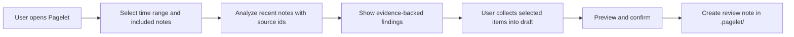
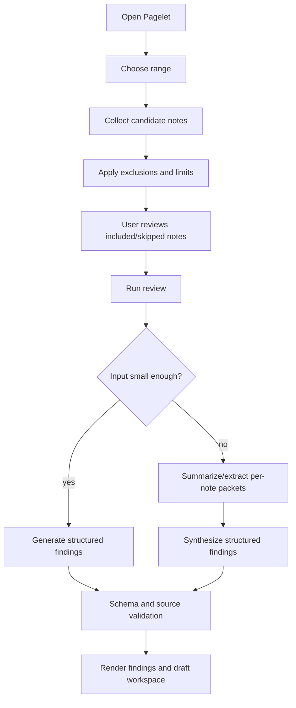

# Pagelet (Review Assistant) Product Design

## Status

| Field | Value |
| --- | --- |
| Feature name | `Pagelet` (中文：`拾页`) |
| Internal codename | Review Assistant |
| Status | Beta product design (PA `2.(x+1).0-beta.N`) |
| Last revised | 2026-06-01 |
| Primary surface | Independent structured review workspace, opened from a quiet mascot entry |
| Runtime relationship | Pagelet shares PA's unified Agent Runtime via a lightweight RunKindAdapter (D024) |
| Write boundary | The only v1 write action is creating one independent review note after preview and confirmation, under **Write Action Framework v1** (D025, D030) |
| Decisions record | See [review-assistant-decisions.md](./review-assistant-decisions.md) |
| Technical design | See [review-assistant-sdd.md](./review-assistant-sdd.md) |

This document defines the first product version of **Pagelet** (formerly "Review Assistant"). It is a product and UX contract, not an implementation tracker. Implementation-level changes that affect runtime boundaries, write rules, Memory behavior, telemetry, packaging, or release process belong in the SDD or decisions record, and must be cross-referenced here.

## Product Promise

> **Pagelet — your note's quiet reviewer.**
>
> 拾页 —— 笔记写完后的安静审视者。

Pagelet helps users revisit recent notes, collect evidence-backed insights, and turn selected findings into a draft review note.

The promise stays intentionally narrow:

- It reviews recent notes, not the whole vault by default.
- It produces evidence-backed findings, not free-form inspiration.
- The user selects what matters, not the model.
- It creates a draft note only after preview and confirmation.
- The mascot is a memorable entry and status surface, not the product's core value.

## Positioning

Pagelet is a **note-review workflow with a quiet mascot entry**. It is not a screen pet, task manager, automatic background analyst, or general write agent.

The product value is the review loop:



The memorable UI line:

> A recognizable little paper companion rests quietly in the workspace, wakes when opened, expands a review workspace from its position, then helps the user collect useful findings into a draft note.

## Differentiation

Pagelet differentiates against same-category AI plugins (Smart Connections, Copilot for Obsidian, Text Generator, Notion AI) through three axes (D006):

| Axis | Statement |
| --- | --- |
| **Review-first** (primary) | Others help you write; Pagelet helps you review what you wrote. |
| **Non-intrusive** (secondary) | Every suggestion is a dismissible card. Pagelet never modifies your notes silently. |
| **Vault-aware** (moat) | Pagelet draws on your own past notes, tags, and links as context. |

Differentiation touchpoints:

- **Community plugins description** opens with: `Pagelet (Beta) — quiet reviewer for your notes. Non-intrusive. Vault-aware.`
- **README first paragraph** establishes the same framing.
- **Settings top callout** restates the position.
- **First-use inline tip** ties usage moment to the value proposition.

Pagelet does NOT name competitors in user-facing copy.

## Target Users

Primary:

- Users who keep daily notes, work logs, research notes, project journals, or meeting notes in Obsidian.
- Users who already write enough material that periodic review can surface patterns, missing follow-ups, research gaps, and idea threads.
- Users who treat Obsidian as a thinking system or personal knowledge base.
- Users already comfortable with PA Agent / Memory reading their notes after explicit action.

Secondary:

- Users who prepare weekly reviews, project retrospectives, newsletters, research summaries, or planning notes.
- Users who need a low-friction way to transform scattered recent notes into a working draft.

Non-target for v1:

- Users who rarely write notes.
- Users who expect a task manager with completion tracking and due dates.
- Users who want an autonomous assistant that monitors notes in the background.
- Users who want a highly playful pet (growth, emotion, feeding, decoration).

## Problems To Solve

- **Review cost is high.** Manually scanning yesterday, the last three days, or the last week is tedious.
- **Ideas and follow-ups get buried.** Notes contain "look this up later", "maybe turn this into...", TODOs, partial insights, unresolved questions that never become next steps.
- **Blank-prompt friction is real.** A structured review starts from recent notes rather than a blank chat box.
- **Insight-to-note handoff is weak.** A good AI answer is not enough if the user must manually copy, edit, cite, and organize it.
- **Trust depends on provenance.** Users need to know which notes were read, which were skipped, and why a recommendation was made.

Pagelet does NOT try to solve:

- Habit formation for users who do not record notes.
- Full task management.
- Automatic rewriting of source notes.
- Whole-vault intelligence by default.
- Autonomous long-running agent work.

## Product Principles

1. **Review first, mascot second.** The mascot exists to make the entry recognizable and the state legible. It must not pull scope toward decoration.
2. **User-triggered by default.** Pagelet does not analyze notes in the background. It may show lightweight reminders based on local activity thresholds, but the user must open or run the review before note text is read or sent to a model.
3. **Evidence over fluency.** Every suggestion must point back to source evidence. Suggestions without sources should be discarded, downgraded, or shown as "needs review".
4. **Collect, then write.** The model generates candidates. The user chooses candidates, edits a draft, previews the final Markdown, and confirms note creation.
5. **Fewer better findings.** Pagelet may output only a few findings or none. It should not pad all categories for completeness.
6. **Vault-local and transparent.** Settings, pending review drafts, and feedback state are scoped to the current vault. Included and skipped notes should be inspectable.
7. **Narrow write boundary.** v1 creates only one independent review note after explicit confirmation, under the **Write Action Framework v1** contract (D025, D030). It must not modify source notes, append to daily notes, change tasks, or update frontmatter. Broader action orchestration belongs to the future **Operations Agent mode**, which sits on top of this framework.
8. **Quiet and non-intrusive.** Pagelet's voice and presence prioritise calm. No urgency, no interruption, no claim of being indispensable.

## Naming

| Aspect | Value |
| --- | --- |
| Formal feature name | `Pagelet` |
| Chinese name | `拾页` |
| Mascot (same) | `Pagelet` / `拾页` |
| Internal codename | `Review Assistant` (legacy; kept in code identifiers where renaming is too costly) |

Rationale and alternatives see decisions D001.

User-facing copy across all surfaces (UI, settings, README, community description) uses `Pagelet` / `拾页`.

## Scope

### V1 Includes

- `Pagelet (Beta)` as the product surface (delivered as a feature inside PA `2.(x+1).0-beta.N`).
- Quiet mascot entry using `Pagelet / 拾页`, visual direction = A · 极简线稿, visual anchor = ④ · Tldraw-like 手绘 (D004, D005).
- Mascot click as the primary entry after the user enables it.
- Obsidian command palette commands and configurable hotkey as reliable official entries (commands prefixed with `Pagelet:`, D029).
- Time ranges: yesterday, last 3 days, last 7 days (custom ranges deferred).
- Candidate note selection from modified time plus daily note date, with created time as auxiliary context.
- Included/skipped note summary with expandable details.
- Manual included/skipped adjustment before running.
- Configurable exclusion rules.
- TODO-like line extraction as evidence for action suggestions.
- Structured review output with four fixed categories.
- Short overall summary.
- Evidence links and confidence labels on suggestions.
- Fixed refinement actions (custom follow-up deferred per cut decision).
- WebSearch only after the user clicks a research-gap action.
- Suggestion collection into a structured draft.
- Draft block editing in the UI.
- Preview and confirmed creation of one independent Markdown review note in `.pagelet/`.
- Pending review/draft restore if the user closes the panel before creating the note.
- Content-free, local/opt-in usage metrics for product validation.
- Cost ceiling: per-call token cap + daily limits + user override (D018-D022).
- UI in English + Chinese day 1 (D014).
- Reviews generated in the language of the source note by default (D015).
- a11y baseline: aria-live announcement on result, `prefers-reduced-motion` reduces motion not color (D007).

### V1 Excludes

- Background automatic analysis.
- Automatic WebSearch during review generation.
- Automatic Memory/VSS writes for review findings.
- Direct edits to source notes.
- Appending to daily notes by default.
- Applying suggestions back into source notes.
- Task management or task completion or due-date systems.
- Full Codex-like notification tray.
- Drag, resize, custom mascots, mascot selection, growth, feeding, emotions, or decoration.
- Whole-vault review by default.
- Cross-vault review.
- Cross-device review state sync as a product feature.
- Full multi-turn chat workspace per suggestion.
- Formal onboarding flow (replaced by first-use inline tip + README + community description).
- Custom follow-up free-text input on suggestion cards (cut from v1).
- Daily note auto-attach (cut from v1).
- LLM-free fallback (D003 — Pagelet requires a configured provider).
- Streaming structured output rendering (deferred to v2 — D026e).
- Advanced exception circuit breakers (deferred to v2 — D023).

### Current Beta Cut

The current Pagelet beta is intentionally narrower than the full V1 product
surface above. It ships the safe review-note path only:

- Entry from the Pagelet ribbon icon or `Pagelet: Review current note`.
- Current Markdown note review.
- Preview and explicit confirmation through the Write Action Framework v1.
- Creation of one independent Markdown review note under `.pagelet/` (or the
  configured review folder).
- Frontmatter metadata, including `pagelet_cost_usd` when cost diagnostics are
  available.

The full Pagelet panel, production-mounted mascot state, SuggestionCard list,
focus jump-in, draft editing, UI cost totals, multi-note range review, related
note controls, and WebSearch action flow remain the next product milestone.

## Enablement

Pagelet is delivered as a feature inside PA `2.(x+1).0-beta.N` and is **on by default** for beta installs (D013).

Default behavior:

- Pagelet commands and mascot are available the moment a user updates to a `-beta.N` release.
- Users can disable the mascot while keeping command/hotkey access.
- Users can hide Pagelet entirely from settings.

**No formal onboarding flow.** Beta and product context are conveyed through (D011):

1. Community plugins description (visible before install).
2. README header callout (visible to anyone browsing the repo).
3. Settings top callout with feedback link (visible on first settings visit).
4. First-use inline tip: when the user first opens Pagelet, a single-line hint appears above the suggestion area with the Beta banner + feedback link. Dismissing it never shows again.

The per-run scope indicator still shows what will be read before each review.

## Entry Points

Official entries:

- Mascot click (after enabled).
- Obsidian command palette: `Pagelet: Review current note`, `Pagelet: Open Pagelet`, `Pagelet: View all reviews`, `Pagelet: Toggle mascot visibility`.
- User-configurable Obsidian hotkey (commands registered, no default binding per Obsidian convention — D007/1).

Experimental entries are deferred — Pagelet does NOT ship double-Ctrl or similar gestures in v1 (cut from v1).

## Mascot UX

### Role

The mascot is an ambient entry and status widget:

- It makes Pagelet visible and memorable.
- It opens the review workspace.
- It communicates simple state.
- It shows lightweight reminders.

It is NOT a full pet-care product or complex notification system.

### Visual Direction

The mascot follows visual direction **A · 极简线稿** (D004) and is anchored on **④ · Tldraw-like 手绘人文** (D005):

- A folded paper sheet (折角纸张) with minimal hand-drawn lines for facial expression.
- 1.6px strokes with slight jitter for handcraft feel.
- Rounded line caps and joins, no sharp corners.
- Neutral gray base (`#e8e8e8`), with state-driven accent colors.
- Slight float idle animation (2.4s ease-in-out) and occasional blink — only when motion is permitted.

Visual spec:

- `docs/pagelet-visual-spec.html` — 4 states + art tokens + colors + scene mockups (D004 + D005 merged execution reference).

Avoid:

- Animal-pet or generic-robot iconography.
- Feeding, mood, level, clothing, collectible, or pet-care loops.
- Strong animations that compete with editing.
- Cute or clingy language ("主人，我发现啦！" etc.).

### States

| State | Stroke / Fill | Animation | Meaning |
| --- | --- | --- | --- |
| `idle` | `#e8e8e8` neutral | Slight float + occasional blink | No active review and no unread result |
| `thinking` | `#7c9eff` thinking blue | Pulsing dots in mouth area | Review generation or refinement is running |
| `done` | `#5dd39e` success green | Brief settle, then return to idle | Review results or pending draft await attention |
| `error` | `#ff6b6b` error red | Subtle frown line + still | Last review or action failed |

`prefers-reduced-motion` users keep color state changes but lose float/jitter/animation (D007/4).

### Mascot Mounting Rules (compatibility, see D029/R1)

The mascot DOM element MUST only be mounted on markdown views (`view.getViewType() === 'markdown'`). It must NOT be mounted on Excalidraw canvases, Kanban boards, Canvas leaves, or any custom view, to avoid intercepting clicks or breaking drag zones.

### Reminders

Lightweight reminders only — Pagelet must not analyze notes for them:

- Use local activity threshold plus cooldown.
- Example signals: several notes modified recently, enough weekly activity since last review.
- Show only a small badge or dot on the mascot.
- Do not open the panel automatically.
- Do not read note bodies or call AI before user action.
- If ignored, enter cooldown for the day or configured interval.

### Beta Indicators (D011)

| Position | Indicator |
| --- | --- |
| Ribbon icon | Bottom-right `β` corner mark + tooltip `Pagelet (Beta)` |
| Suggestion card | **No** Beta marker per card (avoids per-card noise) |
| Settings top | Callout block: `Pagelet is in Beta. Suggestions may be imperfect — your feedback helps us improve.` + `[Send feedback →]` button |
| First-use inline tip | Single-line hint above first suggestion: `Pagelet is in Beta. Feedback → [link]`. Dismiss once, never shown again. |

Feedback channels: GitHub Issues + form (Google Form / Feishu) (D012). Beta tag removed when graduate criteria met (D013).

## Review Workspace UX

The review workspace is a structured workbench, not a chat transcript.

### Surface

Desktop:

- Medium floating / side panel that expands from the mascot area.
- It preserves a spatial relationship with the mascot.
- It needs enough width for suggestions and draft work, roughly panel/workbench scale rather than small popover scale.
- It does not take over the whole Obsidian workspace by default.

Mobile or narrow layout:

- Stepped layout:
  1. Review findings.
  2. Edit draft.
  3. Preview and create note.
- No dense two-column layout on small screens.

### Desktop Layout

- **Header**: time range; included/skipped summary; Run/Cancel/Retry controls; scope indicators.
- **Main findings area**: overall summary; four fixed sections; suggestion cards.
- **Draft area**: collected blocks; editable block text; source links; preview/create controls.

The layout lets users see suggestions and the draft forming at the same time.

### Suggestion Categories

| Category | Purpose |
| --- | --- |
| Insights | Themes, patterns, contradictions, recurring ideas, or promising threads |
| Action suggestions | Evidence-backed next steps (clarify, follow up, organize, develop) |
| Research gaps | Missing information, external references, or search queries to consider |
| Related old notes | A small number of older notes connected to current findings |

The model does NOT invent extra categories in v1.

### Overall Summary

- 2-4 sentences.
- Describes the reviewed range and main thread.
- Notes if evidence is thin.
- Does NOT replace structured findings.
- Does not need per-sentence citations but should be grounded in the included source set.

### Suggestion Card

Each card includes:

- Category.
- Title.
- Short explanation.
- Confidence label: `较明确`, `可能线索`, or `待确认`.
- Source links.
- Primary action: **Add to draft**.
- Secondary actions:
  - Ignore.
  - Open source.
  - Expand.
  - Actionize.
  - Find related notes.
  - Search (research gaps only).

Hover/focus-only controls are acceptable for dense desktop UI, but core actions must remain accessible by keyboard (`Cmd+/` to jump into the most recent card — D007/2) and touch.

**Card-level fields added in v1:**
- Actual cost displayed in small text below the card (e.g. `this review used ~$0.003`, D022).
- Frontmatter `pagelet: true` will be embedded in the created review note (D029 / D009).

### Collection Interaction

Adding a suggestion to the draft has visible collection feedback:

- Clear add button or icon.
- Highlight or mark the source card as added.
- Add a corresponding editable block in the draft area.
- Update draft count or subtle mascot/badge state.
- Provide undo/remove.
- Respect `prefers-reduced-motion`.

Drag-to-draft is NOT implemented in v1.

### Refinement

V1 supports bounded refinement of individual suggestions via fixed actions:

- **Expand**: explain why the suggestion exists.
- **Actionize**: turn it into 2-3 possible next steps.
- **Find related**: look for a few more related old notes.
- **Search**: available for research gaps and explicit user-triggered WebSearch.

Custom follow-up free-text input is **cut from v1** (deferred to v2).

Refinement must stay tied to source evidence. It should not freely branch into general chat.

## Note Selection

### Time Range

V1 presets:

- Yesterday.
- Last 3 days.
- Last 7 days.

Custom ranges are designed after the presets are stable.

Default inclusion logic:

- Markdown notes modified in the selected range.
- Daily/periodic notes whose date falls in the selected range, if recognizable.
- Created time as auxiliary context, not the primary selector.
- Show inclusion reason: `modified in range`, `daily note`, `created in range`, `manually included`.

Reasoning:

- Modified time reflects what the user recently worked on.
- Daily note date reflects the actual day being reviewed.
- Created time can be unreliable after sync, import, migration, or copy.

### Candidate Limits

The assistant must use bounded, transparent reading:

- Show candidate count and estimated scale before running.
- Select a limited included set by recency, relevance, daily-note status, and size constraints.
- When not all candidates are included, show `included / found` count.
- Let the user expand included/skipped details.
- Let the user adjust the included set before running.
- Do NOT claim to have analyzed skipped notes.

Product rule:

> Prefer fewer, more reliable notes over slow, expensive, vague all-in review.

### Manual Adjustment

Before running:

- Users can include or exclude candidate notes.
- Excluded notes do not enter model input.
- Manually included large notes may be truncated with explanation.
- Notes excluded by privacy rules require explicit warning before manual inclusion.

After running:

- Inputs are locked for that review result.
- Changing included/skipped notes requires `Adjust notes and rerun`.

### Exclusion Rules

V1 supports configurable exclusion rules and conservative defaults.

Default exclusions:

- `.trash`.
- Hidden/system folders (including `.pagelet/` itself).
- Templates folder, if identifiable.
- Plugin-generated directories.
- Empty files.
- Non-Markdown files.
- Files marked `pagelet: true` in frontmatter (D029).
- Extremely large files beyond the review budget.

Configurable exclusions:

- Excluded folders.
- Excluded tags: `#private`, `#no-ai`, `#no-review`.
- Excluded filename/path patterns.

Rules:

- `#no-ai` and `#no-review` skipped by default.
- Excluded note bodies do NOT enter model input.
- Skipped details show rule-based skip reasons.

### TODO-like Signals

The local preprocessor identifies TODO-like lines as evidence:

- Markdown task items (`- [ ]`).
- `TODO`.
- `待办`.
- `next`.
- Other configurable conservative patterns later.

These lines may inform action suggestions, but Pagelet must NOT become a task manager in v1:

- No task creation.
- No task completion state edits.
- No due-date setting.
- No task database aggregation.

## Model Input

Pagelet sends bounded source packets, not raw unbounded files.

For each included note:

- Source id.
- Path/title.
- Created/modified time.
- Inclusion reason.
- Headings.
- Frontmatter summary (when useful).
- TODO-like lines.
- Bounded body excerpts or extracted key sections.

Input rules:

- Short daily notes may include more body text.
- Long notes are truncated or summarized first.
- Prefer headings, lists, recent edits, TODO-like lines, dense content.
- Skipped note content MUST NOT be sent.
- All excerpts include source ids so findings can cite them.

Language strategy (D015, D016):

- Source notes' language detected by simple character ratio (regex `/[一-鿿]/g`, > 30% = Chinese).
- System prompt is always English.
- The model is instructed to "respond in {detected_lang}".
- User can override the response language in advanced settings.

## Processing Flow



Rules:

- Small inputs may use one structured generation call (default — D019).
- Large inputs first create bounded summaries/extractions, then synthesize.
- User can request "deeper review" to trigger 3-5 calls instead of 1.
- No persistent background summary index in v1.
- No automatic analysis before user action.

## Structured Output Contract

Output is schema-first, not text-first. Defined and validated with **zod** (D026a), parsed via LangChain `withStructuredOutput` with handwritten parser as fallback (D026b). Supported providers: Qwen/DashScope, Bailian, OpenAI-compatible (D026c).

Required top-level fields:

- `range`.
- `summary`.
- `includedSources`.
- `findings`.
- `warnings` / `limitations`.

Each finding includes:

- Stable local id.
- Category: `insight`, `action`, `research_gap`, `related_note`.
- Title.
- Body.
- Confidence: `high`, `medium`, `low`.
- Source references.
- Suggested draft block text.
- Optional refinement actions.

Validation rules:

- Drop or downgrade findings without source references.
- Enforce category set.
- Enforce quantity limits.
- Enforce source id validity.
- Keep related old notes limited and tied to a current finding or theme.
- Keep research gaps as questions/queries; do not include WebSearch results unless a search has been explicitly run.
- Permit empty or sparse results.

UI labels for confidence:

| Schema | UI label | Meaning |
| --- | --- | --- |
| `high` | 较明确 | Multiple sources or a direct strong source support it |
| `medium` | 可能线索 | Some evidence exists, but it needs judgment |
| `low` | 待确认 | Worth checking, not a conclusion |

Failure-matrix handling (D026d) and prompt structure (D026f) details live in the SDD.

## Evidence And Sources

Every suggestion must be evidence-backed:

- Insights need at least one source note.
- Action suggestions need a source note or a specific TODO-like line/context.
- Research gaps need the source note that raised the gap.
- Related old notes need the old note and the current note/theme that connects to it.
- WebSearch results must be visually and structurally separate from note-derived evidence.
- Created review notes preserve source links.

If evidence is weak:

- Use lower confidence.
- Use careful language.
- Prefer "possible thread" over strong claims.
- Omit low-value suggestions rather than pad.

## Related Old Notes

Supplement, not main scope:

- Generate themes/keywords from included recent notes first.
- Use Memory or vault metadata to find a few older notes.
- Limit to roughly 3-5 related notes per review.
- Explain why each old note relates.
- Do not let old notes dominate or rewrite the recent review conclusion.
- Hide the section if no high-relevance old note exists.

## WebSearch

Review generation MUST NOT automatically search the web.

Research gap flow:

1. Review suggests a research gap with sources and possible queries.
2. User clicks `Search` for a specific gap.
3. Builtin WebSearch runs through the existing network-read capability boundary.
4. Results appear under the gap.
5. User may add selected results to the draft as research leads.

Rules:

- Web results marked as web sources, not note sources.
- WebSearch queries are user-triggered, not automatic.
- Search results do not silently rewrite note-derived findings.
- If user asks to update a finding from search results, show that provenance.
- V1 does not need deep webpage reading or bibliography management.

## Draft And Note Creation

### Draft Model

The UI uses structured editable blocks. The created file is plain Markdown.

Draft blocks:

- Come from selected findings, refinements, and user-selected WebSearch results.
- Can be edited, removed, reordered (simple control; drag not required).
- Keep source links attached.

The draft is a working draft, not a polished report.

### Default Markdown Shape

Default file naming (D009):

```
{原笔记名}-pagelet-review-{YYYY-MM-DD}.md
```

Default target folder (D008):

```
.pagelet/
```

Located in the vault root as a hidden dotfolder (Obsidian's default file explorer hides it). The path is configurable in advanced settings (D010). On collision with an existing `.pagelet/`, auto-suffix to `.pagelet-reviews/`.

Frontmatter MUST include `pagelet: true` so other plugins (Linter, Periodic Notes, etc.) can identify and skip Pagelet-generated files.

Default note structure:

```markdown
---
pagelet: true
range: "YYYY-MM-DD to YYYY-MM-DD"
generated_at: "YYYY-MM-DDTHH:mm:ssZ"
sources: ["[[note-1]]", "[[note-2]]"]
---

# Review of "{源笔记名}" — YYYY-MM-DD

## Summary

...

## Insights

- ...
  Sources: [[...]]

## Possible next actions

- ...
  Sources: [[...]]

## Research gaps

- ...
  Sources: [[...]]

## Research leads

- ...
  Web source: ...

## Related notes

- [[...]] - ...

## Sources

- [[...]]
```

Tone:

- Plain, concrete, editable.
- Avoid overclaiming.
- Avoid "you must" language.
- Avoid overly polished weekly-report voice.

### Write Boundary

Pagelet's write operations go through the **Write Action Framework v1** (D025, D030): preview / confirmation / target confinement / stale re-read / audit. The framework is a PA-level infrastructure layer; a future **Operations Agent mode** will sit on top of it for broader action orchestration. Pagelet's review-note creation is the first real caller of this framework, so its API surface must remain general-purpose, not Pagelet-specific.

The only v1 write action:

- Create one independent review note in `.pagelet/` after preview and explicit confirmation.

Allowed:

- User edits draft.
- User previews Markdown.
- User confirms note creation.
- On success, open the new review note.
- On failure, preserve draft and show retry/repath options.

The write itself uses `vault.adapter.write` to bypass Obsidian's `modify` event, preventing Linter / Templater "on change" loops (D029/R3).

Not allowed in v1:

- Modify source notes.
- Append to daily notes by default.
- Update frontmatter on source notes.
- Create or update tasks.
- Move or rename files.
- Apply suggestions back into old notes.
- Automatically write WebSearch results into notes.

Conflict handling:

- If a note already exists, offer cancel, rename, or append a suffix.
- Do NOT overwrite without explicit user choice.

Completion behavior:

- After creation, open the new review note.
- Clear pending draft state for that review.
- Return mascot to quiet state after a brief success indication.
- Do NOT immediately push more next-step suggestions.

## Persistence

V1 persists unfinished work but does not turn all intermediate model outputs into permanent records.

Persist locally per vault:

- Pending review result.
- Selected draft blocks.
- User edits to pending draft.
- Included/skipped choices for the pending review.
- Basic state needed to restore the panel.

Clear:

- Pending draft after successful note creation or explicit discard.

Do NOT:

- Automatically create review history notes.
- Persist every full AI intermediate result as long-term product history.
- Store pending review state across vaults as a product feature.

## Feedback And Metrics

Product success is measured by adoption of useful findings, not mascot interaction volume.

Primary success signal:

- Users select and write at least some findings into a review note.

V1 metrics are local, content-free, and opt-in.

Allowed metrics:

- Review triggered.
- Time range type.
- Candidate note count.
- Included note count.
- Skipped note count.
- Number of generated findings.
- Number of findings added to draft.
- Number of findings ignored.
- Number of findings refined.
- Whether a review note was created.
- Whether WebSearch was user-triggered.
- Runtime duration.
- Failure category.
- Mascot enabled/hidden status.
- Per-review actual token usage / estimated cost (display only; not exfiltrated unless user opts in to telemetry — D022).
- Cost-ceiling hits and overrides (D021).

Disallowed metrics:

- Prompt text.
- Note text.
- Note titles or paths.
- Suggestion body.
- User follow-up text.
- WebSearch query text.
- Created review note content.

Use feedback data first for product evaluation and coarse ranking. Do NOT implement complex personalization or long-term preference learning in v1.

## Cost Ceiling

Pagelet bounds AI cost to prevent runaway usage. Full mechanism in SDD; product-level summary:

| Dimension | v1 default | User-configurable upper bound |
| --- | --- | --- |
| Per-call token budget | 8K input + 2K output | Up to 32K input + 4K output |
| Hard ceiling | — | 36K total (always rejected beyond this) |
| LLM calls per review | 1 (default) | Up to 5 via "deeper review" |
| Per-hour cap | 10 reviews | Configurable |
| Per-day cap | 100 reviews | Configurable |
| On ceiling hit | Reject + tooltip + `[Override this once]` button | — |

Decisions D018-D023 cover the full matrix. v1 implements only basic "call failed → show user" handling; finer circuit breakers (60s timeout, 3-in-a-row failure pause, rate-limit exponential backoff) deferred to v2.

## Privacy And Trust

Trust requirements:

- No background analysis.
- No hidden note reads before user action.
- No sending skipped note bodies to the model.
- Clear included/skipped details.
- Source-backed suggestions.
- Preview before write.
- User-confirmed note creation.
- Content-free telemetry only.

Per-run scope indicator:

- Selected time range.
- Candidate count.
- Included count.
- Skipped count.
- Whether related old notes may be searched.
- Whether WebSearch has not yet been triggered.

Example:

> Reviewing last 3 days: 14 notes found, 10 included, 4 skipped. Related old notes may be suggested from Memory/vault metadata. WebSearch will only run when you choose a research gap.

## Progress, Cancellation, And Failure

Review runs show transparent stages:

- Collecting candidate notes.
- Applying exclusion rules and limits.
- Preparing bounded excerpts.
- Analyzing notes.
- Finding related old notes.
- Validating sources.
- Preparing draft workspace.

Controls:

- Cancel run.
- Retry failed run.
- Adjust notes and rerun.

Failure behavior:

- Preserve selected range and included/skipped state.
- Keep available candidate-note information.
- Show clear failure category.
- Do NOT discard user-edited draft unless explicitly discarded.
- Mascot enters `error` state until user retries, dismisses, or starts a new review.

## Copy And Tone

The assistant's voice is:

- Warm.
- Specific.
- Careful.
- Research-assistant-like.
- Lightly personable only through subtle mascot cues, never exaggerated language (D002 — 允许少量人设).

Prefer:

- "These notes all mention X, so it may be worth collecting into a theme."
- "This looks like a research gap: you mention Y but do not cite a source."
- "Evidence is thin, so this is marked as a possible thread."
- "Let me take a look…" (mascot thinking)
- "Looks good." (mascot done)

Avoid:

- "主人，我发现啦！"
- "You must do this."
- "This is a major breakthrough."
- "I already handled it for you."

UI copy uses user-facing language:

- `Pagelet`
- `Review recent notes`
- `Create review note`
- `Add to draft`
- `Sources`
- `Research gaps`

Avoid exposing internal terms in ordinary UI:

- VSS, RAG, chunks, embeddings, backend, stale.

Internal docs and diagnostics may use technical terms.

Language coverage: English + Chinese day 1 (D014). Mascot copy follows UI language, not source-note language (D017).

## Relationship To PA Agent And Memory

### Shared Runtime

Pagelet does **not** introduce a separate user-facing agent runtime. The current beta MVP uses a direct Pagelet trigger path:

- The plugin reads the active Markdown note and builds bounded source segments.
- `PageletReviewModel` produces structured review output.
- `pagelet.write_review_output` persists the confirmed review note through the shared Write Action Framework.

The broader PA Agent loop / CapabilityRegistry reuse remains the direction for future related-note tools, WebSearch actions, and Operations Agent orchestration; it is not required for the current single-note MVP.

Details in [review-assistant-sdd.md](./review-assistant-sdd.md).

### Capability Reuse

- Reuse existing PA Agent/capability boundaries for future Memory, vault read-only context, and builtin WebSearch expansion.
- Preserve source bucket separation: note/Memory context and web sources stay distinct.
- Use structured schemas and validation for review output (D026).

### Memory Behavior

- Pagelet may read Memory or vault metadata for related old notes.
- Created notes are ordinary Markdown notes.
- Do NOT inject review findings into Memory/VSS.
- Existing Memory maintenance later processes the created Markdown note per user's Memory policy.
- No immediate special Memory refresh after note creation in v1.

### Write Behavior

- Creating the review note is a narrow write workflow with preview and confirmation, governed by **Write Action Framework v1** (D025, D030).
- It does NOT weaken PA Agent read-only tool policy for Chat (PolicyEngine is parameterized: `runKind="chat"` still rejects writes).
- Broader write/action orchestration belongs to a future **Operations Agent mode** that sits on top of the framework.

## Plugin Compatibility (Summary)

Pagelet is engineered to coexist with mainstream Obsidian plugins. Full risk matrix and mitigations in the SDD. Product-level highlights (D029):

| Plugin | Coexistence note |
| --- | --- |
| Copilot for Obsidian | `.pagelet/` vs `.copilot/` are distinct; no overlap |
| Smart Connections | Pagelet's mascot color uses neutral gray to avoid SC's purple |
| Templater | Pagelet review files include `pagelet: true` frontmatter so Templater rules can skip them |
| Linter | Pagelet writes via `vault.adapter.write` (bypass `modify`); README recommends Linter exclude `.pagelet/` |
| Dataview | Pagelet's `file-open` listener uses 300ms debounce |
| Excalidraw / Kanban / Canvas | Mascot only mounts on markdown views |
| Calendar / Periodic Notes | `.pagelet/` is dotfolder, PN ignores it by default |
| Tasks | Pagelet's action suggestions use Tasks-compatible emoji syntax (`- [ ] 📅`) |

## Settings

Top-level Pagelet settings group inside PA settings:

**General**
- Enable Pagelet mascot entry.
- Hide mascot temporarily.
- Disable Pagelet entirely.

**Storage**
- Review notes folder (default `.pagelet/`; configurable in advanced).

**Reviews**
- Default time range.
- Excluded folders.
- Excluded tags.
- Excluded path/name patterns.
- Maximum included notes.

**Reminders**
- Enable reminders.
- Reminder activity threshold.
- Reminder cooldown.

**Language**
- UI language (follows PA i18n).
- Review response language: `Follow source note` (default) / `Always English` / `Always Chinese`.

**Cost**
- Per-call token budget (default 8K + 2K, max 32K + 4K).
- LLM calls per review (default 1, "deeper review" up to 5).
- Per-hour cap (default 10).
- Per-day cap (default 100).

**Beta**
- Send feedback (link to GitHub Issues + form).
- Enable usage metrics if not already covered.

Defaults:

- Feature on (in `-beta.N`).
- Mascot visible (can be hidden).
- No background analysis.
- WebSearch off until clicked.
- Conservative exclusions on.
- Reminders low intensity.

## Release Posture (D013)

Pagelet ships as a feature inside PA `2.(x+1).0-beta.N`:

- PA stays on its existing `2.x.y` SemVer.
- Beta versions tagged `2.(x+1).0-beta.N` for Pagelet (and other concurrent Beta features).
- Pagelet is **on by default** in beta.
- BRAT users opt into beta releases; non-BRAT community-plugins users stay on stable.
- CHANGELOG follows PA convention; Pagelet Beta features called out in a separate sub-section.

**Graduate to stable** (D013):

- Connected 2 consecutive `-beta.N` releases with no P0/P1 bugs.
- GitHub Issues feedback shows no critical issues.
- When met, Pagelet ships in next stable `2.(x+1).0`; Beta tags removed from all 3 indicator surfaces; Pagelet enters PA's regular release flow.

Suggested community-plugins description (post-graduate or in PA release notes):

> Pagelet — quiet reviewer for your notes. Non-intrusive. Vault-aware.

## Success Criteria

V1 considered successful if:

- A review can be run for yesterday, last 3 days, and last 7 days.
- The panel clearly shows what will be read before the run.
- The user can adjust included/skipped notes before running.
- Output includes a short summary and fixed-category findings.
- Findings without valid sources are not shown as strong suggestions.
- Users add selected findings to a draft without leaving the panel.
- Draft can be edited and previewed.
- Created note is plain Markdown in `.pagelet/`.
- Creating the note never modifies source notes.
- Mascot states correctly reflect idle, thinking, done, error.
- WebSearch only runs from explicit user action.
- Pending drafts survive panel close/reopen until created or discarded.
- Cost ceiling enforced; user can override individual calls.
- Content-free metrics estimate adoption and sedimentation rate.
- Coexists with the 10 mainstream plugins in D029 without HIGH-severity conflicts.

Product validation target:

- In at least one real weekly test window, the user creates review notes from Pagelet at least twice and keeps some selected findings as useful content.

Performance targets to refine during implementation:

- Last 3 days usually completes within a tolerable interactive window.
- Last 7 days remains bounded and transparent rather than all-consuming.
- If a review is too large, the UI explains limits instead of pretending to analyze everything.

## Decisions

Full decision record — including alternatives considered and rationale — lives in [review-assistant-decisions.md](./review-assistant-decisions.md).

29 decisions wired into this design (D001-D029) and 5 open questions (OQ001-OQ005) tracked there.

## Future Phases

Phase 2 candidates:

- Drag or resize mascot.
- More mascot customization.
- Better note-range presets and custom ranges.
- Richer related-note controls.
- Optional recurring review schedules with clear consent.
- Custom follow-up free-text input on cards (cut from v1).
- Streaming structured output rendering (D026e).
- Refined circuit breakers (D023 / OQ003).
- Better refinement history.
- More advanced draft reordering.
- User-tuned review templates.

Phase 3 or Operations Agent mode candidates (sit on top of Write Action Framework v1):

- Append to daily/periodic notes after preview.
- Apply a selected suggestion back to a source note with diff preview.
- Convert selected suggestions into tasks.
- Deeper Web research workflows.
- More durable personalization after a separate privacy and product review.

Do NOT promote any future write or automation behavior into v1 without updating the **Write Action Framework v1** boundary (D025, D030) and Pagelet's decisions record.
