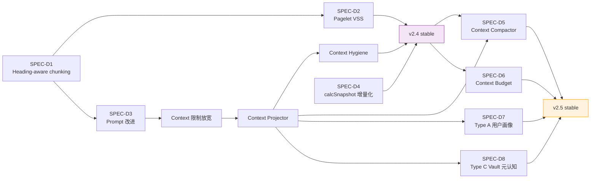
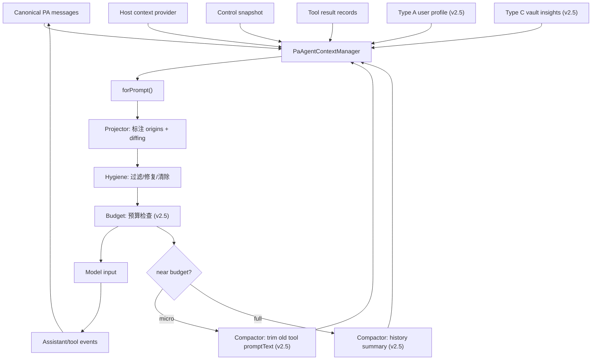
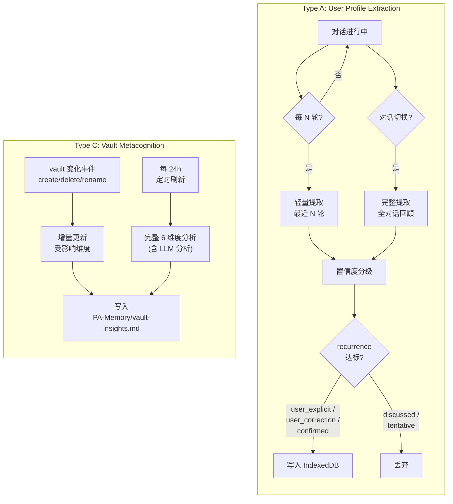

# SDD: AI Insight Foundation — Context & Memory 地基层

**Status:** [D] Drafting
**Phase:** v2.4 (地基层 + Context 限制 + Projector + Hygiene) + v2.5 (Compactor + Budget + Type A + Type C + Extraction)

---

## 0. Status & Blockers

### SPEC 编号

| SPEC | 标题 | Phase | 状态 |
| --- | --- | --- | --- |
| SPEC-D1 | Heading-aware chunking | v2.4 | `[D]` Drafting |
| SPEC-D2 | Pagelet VSS integration | v2.4 | `[D]` Drafting |
| SPEC-D3 | Prompt 改进 5 项 | v2.4 | `[D]` Drafting |
| SPEC-D4 | calcSnapshot 增量化 | v2.4 | `[D]` Drafting |
| SPEC-D5 | Context Compactor (micro + full compaction) | v2.5 | `[D]` Drafting |
| SPEC-D6 | Context Budget (chars/tokens 追踪 + provider usage 回写) | v2.5 | `[D]` Drafting |
| SPEC-D7 | Type A 用户画像 (自动提取 + 置信度 + recurrence) | v2.5 | `[D]` Drafting |
| SPEC-D8 | Type C Vault 元认知 (6 维度) + Memory extraction pipeline | v2.5 | `[D]` Drafting |

### 前置条件

- v2.3 stable 已发布（SQLite 迁移 + 内置 Skills 完成）
- v2.4 地基层 D1-D4 不依赖 Action Mode（C1/C2 推到 v2.6）
- Context 限制放宽（D1 附带）与 Projector/Hygiene 可在 v2.4 内顺序交付
- v2.5 的 Compactor/Budget/Type A/Type C 依赖 v2.4 Projector 作为注入基础设施

### 阻塞关系



---

## 1. Context

### 1.1 背景

PA Agent 当前的 context 管理是 loop-centered 模型：`PaAgentLoop` 持有 in-run transcript，与 hostContext / runtimeInstruction / controlSnapshot 一起直接送入 model adapter。没有显式的投影层（projection）、清洁层（hygiene）、预算追踪（budget）、压缩层（compaction），也没有跨会话记忆提取（memory extraction）。

研究报告见：
- [agent-context-management-research.md](./agent-context-management-research.md) — 5 个 agent 项目的 context 管理对比
- [agent-memory-extraction-research.md](./agent-memory-extraction-research.md) — 跨会话记忆提取与置信度机制对比

### 1.2 当前 context 瓶颈

| 瓶颈 | 现状 | 影响 |
| --- | --- | --- |
| observation 预算过紧 | `maxObservationChars = 24,000`（`pa-agent-loop.ts:187`） | 多文档检索时频繁截断，丢失有用上下文 |
| history 轮次硬上限 | `MAX_CHAT_HISTORY_TURNS = 20`（`pa-agent-runtime.ts:198`） | 长对话上下文丢失，用户需重复信息 |
| memory 检索量过小 | `MAX_MEMORY_DOCUMENTS = 4`（`pa-agent-runtime.ts:192`） | 多主题 vault 中检索覆盖不足 |
| 无投影层 | transcript 直送 model | 无法标注 message 来源、过滤冗余、做增量差分 |
| 无 compaction | 靠轮次/字符硬截断 | 无法在保留关键信息的同时释放上下文空间 |
| 无跨会话记忆 | 用户偏好全靠 vault 笔记 + 手工维护 | Agent 无法跨对话学习用户偏好和 vault 特征 |

### 1.3 v2.4 范围

v2.4 覆盖 7 项改进：

1. **Heading-aware chunking** (SPEC-D1) — 以 Markdown heading 为边界的分块策略
2. **Pagelet VSS integration** (SPEC-D2) — Pagelet 接入 VSS 检索
3. **Prompt 改进 5 项** (SPEC-D3) — 语言匹配/引用/不知道/工具定义去重/聊天历史沙箱+限长
4. **calcSnapshot 增量化** (SPEC-D4) — 减少重复计算开销
5. **Context 限制放宽** — 常量调整，基于 128K 模型基线
6. **Context Projector** (Phase 1-2) — 投影层，message origin 标注 + host context diffing + Type A/C 注入准备
7. **Context Hygiene** — 过滤 status-only results + 修复 orphan + 清除 partial

**Context 限制新值**（128K 模型基线，桌面/移动端统一不区分平台）：

| 参数 | 当前位置 | 旧值 | 新值 | 说明 |
| --- | --- | --- | --- | --- |
| `maxObservationChars` | `pa-agent-loop.ts:187` | 24,000 | 64,000 | 多文档检索空间增大 |
| `MAX_CHAT_HISTORY_TURNS` | `pa-agent-runtime.ts:198` | 20 | 不设上限 | 靠 `MAX_CONVERSATIONS=50` 控制总量 |
| `MAX_CHAT_HISTORY_CHARS`（新增） | `pa-agent-runtime.ts`（待新增） | 无 | 60,000 | history 注入量由 Projector 动态决定 |
| `MAX_MEMORY_DOCUMENTS` | `pa-agent-runtime.ts:192` | 4 | 8 | 多主题 vault 覆盖 |
| `MAX_MEMORY_CHARS` | `pa-agent-runtime.ts:193` | 2,000 | 4,000 | 单文档上下文增大 |
| `MAX_MEMORY_RERANK_CANDIDATES` | `pa-agent-runtime.ts:194` | 6 | 12 | 候选池扩大 |
| `MAX_MEMORY_CANDIDATE_EXCERPT_CHARS` | `pa-agent-runtime.ts:196` | 500 | 1,000 | 摘要更完整 |
| `MAX_MEMORY_CANDIDATE_CHUNKS` | `pa-agent-runtime.ts:195` | 2 | 3 | 单候选更多分块 |

> **注意**：history 存储不设轮次上限，靠 `MAX_CONVERSATIONS = 50`（`chat-history-store.ts:14`）控制总量。注入量由 Projector 动态决定。

### 1.4 v2.5 范围

v2.5 覆盖 4 项改进：

1. **Context Compactor** (SPEC-D5) — micro-compaction + full compaction（chat history 摘要）
2. **Context Budget** (SPEC-D6) — chars/tokens 追踪 + provider usage 回写
3. **Type A 用户画像** (SPEC-D7) — 自动 post-session extraction + 置信度分级 + recurrence 过滤
4. **Type C Vault 元认知** (SPEC-D8) — 6 维度 vault 分析 + Memory extraction pipeline

---

## 2. Goals

### In-Scope

**v2.4 地基层 + Context 管理基础设施：**
- Heading-aware chunking (SPEC-D1)
- Pagelet VSS integration (SPEC-D2)
- Prompt 改进 5 项 (SPEC-D3)
- calcSnapshot 增量化 (SPEC-D4)
- Context 限制放宽（常量调整）
- Context Projector Phase 1-2（投影层）
- Context Hygiene（清洁层）

**v2.5 高级 context + 跨会话记忆：**
- Context Compactor：micro-compaction + full compaction (SPEC-D5)
- Context Budget：chars/tokens 追踪 + provider usage 回写 (SPEC-D6)
- Type A 用户画像：自动提取 + 置信度 + recurrence (SPEC-D7)
- Type C Vault 元认知：6 维度分析 + Memory extraction pipeline (SPEC-D8)

### Non-Goals

- **Action Mode** (SPEC-C1/C2) — 推到 v2.6
- **Skill marketplace / 用户自定义 Skill** — 推到 v2.6+
- **ANN 索引**（HNSW / IVF）— 当前 brute-force 已满足召回需求
- **多模态 context**（图片/音频）— 不在本 SDD 范围
- **Citation feedback loop**（Codex 式引用反馈）— 过于复杂，可后续评估

---

## 3. 技术方案

### 3.1 Heading-aware Chunking (SPEC-D1)

> 详见独立 SDD（待起草）。

核心：以 Markdown heading 为边界做分块，保留 heading 层级上下文。替换当前的固定字符数分块策略。

### 3.2 Pagelet VSS Integration (SPEC-D2)

> 详见独立 SDD（待起草）。

核心：让 Pagelet 的 Review/Analysis 流程接入 VSS 向量检索，获取相关 vault 上下文。

### 3.3 Prompt 改进 (SPEC-D3)

> 详见独立 SDD（待起草）。

5 项改进：
1. 语言匹配（回复语言跟随用户输入）
2. 引用格式（structured citations）
3. 坦诚不知（honest uncertainty）
4. 工具定义去重（tool definition dedup）
5. 聊天历史沙箱 + 限长

### 3.4 calcSnapshot 增量化 (SPEC-D4)

> 详见独立 SDD（待起草）。

核心：`AgentControlSnapshot` 计算从全量重建改为增量更新，减少每轮计算开销。

### 3.5 Context Projector 设计

#### 3.5.1 组件架构

沿用 Orchestrator delegate 模式，4 个独立类 + 1 个 Manager 组合：

```
PaAgentContextManager
 ├── PaAgentContextProjector    (v2.4)
 ├── PaAgentContextHygiene      (v2.4)
 ├── PaAgentContextCompactor    (v2.5)
 └── PaAgentContextBudget       (v2.5)
```

| 组件 | 职责 | Phase |
| --- | --- | --- |
| `PaAgentContextManager` | 组合调用 4 个 delegate；持有 canonical in-run messages、host context snapshots、projection state | v2.4 |
| `PaAgentContextProjector` | 标注 message origins + host context diffing + 注入 Type A/C 上下文 | v2.4 |
| `PaAgentContextHygiene` | 过滤 status-only tool results + 修复 orphan tool results + 清除 partial/empty assistant messages | v2.4 |
| `PaAgentContextCompactor` | micro-compaction（old tool result 压缩）+ full compaction（chat history 摘要） | v2.5 |
| `PaAgentContextBudget` | chars/tokens 追踪 + provider usage 回写 + 预算超限触发 compaction | v2.5 |

数据流：



#### 3.5.2 Projector 详细设计 (v2.4 实现)

**Message Origins 标注**

为每条 canonical message 标注来源类型：

| Origin | 说明 | 示例 |
| --- | --- | --- |
| `user` | 用户输入 | 对话中的用户消息 |
| `assistant` | 模型回复 | Agent 生成的回答 |
| `tool_result` | 工具执行结果 | search_memory / record_note 等工具返回 |
| `host_context` | 宿主上下文 | vault 状态、当前笔记、平台信息 |
| `runtime_instruction` | 运行时指令 | runtimeInstruction 注入 |
| `compaction_summary` | 压缩摘要（v2.5） | full compaction 生成的历史摘要 |

**`forPrompt()` 边界**

`forPrompt()` 是 canonical messages 与 model input 之间的投影边界：

```
canonical messages → 标注 origins → Hygiene 过滤 → Projector 投影 → prompt
```

- 所有 model input 必须经过 `forPrompt()` 而非直接使用 transcript
- `forPrompt()` 可以是有损的（lossy），但 canonical 存储不能有损
- 现有的 `formatCanonicalHostContext()`（`pa-agent-runtime.ts:1817`）和 `formatSkillCatalog()`（`pa-agent-runtime.ts:1854`）将迁入 Projector

**Host Context Diffing**

- 首次注入完整 host context
- 后续仅注入变化的部分（diff），减少 prompt churn
- 参考：Codex `record_context_updates()` 差分注入模式

**参考实现**：
- Codex `for_prompt()` + `normalize_response_input()`
- Pi `transformContext()` + `convertToLlm()`
- Kimi Code `PromptOrigin` + `projector.project()`

#### 3.5.3 Hygiene 详细设计 (v2.4 实现)

**过滤 status-only tool results**

当 tool result 的 outcome 为以下值时，在投影中缩短或移除：
- `duplicate_skipped` — 重复检索跳过
- `policy_rejected` — 策略拒绝

保留 metadata（`sourceRecords`、`contextUsed`）用于 UI 展示，但不注入 prompt。

**修复 orphan tool results**

- 有 tool result 但无对应 tool call 的消息对（orphan）
- 投影时修复为完整的 call-result 对或静默移除
- 参考：Codex `normalize.rs` 的 `remove_orphan_outputs()`

**清除 partial/empty assistant messages**

- 移除空内容的 assistant messages
- 处理中断导致的 partial assistant turns（仅有 tool_use 无 text）
- 参考：Kimi Code `projector.ts` 的 partial message 清理

### 3.6 Context Compactor 设计 (SPEC-D5, v2.5)

#### 3.6.1 Micro-compaction

**触发策略**：混合策略（预算驱动 + 最近轮次保护）

- 当 observation 总量超过 **70% 阈值**时触发
- 从**最旧的 tool result** 开始压缩，向新方向推进，直到回到安全水位
- **最近 2 轮**的 tool results 永远不压缩（active evidence 保护）

**压缩格式**：

```
[Earlier search_memory: 4 docs from notes/xxx.md, notes/yyy.md]
```

**保留策略**：
- `sourceRecords` 保留（UI 引用不丢）
- `contextUsed` metadata 保留
- 仅压缩 `promptText` 内容为简短标记

**参考实现**：Kimi Code `micro.ts` — 将旧的大型 tool result 替换为紧凑标记

#### 3.6.2 Full Compaction (Chat History 摘要)

**摘要生成**：
- 使用 **chatModel**（主模型）生成摘要，不额外引入摘要专用模型
- 摘要 prompt 明确声明摘要仅供参考，最新用户消息优先级最高

**History 处理策略**：
- history 存储不设轮次上限（靠 `MAX_CONVERSATIONS = 50` 控制总量）
- `forPrompt()` 时：**最近 ~10 轮完整注入** + 更早的由主模型摘要
- 摘要结果**缓存**，不重复调用
- 摘要标注 `compaction_summary` origin

**安全机制**：
- 摘要生成为**异步**过程，不阻塞当前轮次
- 如果摘要期间 history 变化，摘要结果作废重新生成
- 参考：Hermes anti-thrashing 机制 — 连续压缩失败时跳过/延迟
- 参考：Pi safe cut-points — 不在 tool-call 对中间切割

### 3.7 Context Budget 设计 (SPEC-D6, v2.5)

**追踪维度**：
- prompt chars（投影后）
- prompt tokens（estimated，用于 provider 限额预判）
- tool result chars（单独追踪）
- actual provider usage（model response 返回的 usage 字段回写）

**预算超限联动**：
- 当预算接近限额时，通知 Compactor 触发 micro-compaction
- 预算信息通过 `forPrompt()` 返回，可用于诊断日志

**Provider usage 回写**：
- 从 model response 的 usage 字段读取实际 token 消耗
- 回写到 Budget tracker，校准下次估算
- 参考：Hermes `ContextCompressor` — 用 actual usage 避免对粗估过度反应

### 3.8 Type A 用户画像设计 (SPEC-D7, v2.5)

#### 3.8.1 数据来源

纯自动 **Post-session extraction**，用户无需操作。

**触发时机**：定时（每 N 轮）+ 对话边界（切换对话时）

| 触发条件 | 提取范围 | 成本 |
| --- | --- | --- |
| 每 N 轮轻量提取 | 只看最近 N 轮新增内容 | 低（局部上下文） |
| 对话切换时 | 完整对话回顾 | 中（全对话上下文） |
| `beforeunload` | best-effort 最后尝试 | 低（可能被中断） |

> **Open decision**: N 轮间隔的具体值（8? 10? 15?）待确定，见 §8。

#### 3.8.2 质量控制

置信度分级 + recurrence 过滤：

| 置信度来源 | 写入策略 | 说明 |
| --- | --- | --- |
| `user_explicit` | 直接写入 | 用户明确表达的偏好/指令 |
| `user_correction` | 直接写入 | 用户纠正 Agent 行为 |
| `inferred_behavior` | 需跨 **3 次独立对话**重复出现才确认写入 | 观察到的行为模式 |
| `discussed` | **丢弃** | 仅讨论过但无承诺的内容 |

**recurrence promotion 机制**（参考 Codex epistemic status + recurrence promotion）：
- `inferred_behavior` 首次出现时标记为 tentative，不写入
- 跨 3 次独立对话重复出现时 promote 为 confirmed，写入
- 避免将偶发行为误判为持久偏好

#### 3.8.3 存储

| 属性 | 设计 |
| --- | --- |
| 存储位置 | 插件内部 IndexedDB，**不在 vault 中** |
| 注入方式 | always-loaded，通过 Projector 注入 system prompt |
| 容量上限 | ~1,400 chars（参考 Hermes `USER.md` 的 ~1,375 chars） |
| 用户可见性 | Settings UI 中可查看和编辑 |
| 容量管理 | 接近上限时触发 LLM consolidation（参考 Hermes capacity-pressure curation） |

### 3.9 Type C Vault 元认知设计 (SPEC-D8, v2.5)

#### 3.9.1 6 个维度

| # | 维度 | 数据源 | API 成本 |
| --- | --- | --- | --- |
| 1 | 文件夹结构 | Obsidian API `vault.getAbstractFileByPath()` | 零 |
| 2 | 标签分布 | `metadataCache.getTags()` | 零 |
| 3 | 链接拓扑 | `metadataCache.resolvedLinks` | 零 |
| 4 | 写作习惯 | `vault.getAbstractFileByPath().stat` (创建/修改时间、字数) | 零 |
| 5 | 主题集群 | VSS embeddings k-means 聚类 | 零额外 embedding 成本（复用已有 embeddings） |
| 6 | 知识空白 | unresolved links 聚合 + LLM 分析 | 有 API 成本 |

> **Open decision**: 主题集群的 k 值（聚类数量）待确定，见 §8。

#### 3.9.2 调度

- **独立于 Type A** 的调度，不跟随对话节奏
- 触发条件：
  - vault 变化事件（`create` / `delete` / `rename`）— 增量更新受影响维度
  - 每 **24h** 完整刷新全部 6 维度
- LLM 分析（维度 6）仅在完整刷新时执行，增量事件不触发

#### 3.9.3 存储

| 属性 | 设计 |
| --- | --- |
| 存储位置 | vault 笔记 `PA-Memory/vault-insights.md` |
| 索引方式 | 被 VSS 自动索引，可通过 `search_memory` 按需检索 |
| 注入方式 | 不 always-loaded（体积较大），通过 Projector 按需注入相关片段 |
| 用户可见性 | 直接可见可编辑（vault 内 Markdown） |

### 3.10 Memory Extraction Pipeline (v2.5)

Type A 和 Type C 使用独立的调度管线：



**调度差异**：

| 维度 | Type A | Type C |
| --- | --- | --- |
| 节奏 | 跟随对话（每 N 轮 + 边界） | 跟随 vault 变化 + 低频定时 |
| LLM 调用 | 每次提取 1 次 | 仅完整刷新时 1 次（维度 6） |
| 存储目标 | IndexedDB | vault 笔记 |
| 注入方式 | always-loaded | on-demand |

---

## 4. 现有代码影响面

### 4.1 v2.4 改动范围

| 文件 | 改动类型 | 说明 |
| --- | --- | --- |
| `src/ai-services/pa-agent-loop.ts` | 修改 | `maxObservationChars` 默认值 24,000 → 64,000 |
| `src/ai-services/pa-agent-runtime.ts` | 修改 | 6 个 `MAX_*` 常量调整 + 新增 `MAX_CHAT_HISTORY_CHARS` + `MAX_CHAT_HISTORY_TURNS` 移除硬上限 |
| `src/ai-services/pa-agent-runtime.ts` | 修改 | `formatCanonicalHostContext()` / `formatSkillCatalog()` 迁入 Projector |
| `src/ai-services/pa-agent-context-manager.ts` | 新增 | `PaAgentContextManager` 组合类 |
| `src/ai-services/pa-agent-context-projector.ts` | 新增 | `PaAgentContextProjector` 投影层 |
| `src/ai-services/pa-agent-context-hygiene.ts` | 新增 | `PaAgentContextHygiene` 清洁层 |
| `src/ai-services/pa-agent-history.ts` | 修改 | `createPaAgentPersistedTurn()` 适配 origin 标注 |

### 4.2 v2.5 改动范围

| 文件 | 改动类型 | 说明 |
| --- | --- | --- |
| `src/ai-services/pa-agent-context-compactor.ts` | 新增 | `PaAgentContextCompactor` 压缩层 |
| `src/ai-services/pa-agent-context-budget.ts` | 新增 | `PaAgentContextBudget` 预算追踪 |
| `src/ai-services/pa-agent-user-profile.ts` | 新增 | Type A 用户画像提取 + 存储 |
| `src/ai-services/pa-agent-vault-metacognition.ts` | 新增 | Type C vault 元认知分析 |
| `src/ai-services/pa-agent-memory-extraction.ts` | 新增 | Memory extraction pipeline 调度 |
| `src/ai-services/pa-agent-context-manager.ts` | 修改 | 接入 Compactor + Budget delegates |
| `src/ai-services/pa-agent-context-projector.ts` | 修改 | 接入 Type A/C 注入 |
| `src/ai-services/pa-agent-loop.ts` | 修改 | 对话边界事件通知 extraction pipeline |

---

## 5. 测试策略

### 5.1 v2.4 测试

| 范围 | 方法 | 验证内容 |
| --- | --- | --- |
| Context 限制常量 | 单元测试 | 新默认值生效；旧行为不退化 |
| Projector | 单元测试 | `forPrompt()` 输出 === 当前 model input（Phase 1 行为等价） |
| Projector origins | 单元测试 | 每条 message 正确标注 origin |
| Hygiene | 单元测试 | orphan 修复、status-only 过滤、partial 清除 |
| 端到端 | Obsidian smoke | PA Agent chat 不退化；长对话 context 改善 |

### 5.2 v2.5 测试

| 范围 | 方法 | 验证内容 |
| --- | --- | --- |
| Micro-compaction | 单元测试 | 超过 70% 阈值触发；最近 2 轮保护；sourceRecords 保留 |
| Full compaction | 单元测试 | 摘要生成 + 缓存；safe cut-points；origin 标注 |
| Budget | 单元测试 | chars/tokens 追踪准确；provider usage 回写 |
| Type A | 集成测试 | 置信度分级正确；recurrence promotion 跨 3 对话 |
| Type C | 集成测试 | 6 维度数据提取；vault 变化增量更新 |
| 端到端 | Obsidian smoke | 跨对话记忆生效；vault-insights.md 内容合理 |

---

## 6. 风险

| 风险 | 影响 | 缓解 |
| --- | --- | --- |
| Context 限制放宽导致 API 成本增加 | 中 | 128K 基线下增量有限；Projector 动态控制实际注入量 |
| Projector Phase 1 行为不等价 | 高 | 严格测试 `forPrompt()` === 现有 model input |
| Compaction 摘要丢失关键上下文 | 高 | 最近 ~10 轮完整保留；sourceRecords 不压缩 |
| Type A 提取引入额外 LLM 成本 | 中 | 仅轻量提取（局部上下文）；频率可配置 |
| Type C LLM 分析成本 | 低 | 仅每 24h 一次；维度 1-5 零 API 成本 |
| Full compaction 竞态（摘要期间 history 变化） | 中 | 参考 Kimi Code 的变化检测 + 作废机制 |
| Type A recurrence 过滤导致有价值信息延迟写入 | 低 | `user_explicit` / `user_correction` 直接写入，不走 recurrence |
| Mobile 端 IndexedDB 容量 | 低 | Type A 上限 ~1,400 chars，远小于 IndexedDB 限额 |

---

## 7. Implementation Sequence

### v2.4 Worktree Map

```
master ─────┬─── WT-D1: feat/heading-aware-chunking ──┐
            │                                          │── merge D1 → master
            ├─── WT-D2: feat/pagelet-vss ─────────────┤── merge D2
            │                                          │
            └─── D3/D4/limits/projector/hygiene ───────┘── sequential on master
```

**交付顺序**：

1. **WT-D1** (`feat/heading-aware-chunking`) 与 **WT-D2** (`feat/pagelet-vss`) 并行开发
2. D1 merge 后，D3（Prompt 改进）sequential on master
3. D4（calcSnapshot 增量化）sequential on master
4. Context 限制放宽（常量调整）sequential on master
5. Projector Phase 1（`forPrompt()` 提取 + 行为等价测试）sequential on master
6. Projector Phase 2（origins 标注 + host context diffing）sequential on master
7. Hygiene（过滤 + 修复 + 清除）sequential on master

> D1/D2 是独立 worktree，可并行。D3-Hygiene 链有依赖关系，sequential on master。

### v2.5 Worktree Map

```
master ─────┬─── WT-D5: feat/context-compactor ────────┐
            │                                           │
            ├─── WT-D7: feat/user-profile-extraction ──┤── merge sequentially
            │                                           │
            └─── WT-D8: feat/vault-metacognition ──────┘
```

**交付顺序**：

1. **WT-D5** (`feat/context-compactor`) — Compactor + Budget 一起实现（Budget 是 Compactor 的触发源）
2. **WT-D7** (`feat/user-profile-extraction`) — Type A 用户画像，可与 D5 并行
3. **WT-D8** (`feat/vault-metacognition`) — Type C Vault 元认知 + extraction pipeline 调度，可与 D5/D7 并行
4. Sequential merge: D5 → D7 → D8 → master → smoke → release

> D6 (Budget) 与 D5 (Compactor) 紧密耦合，在同一 worktree 实现。

---

## 8. Open Decisions

### 已确认决策

| 决策 | 结论 | 说明 |
| --- | --- | --- |
| 检索窗口移动端值 | 已决策：统一不区分平台 | 128K 模型基线下桌面/移动端使用相同常量 |
| Context Projector 定位 | 已决策：v2.4 In-Scope | 不再是 Non-Goal |
| Type A/C 定位 | 已决策：v2.5 In-Scope | 不再是 Non-Goal |
| Type A 存储位置 | 已决策：IndexedDB | 不在 vault 中，避免用户困惑 |
| Type C 存储位置 | 已决策：vault 笔记 `PA-Memory/vault-insights.md` | 被 VSS 自动索引 |
| Full compaction 摘要模型 | 已决策：chatModel（主模型） | 不引入额外摘要专用模型 |
| History 轮次上限 | 已决策：不设上限 | 靠 `MAX_CONVERSATIONS=50` 控制总量 |
| Micro-compaction 最近轮次保护 | 已决策：最近 2 轮 | active evidence 保护 |
| Action Mode (C1/C2) 排期 | 已决策：推到 v2.6 | 从原 v2.5 延后 |

### 待决定

| 决策 | 候选方案 | 影响范围 | 预计决策时点 |
| --- | --- | --- | --- |
| Type A 提取的 N 轮间隔 | 8? 10? 15? | SPEC-D7 提取频率 + API 成本 | v2.5 SDD review 时 |
| Type C 主题集群的 k 值 | 待 vault 规模分析确定 | SPEC-D8 聚类质量 | v2.5 SDD review 时 |
| Micro-compaction 压缩标记的具体格式 | `[Earlier ...]` / `[Compressed ...]` / 其他 | SPEC-D5 prompt 可读性 | v2.4 Projector 实现后 |
| Host context diffing 粒度 | 按字段 diff / 全量 hash 比较 | Projector 实现复杂度 | v2.4 Projector Phase 2 实现时 |

---

## 9. 版本路线图

| 版本 | 范围 | 估时 | 前置 |
| --- | --- | --- | --- |
| **v2.4** | 地基层 5 项 (D1-D4) + Context 限制放宽 + Projector Phase 1-2 + Hygiene | ~3-4 周 | v2.3 stable |
| **v2.5** | Compactor + Budget + Type A + Type C + Extraction pipeline | ~4-5 周 | v2.4 stable |
| **v2.6** | Action Mode (SPEC-C1/C2) | 待定 | v2.5 stable + Framework v1 ≥ 8 周验证 |

```
2026-Q3  ┃ v2.4 开发: 地基层 ∥ Context Projector + Hygiene → v2.4 stable
2026-Q4  ┃ v2.5 开发: Compactor ∥ Type A ∥ Type C → v2.5 stable
2026-Q4+ ┃ v2.6 开发: Action Mode Phase 1 + Skill 扩展
```

---

## Appendix A: 术语对照

| 术语 | 定义 |
| --- | --- |
| Canonical messages | 完整的原始消息序列，不可有损，持久化到 `PaAgentPersistedTurn` |
| Projection / 投影 | 从 canonical messages 派生的 model-facing 视图，可有损 |
| Hygiene / 清洁 | 投影前的修复与过滤（orphan repair、status-only filter、partial cleanup） |
| Micro-compaction | 将旧的大型 tool result 的 `promptText` 替换为简短标记 |
| Full compaction | 将旧的对话历史摘要为 `compaction_summary` origin 的消息 |
| Type A | 用户画像（偏好、习惯、纠正），跨会话自动提取 |
| Type C | Vault 元认知（结构、标签、链接、写作习惯、主题、知识空白） |
| Origin | 消息来源标注，用于 projection 和 compaction 决策 |

## Appendix B: 研究参考映射

| PA Agent 组件 | 主要参考 | 次要参考 |
| --- | --- | --- |
| `PaAgentContextManager` | Codex `ContextManager` | Kimi Code `ContextMemory` |
| `PaAgentContextProjector` | Codex `for_prompt()` + Kimi Code `projector.project()` | Pi `transformContext()` |
| `PaAgentContextHygiene` | Codex `normalize.rs` | Kimi Code `projector.ts` |
| `PaAgentContextCompactor` | Kimi Code micro/full split | Hermes anti-thrashing |
| `PaAgentContextBudget` | Hermes `ContextCompressor` usage feedback | Codex token accounting |
| Type A 置信度 | Codex epistemic status + recurrence promotion | Hermes capacity-pressure curation |
| Type C vault 分析 | 原创设计（Obsidian API 特有） | — |
| Memory extraction pipeline | Codex two-phase async extraction | Hermes Nudge Engine |
