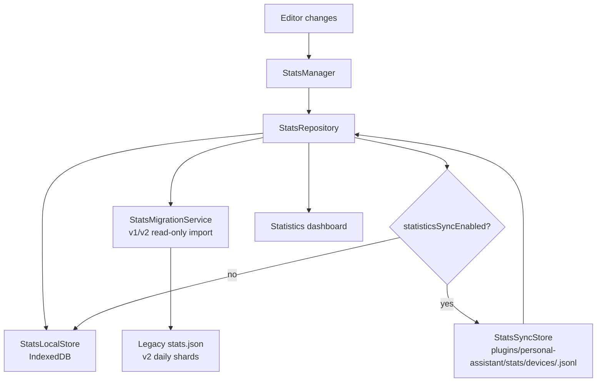

# Statistics v3 Plan

## Purpose

Statistics v3 makes Vault Statistics quiet by default while preserving an explicit path for users who want cross-device writing history.

Current v2 stores daily device shards under the vault configuration directory. That protects multi-device merge semantics, but Git-managed vaults expose many implementation JSON files as files to commit. v3 changes the default product contract:

- Statistics should show useful writing and vault trends.
- Default use should not create or update Statistics data files in the vault.
- Cross-device history remains available only after the user opts in.
- Old v2 data is imported as a read-only source. v3 does not automatically delete old history files.

## Product Contract

| Area | v3 decision |
| --- | --- |
| Default storage | Local IndexedDB only |
| Default vault writes | No new, updated, or deleted Statistics data files |
| Cross-device history | Optional setting |
| Sync file format | JSONL daily device snapshots |
| Sync file visibility | Only appears after sync is enabled |
| v2 migration | Automatic import to local store |
| v2 cleanup | Deferred; v3 MVP performs read-only import only |
| User-facing vocabulary | Statistics, writing history, cross-device history |
| Internal vocabulary | v2, shard, JSONL, IndexedDB, deviceId may appear only in code, diagnostics, or docs |

The default mode accepts that local writing history can be lost if the user clears Obsidian app data, changes device, or removes local browser storage. Vault notes remain the source of truth, and current totals can be recalculated from notes.

Automatic cleanup is intentionally not part of v3 MVP. Deleting v2 files can sync to other devices before those devices have imported their own visible history. v3 records migration metadata locally for diagnostics and leaves any future cleanup as an explicit user action or a later, separately reviewed feature.

## Storage Architecture



### Local Store

Add a `StatsLocalStore` backed by native IndexedDB. Tests should exercise business behavior through an injected memory implementation and cover the IndexedDB wrapper through injected IndexedDB API fakes. Production must not silently fall back to volatile in-memory storage; if local app storage is unavailable, Statistics should surface an unavailable local-history state without touching notes or writing vault data. Do not add a new IndexedDB test dependency for the first v3 implementation unless the tracker is updated first.

Records are stored by `recordKey = date + "\0" + deviceId`.

```ts
interface StatsDailyDeviceRecord {
  version: 3;
  vaultId: string;
  recordKey: string;
  date: string;
  deviceId: string;
  revision: number;
  updatedAt: string;
  activity: ActivityCounts;
  snapshot: SnapshotCounts;
}
```

Store migration and sync bookkeeping separately from each daily record. `cleanupStatus` is retained as compatibility/future-cleanup metadata; the v3 MVP never performs automatic cleanup. Minimum metadata:

```ts
interface StatsMigrationMetadata {
  v2ImportFingerprint: string;
  validShardCount: number;
  corruptShardCount: number;
  importedRecordKeyCount: number;
  aggregateHash: string;
  cleanupStatus: "not-started" | "complete" | "blocked" | "failed";
  cleanupTimestamp?: string;
  cleanupError?: string;
}

interface StatsSyncState {
  records: Record<string, {
    revision: number;
    hash: string;
    exportedAt: string;
  }>;
}
```

`vaultId` is generated once in plugin settings and reused. The local IndexedDB scope must include plugin id, `vaultId`, and a config-dir or base-path hash so copied vaults on the same machine do not accidentally share local Statistics storage. Do not derive the scope solely from vault name because users can rename vaults.

Record revision starts at `1`. Local edits increment the current device's daily record revision only when the normalized activity or snapshot changes. Legacy imports initialize revision to `1`. Sync imports preserve the source revision.

### Repository Facade

Introduce `StatsRepository` as the single persistence facade used by `StatsManager`.

Minimum interface:

```ts
interface StatsRepository {
  initialize(): Promise<void>;
  getDeviceId(): string;
  invalidateDashboardCache(): void;
  readDashboardData(): Promise<StatsDashboardData>;
  readLatestSnapshot(): Promise<SnapshotCounts | null>;
  readOwnShard(date: string): Promise<StatsDeviceShard | null>;
  writeOwnShard(shard: StatsDeviceShard): Promise<void>;
  checkpointSync(): Promise<void>;
  isStatsStorePath(path: string): boolean;
}
```

`StatsManager` continues to work with the current daily draft shape (`StatsDeviceShard`) and dashboard DTO (`StatsDashboardData`). v3 is a storage schema change, not a required dashboard DTO version change. `StatsRepository` converts daily drafts into v3 records internally.

After SPEC-02A, `StatsManager.flush()` should persist local state only. During SPEC-01 the v2 repository still preserves existing vault writes. Sync checkpointing is added in the sync phase as a separate repository method and runs only when `statisticsSyncEnabled` is true.

## Cross-Device Sync

Sync is opt-in through a setting named `Sync statistics history across devices`.

Setting description must explain the tradeoff: enabling sync creates Statistics history files in the vault so other devices can read them; Git users will see those files change.

Use one file per device:

```text
<vault.configDir>/plugins/personal-assistant/stats/devices/<deviceId>.jsonl
```

Each line is a complete daily device snapshot:

```json
{"version":3,"vaultId":"...","date":"2026-05-19","deviceId":"...","revision":3,"updatedAt":"2026-05-19T12:00:00.000Z","activity":{"words":10,"characters":50,"sentences":2,"pages":0.1,"footnotes":0,"citations":0},"snapshot":{"totalWords":1000,"totalCharacters":5000,"totalSentences":200,"totalFootnotes":0,"totalCitations":0,"totalPages":3.3,"files":20}}
```

Read all device JSONL files, ignore records with a mismatched `vaultId`, skip invalid lines or Git conflict marker lines with a recoverable error, and merge records by `date + deviceId`. Prefer higher `revision`; use `updatedAt` and `deviceId` as deterministic tie-breakers.

Checkpoint rules:

- Do not write JSONL while sync is disabled.
- Append only when the current device record's revision/hash differs from `StatsSyncState`.
- Trigger checkpoints on Statistics view open, idle timer, cross-day transition, and plugin unload as best effort.
- Do not rely on unload as the only sync path.
- Defer manual sync UI/API until after the first sync implementation.
- Do not compact JSONL in v3 phase 1; future compaction may rewrite only the current device's JSONL file.

## Migration And Cleanup

On v3 initialization:

1. Import existing configured legacy `settings.statsPath`, current config-dir `stats.json`, legacy `.obsidian/stats.json`, and v2 daily shards from current and legacy plugin-owned roots as read-only sources.
2. Normalize them into v3 records in IndexedDB.
3. Record migration metadata including import fingerprint, valid/corrupt shard counts, imported record key count, aggregate hash, compatibility cleanup status, and last import error.
4. Keep all legacy files in place. v3 does not call vault `remove` or `rmdir` for old Statistics data.
5. If validation fails, keep v2 files and surface a low-noise Statistics issue.

Do not create a JSONL backup by default. JSONL files appear only after cross-device sync is enabled.

Do not delete user notes. Do not delete unrelated files. Do not delete old Statistics data automatically. A future cleanup flow must be explicit, separately reviewed, and safe for users who sync vault files through Git or another file-sync system.

Expected cross-device behavior: if device A migrates before device B upgrades, device A imports the v2 history visible on device A and leaves the v2 files untouched. Device B can still import its own visible v2 files later if those files sync or remain available locally.

## UI And Settings

- Hide `Legacy Vault Stats File Path` from the normal settings UI. Keep the setting field only for compatibility.
- Add `Sync statistics history across devices`, default off.
- Default Statistics view does not show device count or device id.
- When sync is enabled and multi-device data exists, show a `Devices` metric.
- Use user-facing copy such as "Statistics history issue" and "Some old statistics could not be imported." Avoid v2/shard/IndexedDB/deviceId language in normal UI.

## Implementation Phases

### Phase 0: Spec Gate

Create this plan and the development tracker, then review the plan before runtime code changes begin.

### Phase 1: Store Facade Without Behavior Change

Add the `StatsRepository` facade while preserving v2 behavior. Extract only the parsing, normalization, aggregation, and dashboard cache helpers needed by the facade; avoid broad cleanup refactors in this phase.

### Phase 2A: Local v3 Store

Add IndexedDB-backed local storage and make default writes local-only. Stop creating or writing v2 daily shards in default mode.

### Phase 2B: v2 Read-Only Import

Import configured legacy stats and v2 daily shards into local records. Keep v2 files during this phase.

### Phase 2C: v2 Cleanup Deferral

Remove automatic cleanup from the MVP. Keep migration read-only, preserve old files, and document that cleanup requires a future explicit user action.

### Phase 3: Optional Cross-Device Sync

Add the settings toggle and per-device JSONL sync. Split local flush from sync checkpoint. Prepare the dashboard data needed to show device metrics only when sync is enabled and multi-device data is present.

### Phase 4: Polish, Smoke, And Closeout

Harden migration failure paths, settings copy, diagnostics, docs, and Obsidian smoke coverage. Defer JSONL compaction unless evidence shows the file grows too fast.

## Validation Strategy

Focused tests:

- v2 import is idempotent and preserves dashboard aggregates.
- Default mode does not call vault `mkdir`, `write`, `append`, `process`, `remove`, or `rmdir` for Statistics data.
- v2 cleanup does not run automatically.
- Corrupt v2 data records a recoverable issue while keeping old files untouched.
- Configured legacy `settings.statsPath`, current config-dir `stats.json`, legacy `.obsidian/stats.json`, current v2 root, and legacy v2 root are imported and deduplicated.
- Sync disabled never creates JSONL.
- Sync enabled appends to the current device JSONL only.
- Multi-device JSONL merge deduplicates by `date + deviceId`.
- JSONL conflict marker lines and bad lines are skipped without blocking local Statistics.
- A damaged current-device JSONL does not prevent local writes.
- Cross-day pending writes are not lost.
- UI hides device details when sync is off and shows devices only when sync is on with multi-device data.

Runtime smoke:

- Deploy to the test vault.
- Open Statistics in default mode and confirm no new v3 JSONL appears.
- Edit a note, switch leaves, reopen Statistics, and confirm dashboard updates.
- Enable sync, open Statistics, and confirm one device JSONL appears.
- Add a second synthetic or test-device JSONL and confirm multi-device aggregation.

## Open Risks

| Risk | Mitigation |
| --- | --- |
| IndexedDB unavailable or cleared | Show local Statistics unavailable/empty state; notes are unaffected |
| Old v2 files remain visible to Git users | Do not create new default vault files; defer cleanup to an explicit future flow instead of deleting history automatically |
| Automatic v2 cleanup deletes before all devices migrate | Avoided in v3 MVP by keeping v2 import read-only and never deleting old history automatically |
| JSONL grows over time | Append only changed records; defer compaction until growth is observed |
| Device clock drift affects merge | Use `revision` first, then deterministic tie-breakers |
| Unload sync is not guaranteed | Treat unload checkpoint as best effort and rely on idle/view-open checkpoints |
