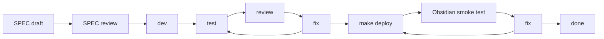

# v2 Post-Release SPEC-Driven Development

## Purpose

This tracker drives SPEC-first implementation of the 8 SDDs split out of the v2.1.2 review. Use [`v2.1.2-decisions.md`](./v2.1.2-decisions.md) as the frozen decision contract. Use this tracker to record approval gates, phase status (per release window v2.2 / v2.3 / v2.4 / v2.5), review records, verification evidence, and Obsidian smoke closeout for each SPEC-A* slice.

No runtime code should be changed under a SPEC until that SPEC is reviewed and marked `[A] Approved for implementation`.

## Source Relationship

| Document | Role | Conflict Rule |
| --- | --- | --- |
| [`v2.1.2-comprehensive-review.md`](./v2.1.2-comprehensive-review.md) | Frozen review snapshot (2026-06-01); contains the 5 decisions, 8 review dimensions, P0 list, and §8 driver fix. | Decisions in this snapshot are immutable; if real implementation diverges, record an Addendum here, do not edit the review. |
| [`v2.1.2-decisions.md`](./v2.1.2-decisions.md) | Frozen decision record indexing all 5 original decisions + Q1-Q8 拍板 + P0 list. | This is the contract source of truth for "what to build and when". This tracker must stay synchronized with it. |
| Root `./sdd-*.md` + archived `./archive/sdd-*.md` | Per-SPEC implementation specs. Active SDDs stay in root; completed historical SDDs move to archive. | Each SDD owns runtime detail; this tracker indexes status only. |
| Memory `[[v2-release-schedule]]` | v2.x version cadence (≥ 5 minor + 6 month gates). | This tracker references the schedule; cadence changes update both together. |

## Status Legend

| Mark | Meaning |
| --- | --- |
| `[ ]` | Todo |
| `[D]` | Drafting |
| `[R]` | Ready for review |
| `[A]` | Approved for implementation |
| `[~]` | Implementing |
| `[T]` | Triggered evaluation only — placeholder, no implementation until trigger fires |
| `[V]` | Review in progress |
| `[S]` | Obsidian smoke in progress |
| `[x]` | Done |
| `[!]` | Blocked |

## SPEC Approval Gates

A SPEC may move to `[R] Ready for review` only when all of these are true:

- Decision references in [`v2.1.2-decisions.md`](./v2.1.2-decisions.md) have been checked for drift.
- Implementation file:line references in the SDD have been re-grepped against the current `master` (line numbers in v2.1.2 may have shifted).
- The SDD lists implementation boundaries, expected code/test areas, non-goals, and verification commands.
- Acceptance checklist covers product behavior, runtime behavior, negative assertions, and verification commands.
- Risks have an owner and a closure condition.

A SPEC may move to `[A] Approved for implementation` only after review records:

- reviewer (subagent or human),
- date,
- result (approved / request changes),
- blocking findings and disposition,
- deferred items with owner, reason, unblock condition.

Runtime implementation must not begin while the owning SPEC is `[D]`, `[R]`, or `[!]`.
`[T]` SPECs do not begin implementation; they wait for trigger conditions documented in the SDD.

## Required Delivery Loop

Every implementation SPEC follows the repository refactor loop:

Loop rules:

- SPEC review must happen before runtime implementation starts.
- Runtime/UI phases must use subagent review when available; if unavailable, record the skip reason and residual risk.
- Runtime/UI phases require automated tests, `make deploy`, and real Obsidian test-vault smoke before completion.
- Docs-only phases may skip Obsidian smoke, but the skip and residual risk must be recorded.
- SPEC status changes must update Current Status, SPEC Index, Phase Ledger, Review Log, and Verification Log together.
- `[T]` SPECs do not enter the loop until trigger conditions in their SDD are met; trigger event is recorded in the Review Log.

## Current Status

| Field | Value |
| --- | --- |
| Created | 2026-06-01 |
| Decision contract source | [`v2.1.2-decisions.md`](./v2.1.2-decisions.md) |
| Current stage | A-series: SPEC-A0/A1/A3(non-H-1)/A4/A5 全部 `[x] Done`; SPEC-A2 `[D]`; SPEC-A3 H-1 `[D]` (>= 06/12 可执行); SPEC-A6/A7 `[D]` deferred to v2.3/v2.5; SPEC-A8/A9 `[T]`。B-series (2026-06-15 assessment-derived): SPEC-B1 `[~]` Implementing (HEAD 未提交); SPEC-B2 `[ ]` (毕业 gate); SPEC-B3/B4/B5 `[ ]` (v2.3)。C-series: SPEC-C1/C2 `[ ]` (v2.4)。Execution roadmap: [`development-roadmap.md`](./development-roadmap.md)。 |
| Runtime code changes in this pass | Review remediation: PA Agent history sandboxing, VSS search abort/rewrite safety, Obsidian Operations v1A capability invariant enforcement, chat setup banner refresh on settings save, and release/changelog/doc consistency fixes. |
| Open contract decisions | None. All 5 original decisions + Q1-Q8 拍板 are frozen in the decision record. |
| Blocked implementation areas | SPEC-A3 H-1 (>= 2026-06-12); SPEC-A6 (v2.3 + spike); SPEC-A7 (v2.5); SPEC-A8/A9 (triggered). `git push origin master` deferred per user. |
| Next required action | (1) Start SPEC-A2 (command palette cleanup: Memory advanced commands behind `showAdvancedMemoryControls` toggle; Featured Images limited to qwen) — touches `src/plugin.ts` addCommand registrations + `src/settings.ts` toggle. (2) After A2 lands + deploy + smoke, v2.2 batch is complete and `git push origin master` + PR is unblocked. (3) A1 follow-up: capture onboarding screenshots + add Manual-CN.md mirror (non-blocking, can ride alongside A2 PR). |

## SPEC Index

| SPEC | Goal | Status | Phase | Depends On | SDD File | Primary Areas | Exit Gate |
| --- | --- | --- | --- | --- | --- | --- | --- |
| SPEC-A0 | Freeze v2.1.2 review + author decision record + tracker | `[x]` Done | v2.1.2 (closeout) | None | (this file + [`v2.1.2-decisions.md`](./v2.1.2-decisions.md) + [`v2.1.2-comprehensive-review.md`](./v2.1.2-comprehensive-review.md)) | Docs | Review frozen, decisions immutable, tracker exists, all 8 SDDs cross-linked. |
| SPEC-A1 | Chat onboarding 链路(P0 #1+#2+#4) | `[x]` Done @`6ed1ea8`/`db0db7b`/`b251962`(smoke pass 2026-06-01) | v2.2 批 1 | SPEC-A0 | [`sdd-chat-onboarding-flow.md`](./archive/sdd-chat-onboarding-flow.md) | `./src/plugin.ts` ribbon(left=chat,right=modal)、`./src/chat/chat-view.ts` empty state(setupIssue banner)、`./src/custom.pcss` `.pa-chat-config-banner`、`README.md` "AI Chat in 60 seconds"、`Manual.md` AI Chat chapter | ✅ Ribbon 直达 chat、空状态 banner 引导配置、README + Manual Chat 章节齐备。Manual-CN.md 镜像 + onboarding 截图 follow-up 非阻塞。 |
| SPEC-A2 | 命令面板清理(P0 #8) | `[D]` Drafting | v2.2 批 2 | SPEC-A0 | [`sdd-command-palette-cleanup.md`](./sdd-command-palette-cleanup.md) | `./src/plugin.ts` `addCommand` 注册、`./src/settings.ts` toggle | Memory advanced 命令在 toggle 后;Featured Images 命令限定 `aiProvider === 'qwen'`。 |
| SPEC-A3 | 依赖与构建清理(P0 #5+#6+#7+H-1) | `[x]` PR-1 portion Done @`cee367a`(smoke pass 2026-06-01);H-1 still `[D]` deferred to >= 2026-06-12 | v2.2 批 2(H-1 推迟到 6/12 后) | SPEC-A0 | [`sdd-dependency-pruning.md`](./sdd-dependency-pruning.md) | `./jest.config.js`、`./package.json`、`./src/ai-services/pa-agent-required-capability-policy.ts` | ✅ P0 #5 patches/ 不存在(决策已闭)、#6 callout-manager 保留(决策已闭)、#7 jest coverage 默认关(已合并);H-1 4 个 deprecated 类型 6/12 之后删除。 |
| SPEC-A4 | 无消费者 flag 删除 | `[x]` Done @`8352261`(smoke pass 2026-06-01 on `fd6f9b5`) | v2.2 | SPEC-A0 | [`sdd-deprecated-flags-removal.md`](./archive/sdd-deprecated-flags-removal.md) | `./src/settings.ts`、`./src/ai-services/chat-service.ts`、`./src/plugin.ts` migrateSettings、`./__tests__/chat-service.test.ts`、`./scripts/changelog.mjs` | ✅ `paAgentAnswerStreamEnabled` / `nativeToolPlanningSmokeEnabled` 字段及全部消费点已删除;generated CHANGELOG breaking section 已记录;native tool planning 主链路 + 旧 settings 兼容均通过真机 smoke。 |
| SPEC-A5 | 三层 ToolRegistry 塌缩(决策②) | `[x]` Done @`6cd1042`(smoke pass 2026-06-01) | v2.2 | SPEC-A0 | [`sdd-tool-registry-collapse.md`](./archive/sdd-tool-registry-collapse.md) | `./src/ai-services/chat-tool-registry.ts`、`./src/ai-services/core-tool-provider.ts`(已删)、`./src/ai-services/capability-adapter.ts`、`./src/ai-services/pa-agent-runtime.ts`、`./src/ai-services/capability-types.ts` | ✅ `ToolRegistry` + `CoreToolProvider` 已删;wrap 改在 `capability-adapter.ts` parity 层(SDD §4.1 偏离,reviewer 接受);net −7 LOC src;`policy-engine.ts:35` action 防御线未动。 |
| SPEC-A6 | @sqliteai 供应商脱钩(决策⑤) | `[D]` Drafting | v2.3(v2.2 允许机会 spike) | SPEC-A0 | [`sdd-sqliteai-supplier-migration.md`](./sdd-sqliteai-supplier-migration.md) | `./package.json`、`./src/vss/sqlite-worker.ts`、`./src/vss/sqlite-inline-assets.ts` | `@sqlite.org/sqlite-wasm` 替换;3 处 `vector_*` SQL 改 JS brute-force + 热向量 cache;真机 10k chunk 性能持平;移动端不爆。 |
| SPEC-A7 | apiToken 链清理(决策④ part 2) | `[D]` Drafting | v2.5 | SPEC-A0 | [`sdd-apitoken-cleanup.md`](./sdd-apitoken-cleanup.md) | `./src/settings.ts`、`./src/utils.ts`、`./src/plugin.ts` 迁移段 | ~110 行迁移代码删除;v1.x 跳升用户在 release notes 提示重输 token;production confirmation 触达率达标。 |
| SPEC-A8 | React → Preact 评估(决策③触发型) | `[T]` Triggered evaluation only | 触发型(无固定 phase) | SPEC-A0 | [`sdd-react-preact-evaluation.md`](./sdd-react-preact-evaluation.md) | (占位) | 触发条件:新组件用 React 独占特性 OR 引入 preact/compat 不兼容库;触发后启动正式 SDD,本占位标 `[x] superseded`。 |
| SPEC-A9 | WASM 内联策略复议(决策①触发型) | `[T]` Triggered evaluation only | 触发型(无固定 phase) | SPEC-A0 | (无 SDD,仅决策记录) | (占位) | 触发条件:移动端冷启动 ≥ 5s / OOM ≥ 3 例 / P95 ≥ 5s;触发后开 SDD;不主动测 bundle。 |
| SPEC-B1 | Pagelet review 5 修复(C-2/H-1/H-3/H-6/iOS) + Orchestrator 拆分 + Bubble 行为 + Onboarding | `[~]` Implementing | v2.2 | SPEC-A0 | (无独立 SDD;源自 [`pagelet-v2-review-decisions`](../memory/project_pagelet_v2_review_decisions.md)) | `src/pagelet/orchestrator.ts`、`src/pagelet/pet/PetSvg.ts`、`src/pagelet/preload/PreloadEngine.ts`、`src/pagelet/bubble/BubbleView.ts`、`src/pagelet/dom-utils.ts`(新)、`src/plugin.ts`、`src/custom.pcss`、`src/locales/pagelet/*.json`、`src/settings/pagelet/index.ts` | HEAD 16 文件未提交变更全部 commit + pagelet jest 全过。 |
| SPEC-B2 | Pagelet beta 毕业 gate(commit + smoke + provider) | `[ ]` Todo | v2.2 | SPEC-B1, SPEC-A3 H-1 | (无 SDD;gate checklist in [`development-roadmap.md`](./development-roadmap.md)) | `manifest.json`、`manifest-beta.json`、`versions.json`、`CHANGELOG.md` | 全量 smoke + OQ002 ≥ 2 providers + v2.2.0 stable 发布。 |
| SPEC-B3 | 内置 Skills 扩展(obsidian-dataview, obsidian-templater) | `[ ]` Todo | v2.3 | SPEC-A0 | (待起草) | `skills/` 新目录、`src/ai-services/bundled-skill-catalog.ts`、`src/ai-services/bundled-skills.ts` | 新 skill SKILL.md + references 完整;catalog 注册;enabledSkillIds 默认包含;jest 通过。 |
| SPEC-B4 | v1 Pagelet 死代码移除 | `[ ]` Todo | v2.3 | SPEC-B2 | (无 SDD;机械删除) | `src/ui/pagelet/`(全目录)、barrel exports | `src/ui/pagelet/` 全部文件删除;grep 确认 0 运行时引用;jest 通过。 |
| SPEC-B5 | Orchestrator 进一步拆分(纯协调层) | `[ ]` Todo | v2.3 | SPEC-B1 | (待起草) | `src/pagelet/orchestrator.ts` | Orchestrator < 800 行;AnalysisSessionManager / ReviewNoteSaveFlow 独立;jest 通过。 |
| SPEC-C1 | Action Mode Phase 1(append-to-current-note) | `[ ]` Todo | v2.4 | SPEC-B2, Framework v1 ≥ 8 周验证, SPEC-B5 | (待起草:`operations-agent-mode-sdd.md`) | `src/ai-services/write-action-framework/`、`src/ai-services/policy-engine.ts`、`src/ai-services/capability-types.ts` | append action family 实现 + stale-reread mode B + policy tier + prompt injection tests。 |
| SPEC-C2 | Skill 用户自定义扩展 | `[ ]` Todo | v2.4 | SPEC-B3 | (待起草) | `src/ai-services/skill-router.ts`、`src/ai-services/skill-context-provider.ts`、`src/settings.ts` | allowed-tools enforce + Settings UI + (optional) vault-side discovery。 |

## Phase Ledger(by release window)

每行 = 一个 v2.x release 窗口,列出该窗口要落地的 SPEC 与状态。Per-SPEC 阶段(SPEC Review / Dev / Test / Code Review / Deploy / Smoke)在 SPEC 开始执行后填入对应 SDD 与本表。

### v2.1.2(closeout)

| SPEC | SPEC Review | Dev | Test | Code Review | Deploy | Smoke | Fix / Disposition |
| --- | --- | --- | --- | --- | --- | --- | --- |
| SPEC-A0 | Self-review on 2026-06-01: review.md 冻结 + decisions.md/tracker 创建 + 8 SDD 交叉链接通过 | Docs-only | Docs checks pending(待 §Verification Log 记录) | None required | Not applicable | Skipped(docs-only) | Done; v2.2 SPEC 进入 `[R]` 后启动正式 SPEC review。 |

### v2.2(P0 + flag 清扫 + Plan C 拆 SDD)

| SPEC | SPEC Review | Dev | Test | Code Review | Deploy | Smoke | Fix / Disposition |
| --- | --- | --- | --- | --- | --- | --- | --- |
| SPEC-A1 | Self-review 2026-06-01 (re-grep validated: ribbon at `plugin.ts:162`, `activeChatView` at `:693`, `getAISetupIssue` at `:1222`, `renderEmptyState` closure at `chat-view.ts:829`; SDD references to `VIEW_TYPE_CHAT`/`activateView(...)` corrected to use existing `activeChatView()` + `VIEW_TYPE_LLM`) | ✓ 2026-06-01 commits `6ed1ea8` (ribbon) → `db0db7b` (empty-state banner + CSS) → `b251962` (README + Manual) | ✓ tsc=0 + jest 4492/4492 on master HEAD `b251962` 2026-06-01;chat-related subset 540/540 | Skipped — incremental commits each scoped to a single concern; residual risk: SDD §4.2 prescribed a CN mirror in Manual-CN.md and onboarding screenshots (`docs/onboarding-*.png`) that are deferred to a follow-up commit | ✓ 2026-06-01 user `make deploy` to test vault | ✓ 2026-06-01 combined Obsidian smoke pass (A3 PR-1 + A5 + A1 tree on HEAD `13dbb2b`) | Done。Manual-CN.md mirror + onboarding screenshots deferred to follow-up (non-blocking, can ride alongside A4/A2 PR)。 |
| SPEC-A2 | Pending(批 2 独立 PR) | Pending | Pending | Pending | Pending | Pending(命令面板 Memory + Featured Images 显隐) | Drafted; awaits SPEC review pass。 |
| SPEC-A3(non-H-1) | Self-review 2026-06-01 (1-line scope, dry-run validated) | ✓ 2026-06-01 commit `0ec8b92` (worktree-agent-a076c1ec001c1c741) | ✓ tsc=0 + jest 916 (throwaway) + jest 4492 (master) on 2026-06-01 | Skipped — 1-line scope; residual risk: jest coverage threshold (master commit `046774b`) is inert when collectCoverage off (acceptable per A3 SDD) | ✓ 2026-06-01 user `make deploy` to test vault | ✓ 2026-06-01 combined Obsidian smoke pass (A3 PR-1 + A5 + A1 tree on HEAD `13dbb2b`);record-note callout 不退化 + jest coverage 默认关都符合预期 | Done。P0 #5/#6 closed by decision (no code change)。 |
| SPEC-A3(H-1) | Pending(PR-2,6/12 之后) | Pending | Pending | Pending | Pending | Pending(PA Agent chat 不退化) | Drafted; 6/12 之前不动。时间窗已开放(>= 06/12)。 |
| SPEC-B1 | Self (assessment-derived, review decisions 已确认) | `[~]` HEAD 16 files uncommitted | Pending(`npx jest --testPathPattern=pagelet`) | Pending | Pending(`make deploy`) | Pending(pagelet-smoke-checklist.md 全过) | Implementing; worktree `feat/pagelet-review-fixes`。 |
| SPEC-B2 | N/A (gate, not implementation) | N/A | N/A | N/A | Pending(beta.2 + soak + stable) | Pending(全量 smoke + OQ002 provider) | Blocked on SPEC-B1 + A3(H-1) + A2 completion。 |
| SPEC-A4 | Self-review 2026-06-01 (re-grep validated against master HEAD `e3914f2`: `settings.ts:70`/`:140`、`chat-service.ts:102` 三元、`plugin.ts:1062-1065`/`:1084-1087` 两段 migrate;all matches present, scope unchanged from SDD) | ✓ 2026-06-01 commit `8352261` (refactor) + companion `b8030b9` (A1 styles rebuild) | ✓ tsc=0 + jest 4492/4492 + chat-service 子集 65/65 on master HEAD `8352261` 2026-06-01 | Self-review only (deletion-only diff,无逻辑变更;两个 flag 自 v2.0.0 起已是 no-op) | ✓ 2026-06-01 用户 `make deploy` to test vault | ✓ 2026-06-01 Obsidian smoke pass on master HEAD `fd6f9b5`;native tool planning 主链路 + 旧 settings 残留 keys 兼容均符合预期 | Done。 |
| SPEC-A5 | Subagent review 2026-06-01: Approve (deviations: factories unmodified, parity layer added at registry edge — defensible per `__tests__/obsidian-operations-tools.test.ts:208` direct registry.execute() callsite;LOC delta accepted) | ✓ 2026-06-01 commits `9129ae6` → `dfa3f91` → `285d8f1` → `d98ceb2` (worktree-agent-a16cf09d50baee0e9) | ✓ tsc=0 + jest 916 (throwaway) + jest 4492 (master) on 2026-06-01 | ✓ Subagent Approve, no blockers (LOC delta −7 net source vs −500 SDD prediction;user accepted) | ✓ 2026-06-01 user `make deploy` to test vault | ✓ 2026-06-01 combined Obsidian smoke pass (A3 PR-1 + A5 + A1 tree on HEAD `13dbb2b`);全 capability 调用链行为不变 + chat / search_memory / WebSearch / record-note 均符合预期 | Done。 |

### v2.3(@sqliteai 脱钩 + spike + 真机回归)

| SPEC | SPEC Review | Dev | Test | Code Review | Deploy | Smoke | Fix / Disposition |
| --- | --- | --- | --- | --- | --- | --- | --- |
| SPEC-A6(spike) | Pending(`feat/sqlite-org-spike` 分支) | Pending | Pending(vss 全套) | Pending | Pending | Pending(真机 10k chunk + iOS / Android 内存) | Drafted; v2.2 期允许机会 spike,但不作为 v2.2 发版条件。 |
| SPEC-A6(迁移) | Pending(spike 通过后) | Pending | Pending | Pending | Pending | Pending(vault 升级数据完整性) | Drafted; 失败回 Plan B(另起 SDD)。 |
| SPEC-B3 | Pending | Pending | Pending | Pending | Pending | Pending(skill load + chat 验证) | 纯内容工作,可与 A6 并行 worktree。 |
| SPEC-B4 | Pending | Pending(文件删除 + barrel 更新) | Pending(grep 0 引用) | Pending | Pending | Pending | Sequential after A6 merge。 |
| SPEC-B5 | Pending | Pending | Pending | Pending | Pending | Pending(Orchestrator < 800 行) | Sequential after B1 merge。 |

### v2.4(解放窗口)

| SPEC | SPEC Review | Dev | Test | Code Review | Deploy | Smoke | Fix / Disposition |
| --- | --- | --- | --- | --- | --- | --- | --- |
| SPEC-C1 | Pending(SDD 在 v2.3 周期起草审查) | Pending | Pending | Pending | Pending | Pending(append action + stale-reread B + policy + injection tests) | 前置: Framework v1 ≥ 8 周验证 + Orchestrator 拆分。 |
| SPEC-C2 | Pending | Pending | Pending | Pending | Pending | Pending(allowed-tools enforce + Settings UI) | 可与 C1 并行 worktree。 |

### v2.5(apiToken 链清理,≥ 5 minor + ≥ 2026-11-29)

| SPEC | SPEC Review | Dev | Test | Code Review | Deploy | Smoke | Fix / Disposition |
| --- | --- | --- | --- | --- | --- | --- | --- |
| SPEC-A7 | Pending(production confirmation 前置) | Pending | Pending | Pending | Pending | Pending(干净启动 + v1.x 跳升 + multi-vault) | Drafted; 触发复议条件见 SDD §8。 |

### Triggered evaluation(无固定 phase)

| SPEC | Trigger Condition | Status |
| --- | --- | --- |
| SPEC-A8 | 新组件用 React 独占特性(Suspense+lazy / useTransition / useDeferredValue / concurrent / Server Components)OR 引入 preact/compat 不兼容第三方库 | `[T]` 占位;触发后启动正式 SDD。 |
| SPEC-A9 | 移动端冷启动 ≥ 5s / OOM ≥ 3 例独立用户 / 加载阶段被动遥测 P95 ≥ 5s | `[T]` 占位;触发后开 SDD。bundle 体积变化不触发。 |

## Traceability Matrix

| 决策 | SPEC | 关键 file:line(以 v2.1.2 为基线,实施前需 grep 验证) | Phase |
| --- | --- | --- | --- |
| 决策① WASM 不动(A3) | SPEC-A9 | (无代码改动;触发后定位 `./src/vss/sqlite-inline-assets.ts` + `./src/vss/sqlite-worker.ts`) | 触发型 |
| 决策② 三层塌缩(B3) | SPEC-A5 | `./src/ai-services/chat-tool-registry.ts`(整 class)、`./src/ai-services/core-tool-provider.ts`(整文件)、`./src/ai-services/chat-tool-factories.ts`、`./src/ai-services/capability-types.ts:20`(kind 注释)、`./src/ai-services/policy-engine.ts:35`(action 守卫,**不动**) | v2.2 或 v2.3 |
| 决策③ React 不切(C1) | SPEC-A8 | (无代码改动;触发后定位 `./package.json`、`./esbuild.config.mjs`、`./jest.config.js`、`./src/components/*.tsx`) | 触发型 |
| 决策④ part 1: flag 清扫 | SPEC-A4 | `./src/settings.ts:70`(类型)、`./src/settings.ts:140`(默认值)、`./src/ai-services/chat-service.ts:102`(消费点)、`./src/plugin.ts:1062-1065`(归一化)、`./src/plugin.ts:1084-1087`(已存在的 delete 块) | v2.2 |
| 决策④ part 2: apiToken 链 | SPEC-A7 | `./src/settings.ts:59-60`、`./src/utils.ts:189-190`(`personalAssitant` 常量)、`./src/utils.ts:192-`(`CryptoHelper` 类)、`./src/plugin.ts:14`(import)、`./src/plugin.ts:117-118`(字段)、`./src/plugin.ts:1172-1196`(migrateSettings)、`./src/plugin.ts:1219-1221`(`getLegacyAPITokenSecretId`)、`./src/plugin.ts:1224-1227`(legacy fallback) | v2.5 |
| 决策⑤ @sqliteai 脱钩 | SPEC-A6 | `./package.json`(依赖替换)、`./src/vss/sqlite-worker.ts:339-622`(3 处 `vector_*` SQL)、`./src/vss/sqlite-inline-assets.ts`(WASM 路径)、`./src/vss/schema.ts`(若存在) | v2.3 |
| P0 #1 ribbon 直达 | SPEC-A1 | `./src/plugin.ts:162-165`(addRibbonIcon,需 grep 验证) | v2.2 批 1 |
| P0 #2 空状态 banner | SPEC-A1 | `./src/chat/chat-view.ts:829-861`(`renderEmptyState`,需 grep 验证) | v2.2 批 1 |
| P0 #3 4 个 deprecated 类型 | SPEC-A3 (H-1) | `./src/ai-services/pa-agent-required-capability-policy.ts:25,42,52,77`(类型)、`:99-101`(签名 inline) | v2.2 批 2,6/12 之后 |
| P0 #4 README + Manual | SPEC-A1 | `./README.md`、`./Manual.md`、`./docs/onboarding-*.png`(新增) | v2.2 批 1 |
| P0 #5 patches/ 残留 | SPEC-A3 | (确认不存在) | v2.2 批 2(PR-1) |
| P0 #6 obsidian-callout-manager | SPEC-A3 | `./package.json`、`./src/callout.ts:4`、`./src/plugin.ts:4`、`./src/types/obsidian-callout-manager.d.ts:1`、`./__tests__/plugin-record-note.test.ts:50`、`./__tests__/callout.test.ts:4`(路径 A 保留) | v2.2 批 2(PR-1) |
| P0 #7 jest coverage | SPEC-A3 | `./jest.config.js:20`(`collectCoverage: true` 改注释或 false) | v2.2 批 2(PR-1) |
| P0 #8 命令面板清理 | SPEC-A2 | `./src/plugin.ts`(addCommand 调用,需 grep 验证)、`./src/settings.ts`(`showAdvancedMemoryControls` toggle) | v2.2 批 2 |
| §8 决策驱动力修正 | (横向) | (无代码改动;反映在 SPEC-A8 / SPEC-A9 触发条件 + decisions.md §0/§4) | v2.1.2 review 时点 |

## Verification Log

| Date | SPEC / Phase | Scope | Command / Method | Result | Notes |
| --- | --- | --- | --- | --- | --- |
| 2026-06-01 | SPEC-A0 | 文档冻结 + 交叉链接 | Manual review of [`v2.1.2-comprehensive-review.md`](./v2.1.2-comprehensive-review.md) Status header + decision/tracker cross-links | Passed | Review 头部已加 Frozen 标识;decisions.md 引用 review.md + tracker;tracker 引用 decisions.md + 8 SDD;8 SDD 各自含 Phase 标识。 |
| 2026-06-01 | SPEC-A3 PR-1 + SPEC-A5 + docs(umbrella) | Throwaway worktree merge validation | `git worktree add --detach /tmp/pa-merge-test master` + 3 sequential `git merge --no-ff` of docs / A3 / A5 + `npx tsc --noEmit --skipLibCheck` + `npm test` | Passed (3 auto-merges;tsc=0;jest 57 suites / 916 tests) | Throwaway used symlinked node_modules;lower test count vs master is path-resolution artifact, no failures。Worktree cleaned up post-validation。 |
| 2026-06-01 | master post-merge sanity | tsc + jest on master HEAD `510efcf` | `npx tsc --noEmit --skipLibCheck` + `npm test` | Passed (tsc=0;jest 265 suites / 4492 tests in 8.7s) | Authoritative green;master ready for `make deploy` + smoke。Rollback anchor `pre-v2.1.2-merge` → `6a262d8` retained。 |
| 2026-06-01 | SPEC-A1 Commit 1 (ribbon) | Targeted regression on `plugin-record-note.test.ts` after `addEventListener` mock extension | `npx jest __tests__/plugin-record-note.test.ts` | Passed (5 suites / 75 tests) | Confirms ribbon mock contract widening does not break existing record-note behavior。 |
| 2026-06-01 | SPEC-A1 Commit 2 (empty-state banner) | Chat-related tests after `renderEmptyState` setupIssue path + CSS tweak | `npx jest src/chat/ __tests__/chat-view` | Passed (5 suites / 540 tests) | Banner branch executes only when `getAISetupIssue()` returns non-null;default chips path unchanged。 |
| 2026-06-01 | SPEC-A1 full sanity | tsc + jest on master HEAD `b251962` after all 3 A1 commits | `npx tsc --noEmit --skipLibCheck` + `npm test` | Passed (tsc=0;jest 265 suites / 4492 tests in 6.6s) | Authoritative green post-A1;master ready for combined Step 1 + A1 deploy + smoke。 |
| 2026-06-01 | Combined Step 1 + A1 Obsidian smoke | Real Obsidian test vault on master HEAD `13dbb2b` (after `make deploy`) | User-driven manual smoke per tracker checklist (ribbon left/right click;empty-state banner show/clear;capability dispatch;jest config) | Passed | Smoke green;A3(non-H-1) + A5 + A1 cleared the deploy gate;v2.2 batch 1 + 批 2 PR-1 portion fully closed。Manual-CN.md + onboarding screenshots remain as A1 follow-up docs (non-blocking)。 |
| 2026-06-01 | SPEC-A4 dev cycle | tsc + jest on master HEAD `8352261` after flag removal commit | `npx tsc --noEmit --skipLibCheck` + `npx jest __tests__/chat-service.test.ts` + `npm test` | Passed (tsc=0;jest 5 suites / 65 tests targeted;jest 265 suites / 4492 tests full in 5.4s) | Authoritative green post-A4 dev;master ready for `make deploy` + smoke。Companion `b8030b9` 仅为 A1 `.pa-chat-config-banner` CSS 重新生成,无逻辑变更。 |
| 2026-06-01 | SPEC-A4 Obsidian smoke | Real Obsidian test vault on master HEAD `fd6f9b5` (after `make deploy`) | User-driven manual smoke (chat path / native tool planning / record-note / search_memory + 旧 settings 残留 `paAgentAnswerStreamEnabled` / `nativeToolPlanningSmokeEnabled` keys 加载) | Passed | Smoke green;两个 deprecated flag 移除不影响主链路,旧 settings 加载亦无错误。SPEC-A4 翻 `[x] Done`。 |

(后续 SPEC `[R]` → `[A]` → `[~]` → `[T]` → `[V]` → `[S]` → `[x]` 期间产生的 verification 命令在此追加。)

## Review Log

| Date | Scope | Reviewer | Result | Findings / Disposition |
| --- | --- | --- | --- | --- |
| 2026-06-01 | v2.1.2 review 5 决策 + Q1-Q8 不确定性 | 用户(主决策)+ 多 subagent(支持分析) | Frozen | 5 原始决策 + Q1-Q8 拍板全部入 [`v2.1.2-decisions.md`](./v2.1.2-decisions.md);review.md 加 Frozen header + F4 修正 + §8 决策驱动力章节。 |
| 2026-06-01 | 9 个 SPEC 拆分（A1-A9） | Wave 1.B/C/D/E 多 subagent | Drafted | 7 个 SDD (A1-A7) 进入 `[D]` Drafting;触发型 SDD-A8 标 `[T]`;SPEC-A9 仅决策记录无 SDD,占位 `[T]`。 |
| 2026-06-01 | tracker / decisions / SDD 一致性自检 | Self (Wave 1+2 closeout) | Fixed | 5 项 across 6 文件:B-1 `[[]]` reference 格式不统一(7 处)、B-4 memory 中 "今天到期" 与 today=2026-06-01 矛盾、+3 项小修;2 commits in worktree (`738796a` + `77d2a5a`)。 |
| 2026-06-01 | SPEC-A5 implementation diff | Subagent code-review (worktree-agent-a16cf09d50baee0e9 commits `9129ae6`→`dfa3f91`→`285d8f1`→`d98ceb2`) | Approve (no blockers) | 偏离 SDD §3/§4.1:`chat-tool-factories.ts` 未改,wrap 移到 `capability-adapter.ts` parity 层(理由:`__tests__/obsidian-operations-tools.test.ts:208` 直接调 `registry.execute()`,要求 entry-point parity)。LOC delta −7 net src(SDD 预测 −500),用户已接受。`policy-engine.ts:35` action 守卫未动。 |
| 2026-06-01 | SPEC-A1 implementation (3 commits) | Self-review only (incremental commits, each tsc + targeted jest green) | Self-approve, no blockers | 偏离 SDD §4.1:采用 Plan A(单 ribbon icon + contextmenu 右键弹 modal),与 SDD 推荐一致。SDD §4 提及的 `VIEW_TYPE_CHAT` / `activateView(VIEW_TYPE_CHAT)` 在仓库中实际为 `VIEW_TYPE_LLM` / `activeChatView()`;实施已对齐现仓库命名。SDD §4.2 假设 `hasConfiguredAPIToken` 可能不存在,实际已存在于 `plugin.ts:1216`,且更具体的 `getAISetupIssue()` 已存在于 `:1222`,空状态 banner 直接复用后者(返回 string \| null,既检测又给文案)。`pa-chat-config-banner` CSS class 在 `custom.pcss` 末端追加,样式微调(gap + max-width),未引入红色错误态。SDD §4.3 要求三张截图(`docs/onboarding-*.png`)与 Manual-CN.md 镜像 — 两者均推迟到 follow-up,残余风险已记入 Phase Ledger 与 Verification Log。`hasConfiguredAPIToken` / `getAISetupIssue` / `activeChatView` 等 helper 全部复用,未引入新 helper。 |
| 2026-06-01 | Combined Step 1 + A1 smoke closeout | User (real Obsidian test vault) | Pass (no blockers) | 用户在 master HEAD `13dbb2b` 上 `make deploy` + 真机 smoke 确认 A3 PR-1 + A5 + A1 tree 全部行为符合预期。三个 SPEC 同步翻 `[x] Done`。v2.2 批 1 + 批 2 PR-1 部分完全闭合,下一步为 SPEC-A4(flag removal)→ SPEC-A2(命令面板)顺序实施。`pre-v2.1.2-merge` → `6a262d8` 回滚锚点保留以备后续 SmokeFix 需要。 |
| 2026-06-01 | SPEC-A4 implementation diff | Self-review only (deletion-only;无逻辑变更;两个 flag 自 v2.0.0 起已是 no-op) | Self-approve, no blockers | 删除 7 处:`settings.ts` 类型字段 (`:70`) + 默认值 (`:140`)、`chat-service.ts` `SMOKE_NATIVE_TOOL_CALLING_VALIDATIONS` import + 三元 `nativeToolPlanningOptions` (折叠为单对象)、`plugin.ts` migrateSettings 两段 (`nativeToolPlanningSmokeEnabled` 归一化 + `paAgentAnswerStreamEnabled` delete 块)、`chat-service.test.ts` fixture 类型字段 + 默认值 (2 处)。`scripts/changelog.mjs` 生成 `Removed (Breaking)` section 记录两 flag 移除及历史背景。`SMOKE_NATIVE_TOOL_CALLING_VALIDATIONS` 常量本身保留(`__tests__/ai-utils.test.ts` 仍引用,SDD §4.1 允许)。Companion commit `b8030b9` 提交属于 A1 build artifact 重新生成 (`styles.css` 加入 `.pa-chat-config-banner` 规则),与 A4 解耦但同一推送。 |
| 2026-06-01 | SPEC-A4 smoke closeout | User (real Obsidian test vault on master HEAD `fd6f9b5`) | Pass (no blockers) | 用户 `make deploy` + 真机 smoke 确认两个 deprecated flag 移除不影响 chat / native tool planning / record-note / search_memory 等主链路;旧 settings 中残留 key 加载亦无错误。SPEC-A4 同步翻 `[x] Done`。v2.2 Step 2 仅余 SPEC-A2(命令面板清理)+ SPEC-A3 H-1(>= 6/12)未闭合。 |

(后续 SPEC review/code review/smoke 评审记录在此追加。)

## Update Rules

- 本 tracker 是 v2 后续发版唯一活跃 SPEC tracker。
- SPEC 状态变化必须同时更新 Current Status、SPEC Index、Phase Ledger、Review Log、Verification Log。
- 决策语言变化必须同步修订 [`v2.1.2-decisions.md`](./v2.1.2-decisions.md) + 本 tracker;不得只动一边。
- 不得将运行时/UI SPEC 标 `[A] Approved for implementation` 而无 Review Log 记录。
- 不得将运行时/UI SPEC 标 `[x] Done` 而无自动化测试 + `make deploy` + Obsidian smoke 证据(或显式 deferral)。
- `[T]` SPEC 触发条件满足时,在 Review Log 记录触发事件,起草正式 SDD,本占位 SPEC 标 `[x] superseded` 并链接到新 SDD。
- file:line 引用以 v2.1.2 为基线;每个 SPEC 进入 `[A]` 前必须 re-grep 验证行号偏移并在 SDD 内修正。
