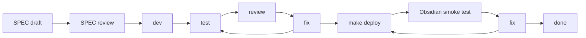

# v2 Post-Release SPEC-Driven Development

## Purpose

This tracker drives SPEC-first implementation of the 8 SDDs split out of the v2.1.2 review. Use [`v2.1.2-decisions.md`](./v2.1.2-decisions.md) as the frozen decision contract. Use this tracker to record approval gates, phase status (per release window v2.2 / v2.3 / v2.4 / v2.5), review records, verification evidence, and Obsidian smoke closeout for each SPEC-A* slice.

No runtime code should be changed under a SPEC until that SPEC is reviewed and marked `[A] Approved for implementation`.

## Source Relationship

| Document | Role | Conflict Rule |
| --- | --- | --- |
| [`v2.1.2-comprehensive-review.md`](./v2.1.2-comprehensive-review.md) | Frozen review snapshot (2026-06-01); contains the 5 decisions, 8 review dimensions, P0 list, and §8 driver fix. | Decisions in this snapshot are immutable; if real implementation diverges, record an Addendum here, do not edit the review. |
| [`v2.1.2-decisions.md`](./v2.1.2-decisions.md) | Frozen decision record indexing all 5 original decisions + Q1-Q8 拍板 + P0 list. | This is the contract source of truth for "what to build and when". This tracker must stay synchronized with it. |
| `./docs/sdd-*.md`(8 文件) | Per-SPEC implementation specs. | Each SDD owns runtime detail; this tracker indexes status only. |
| Memory `[[v2-release-schedule]]` | v2.x version cadence (≥ 5 minor + 6 month gates). | This tracker references the schedule; cadence changes update both together. |

## Status Legend

| Mark | Meaning |
| --- | --- |
| `[ ]` | Todo |
| `[D]` | Drafting |
| `[R]` | Ready for review |
| `[A]` | Approved for implementation |
| `[~]` | Implementing |
| `[T]` | Triggered evaluation only — placeholder, no implementation until trigger fires |
| `[V]` | Review in progress |
| `[S]` | Obsidian smoke in progress |
| `[x]` | Done |
| `[!]` | Blocked |

## SPEC Approval Gates

A SPEC may move to `[R] Ready for review` only when all of these are true:

- Decision references in [`v2.1.2-decisions.md`](./v2.1.2-decisions.md) have been checked for drift.
- Implementation file:line references in the SDD have been re-grepped against the current `master` (line numbers in v2.1.2 may have shifted).
- The SDD lists implementation boundaries, expected code/test areas, non-goals, and verification commands.
- Acceptance checklist covers product behavior, runtime behavior, negative assertions, and verification commands.
- Risks have an owner and a closure condition.

A SPEC may move to `[A] Approved for implementation` only after review records:

- reviewer (subagent or human),
- date,
- result (approved / request changes),
- blocking findings and disposition,
- deferred items with owner, reason, unblock condition.

Runtime implementation must not begin while the owning SPEC is `[D]`, `[R]`, or `[!]`.
`[T]` SPECs do not begin implementation; they wait for trigger conditions documented in the SDD.

## Required Delivery Loop

Every implementation SPEC follows the repository refactor loop:

Loop rules:

- SPEC review must happen before runtime implementation starts.
- Runtime/UI phases must use subagent review when available; if unavailable, record the skip reason and residual risk.
- Runtime/UI phases require automated tests, `make deploy`, and real Obsidian test-vault smoke before completion.
- Docs-only phases may skip Obsidian smoke, but the skip and residual risk must be recorded.
- SPEC status changes must update Current Status, SPEC Index, Phase Ledger, Review Log, and Verification Log together.
- `[T]` SPECs do not enter the loop until trigger conditions in their SDD are met; trigger event is recorded in the Review Log.

## Current Status

| Field | Value |
| --- | --- |
| Created | 2026-06-01 |
| Decision contract source | [`v2.1.2-decisions.md`](./v2.1.2-decisions.md) |
| Current stage | 7 implementation SDDs drafted (`[D]` A1-A7); 1 triggered SDD (`[T]` A8); 1 placeholder SPEC w/o SDD (`[T]` A9); SPEC-A0 closed at `[x]` (review/decisions docs frozen). Awaiting SPEC review pass before any `[A]` transition. |
| Runtime code changes in this pass | None. Wave 1+2 produced docs only: review snapshot, decision record, tracker, and 8 SDDs. |
| Open contract decisions | None. All 5 original decisions + Q1-Q8 拍板 are frozen in the decision record. |
| Blocked implementation areas | SPEC-A6 (@sqliteai) starts at v2.3 only; SPEC-A7 (apiToken) starts at v2.5 only; SPEC-A8/A9 await trigger events. SPEC-A4 H-1 sub-item starts after 2026-06-12 only. |
| Next required action | Move SPEC-A1 / SPEC-A2 / SPEC-A3 / SPEC-A4 / SPEC-A5 from `[D]` to `[R]` for v2.2 batch review, then approve and start implementation per the v2.2 phase ledger. |

## SPEC Index

| SPEC | Goal | Status | Phase | Depends On | SDD File | Primary Areas | Exit Gate |
| --- | --- | --- | --- | --- | --- | --- | --- |
| SPEC-A0 | Freeze v2.1.2 review + author decision record + tracker | `[x]` Done | v2.1.2 (closeout) | None | (this file + [`v2.1.2-decisions.md`](./v2.1.2-decisions.md) + [`v2.1.2-comprehensive-review.md`](./v2.1.2-comprehensive-review.md)) | Docs | Review frozen, decisions immutable, tracker exists, all 8 SDDs cross-linked. |
| SPEC-A1 | Chat onboarding 链路(P0 #1+#2+#4) | `[D]` Drafting | v2.2 批 1 | SPEC-A0 | [`sdd-chat-onboarding-flow.md`](./sdd-chat-onboarding-flow.md) | `./src/plugin.ts` ribbon、`./src/chat/chat-view.ts` empty state、`README.md`、`Manual.md` | Ribbon 直达 chat;空状态 banner 引导配置;README + Manual Chat 章节齐备。 |
| SPEC-A2 | 命令面板清理(P0 #8) | `[D]` Drafting | v2.2 批 2 | SPEC-A0 | [`sdd-command-palette-cleanup.md`](./sdd-command-palette-cleanup.md) | `./src/plugin.ts` `addCommand` 注册、`./src/settings.ts` toggle | Memory advanced 命令在 toggle 后;Featured Images 命令限定 `aiProvider === 'qwen'`。 |
| SPEC-A3 | 依赖与构建清理(P0 #5+#6+#7+H-1) | `[D]` Drafting | v2.2 批 2(H-1 推迟到 6/12 后) | SPEC-A0 | [`sdd-dependency-pruning.md`](./sdd-dependency-pruning.md) | `./jest.config.js`、`./package.json`、`./src/ai-services/pa-agent-required-capability-policy.ts` | patches 验证、callout-manager 保留决策、jest coverage 默认关、4 个 deprecated 类型删除(6/12 后)。 |
| SPEC-A4 | 无消费者 flag 删除 | `[D]` Drafting | v2.2 | SPEC-A0 | [`sdd-deprecated-flags-removal.md`](./sdd-deprecated-flags-removal.md) | `./src/settings.ts`、`./src/ai-services/chat-service.ts`、`./src/plugin.ts` migrateSettings | `paAgentAnswerStreamEnabled` / `nativeToolPlanningSmokeEnabled` 字段及全部消费点删除;CHANGELOG breaking 记录。 |
| SPEC-A5 | 三层 ToolRegistry 塌缩(决策②) | `[D]` Drafting | v2.2 或 v2.3 | SPEC-A0 | [`sdd-tool-registry-collapse.md`](./sdd-tool-registry-collapse.md) | `./src/ai-services/chat-tool-registry.ts`、`./src/ai-services/core-tool-provider.ts`、`./src/ai-services/chat-tool-factories.ts`、`./src/ai-services/capability-types.ts` | `ToolRegistry` + `CoreToolProvider` 删除;factory 直产 capability;-500 LOC;`policy-engine.ts:35` action 防御线不动。 |
| SPEC-A6 | @sqliteai 供应商脱钩(决策⑤) | `[D]` Drafting | v2.3(v2.2 允许机会 spike) | SPEC-A0 | [`sdd-sqliteai-supplier-migration.md`](./sdd-sqliteai-supplier-migration.md) | `./package.json`、`./src/vss/sqlite-worker.ts`、`./src/vss/sqlite-inline-assets.ts` | `@sqlite.org/sqlite-wasm` 替换;3 处 `vector_*` SQL 改 JS brute-force + 热向量 cache;真机 10k chunk 性能持平;移动端不爆。 |
| SPEC-A7 | apiToken 链清理(决策④ part 2) | `[D]` Drafting | v2.5 | SPEC-A0 | [`sdd-apitoken-cleanup.md`](./sdd-apitoken-cleanup.md) | `./src/settings.ts`、`./src/utils.ts`、`./src/plugin.ts` 迁移段 | ~110 行迁移代码删除;v1.x 跳升用户在 release notes 提示重输 token;production confirmation 触达率达标。 |
| SPEC-A8 | React → Preact 评估(决策③触发型) | `[T]` Triggered evaluation only | 触发型(无固定 phase) | SPEC-A0 | [`sdd-react-preact-evaluation.md`](./sdd-react-preact-evaluation.md) | (占位) | 触发条件:新组件用 React 独占特性 OR 引入 preact/compat 不兼容库;触发后启动正式 SDD,本占位标 `[x] superseded`。 |
| SPEC-A9 | WASM 内联策略复议(决策①触发型) | `[T]` Triggered evaluation only | 触发型(无固定 phase) | SPEC-A0 | (无 SDD,仅决策记录) | (占位) | 触发条件:移动端冷启动 ≥ 5s / OOM ≥ 3 例 / P95 ≥ 5s;触发后开 SDD;不主动测 bundle。 |

## Phase Ledger(by release window)

每行 = 一个 v2.x release 窗口,列出该窗口要落地的 SPEC 与状态。Per-SPEC 阶段(SPEC Review / Dev / Test / Code Review / Deploy / Smoke)在 SPEC 开始执行后填入对应 SDD 与本表。

### v2.1.2(closeout)

| SPEC | SPEC Review | Dev | Test | Code Review | Deploy | Smoke | Fix / Disposition |
| --- | --- | --- | --- | --- | --- | --- | --- |
| SPEC-A0 | Self-review on 2026-06-01: review.md 冻结 + decisions.md/tracker 创建 + 8 SDD 交叉链接通过 | Docs-only | Docs checks pending(待 §Verification Log 记录) | None required | Not applicable | Skipped(docs-only) | Done; v2.2 SPEC 进入 `[R]` 后启动正式 SPEC review。 |

### v2.2(P0 + flag 清扫 + Plan C 拆 SDD)

| SPEC | SPEC Review | Dev | Test | Code Review | Deploy | Smoke | Fix / Disposition |
| --- | --- | --- | --- | --- | --- | --- | --- |
| SPEC-A1 | Pending(批 1 同 PR) | Pending | Pending | Pending | Pending | Pending(三步真机:ribbon → 空状态 → 配置流) | Drafted; awaits SPEC review pass。 |
| SPEC-A2 | Pending(批 2 独立 PR) | Pending | Pending | Pending | Pending | Pending(命令面板 Memory + Featured Images 显隐) | Drafted; awaits SPEC review pass。 |
| SPEC-A3(non-H-1) | Pending(批 2 独立 PR;PR-1 立即可发) | Pending | Pending | Pending | Pending | Pending(record-note callout 不退化 + jest coverage 默认关) | Drafted; H-1 子项推迟到 PR-2(6/12 后)。 |
| SPEC-A3(H-1) | Pending(PR-2,6/12 之后) | Pending | Pending | Pending | Pending | Pending(PA Agent chat 不退化) | Drafted; 6/12 之前不动。 |
| SPEC-A4 | Pending | Pending | Pending | Pending | Pending | Pending(native tool planning 主链路不退化) | Drafted; awaits SPEC review pass。 |
| SPEC-A5 | Pending(可 v2.2 或顺延 v2.3) | Pending | Pending | Pending | Pending | Pending(全 capability 调用链行为不变) | Drafted; window 视 v2.2 P0 完成度决定。 |

### v2.3(@sqliteai 脱钩 + spike + 真机回归)

| SPEC | SPEC Review | Dev | Test | Code Review | Deploy | Smoke | Fix / Disposition |
| --- | --- | --- | --- | --- | --- | --- | --- |
| SPEC-A6(spike) | Pending(`feat/sqlite-org-spike` 分支) | Pending | Pending(vss 全套) | Pending | Pending | Pending(真机 10k chunk + iOS / Android 内存) | Drafted; v2.2 期允许机会 spike,但不作为 v2.2 发版条件。 |
| SPEC-A6(迁移) | Pending(spike 通过后) | Pending | Pending | Pending | Pending | Pending(vault 升级数据完整性) | Drafted; 失败回 Plan B(另起 SDD)。 |

### v2.4(解放窗口)

| SPEC | SPEC Review | Dev | Test | Code Review | Deploy | Smoke | Fix / Disposition |
| --- | --- | --- | --- | --- | --- | --- | --- |
| (无固定 SPEC) | — | — | — | — | — | — | v2.4 解放;可填入 Action mode 早期 / Skill 扩展 / 其他 P1。 |

### v2.5(apiToken 链清理,≥ 5 minor + ≥ 2026-11-29)

| SPEC | SPEC Review | Dev | Test | Code Review | Deploy | Smoke | Fix / Disposition |
| --- | --- | --- | --- | --- | --- | --- | --- |
| SPEC-A7 | Pending(production confirmation 前置) | Pending | Pending | Pending | Pending | Pending(干净启动 + v1.x 跳升 + multi-vault) | Drafted; 触发复议条件见 SDD §8。 |

### Triggered evaluation(无固定 phase)

| SPEC | Trigger Condition | Status |
| --- | --- | --- |
| SPEC-A8 | 新组件用 React 独占特性(Suspense+lazy / useTransition / useDeferredValue / concurrent / Server Components)OR 引入 preact/compat 不兼容第三方库 | `[T]` 占位;触发后启动正式 SDD。 |
| SPEC-A9 | 移动端冷启动 ≥ 5s / OOM ≥ 3 例独立用户 / 加载阶段被动遥测 P95 ≥ 5s | `[T]` 占位;触发后开 SDD。bundle 体积变化不触发。 |

## Traceability Matrix

| 决策 | SPEC | 关键 file:line(以 v2.1.2 为基线,实施前需 grep 验证) | Phase |
| --- | --- | --- | --- |
| 决策① WASM 不动(A3) | SPEC-A9 | (无代码改动;触发后定位 `./src/vss/sqlite-inline-assets.ts` + `./src/vss/sqlite-worker.ts`) | 触发型 |
| 决策② 三层塌缩(B3) | SPEC-A5 | `./src/ai-services/chat-tool-registry.ts`(整 class)、`./src/ai-services/core-tool-provider.ts`(整文件)、`./src/ai-services/chat-tool-factories.ts`、`./src/ai-services/capability-types.ts:20`(kind 注释)、`./src/ai-services/policy-engine.ts:35`(action 守卫,**不动**) | v2.2 或 v2.3 |
| 决策③ React 不切(C1) | SPEC-A8 | (无代码改动;触发后定位 `./package.json`、`./esbuild.config.mjs`、`./jest.config.js`、`./src/components/*.tsx`) | 触发型 |
| 决策④ part 1: flag 清扫 | SPEC-A4 | `./src/settings.ts:70`(类型)、`./src/settings.ts:140`(默认值)、`./src/ai-services/chat-service.ts:102`(消费点)、`./src/plugin.ts:1062-1065`(归一化)、`./src/plugin.ts:1084-1087`(已存在的 delete 块) | v2.2 |
| 决策④ part 2: apiToken 链 | SPEC-A7 | `./src/settings.ts:59-60`、`./src/utils.ts:189-190`(`personalAssitant` 常量)、`./src/utils.ts:192-`(`CryptoHelper` 类)、`./src/plugin.ts:14`(import)、`./src/plugin.ts:117-118`(字段)、`./src/plugin.ts:1172-1196`(migrateSettings)、`./src/plugin.ts:1219-1221`(`getLegacyAPITokenSecretId`)、`./src/plugin.ts:1224-1227`(legacy fallback) | v2.5 |
| 决策⑤ @sqliteai 脱钩 | SPEC-A6 | `./package.json`(依赖替换)、`./src/vss/sqlite-worker.ts:339-622`(3 处 `vector_*` SQL)、`./src/vss/sqlite-inline-assets.ts`(WASM 路径)、`./src/vss/schema.ts`(若存在) | v2.3 |
| P0 #1 ribbon 直达 | SPEC-A1 | `./src/plugin.ts:162-165`(addRibbonIcon,需 grep 验证) | v2.2 批 1 |
| P0 #2 空状态 banner | SPEC-A1 | `./src/chat/chat-view.ts:829-861`(`renderEmptyState`,需 grep 验证) | v2.2 批 1 |
| P0 #3 4 个 deprecated 类型 | SPEC-A3 (H-1) | `./src/ai-services/pa-agent-required-capability-policy.ts:25,42,52,77`(类型)、`:99-101`(签名 inline) | v2.2 批 2,6/12 之后 |
| P0 #4 README + Manual | SPEC-A1 | `./README.md`、`./Manual.md`、`./docs/onboarding-*.png`(新增) | v2.2 批 1 |
| P0 #5 patches/ 残留 | SPEC-A3 | (确认不存在) | v2.2 批 2(PR-1) |
| P0 #6 obsidian-callout-manager | SPEC-A3 | `./package.json`、`./src/callout.ts:4`、`./src/plugin.ts:4`、`./src/types/obsidian-callout-manager.d.ts:1`、`./__tests__/plugin-record-note.test.ts:50`、`./__tests__/callout.test.ts:4`(路径 A 保留) | v2.2 批 2(PR-1) |
| P0 #7 jest coverage | SPEC-A3 | `./jest.config.js:20`(`collectCoverage: true` 改注释或 false) | v2.2 批 2(PR-1) |
| P0 #8 命令面板清理 | SPEC-A2 | `./src/plugin.ts`(addCommand 调用,需 grep 验证)、`./src/settings.ts`(`showAdvancedMemoryControls` toggle) | v2.2 批 2 |
| §8 决策驱动力修正 | (横向) | (无代码改动;反映在 SPEC-A8 / SPEC-A9 触发条件 + decisions.md §0/§4) | v2.1.2 review 时点 |

## Verification Log

| Date | SPEC / Phase | Scope | Command / Method | Result | Notes |
| --- | --- | --- | --- | --- | --- |
| 2026-06-01 | SPEC-A0 | 文档冻结 + 交叉链接 | Manual review of [`v2.1.2-comprehensive-review.md`](./v2.1.2-comprehensive-review.md) Status header + decision/tracker cross-links | Passed | Review 头部已加 Frozen 标识;decisions.md 引用 review.md + tracker;tracker 引用 decisions.md + 8 SDD;8 SDD 各自含 Phase 标识。 |

(后续 SPEC `[R]` → `[A]` → `[~]` → `[T]` → `[V]` → `[S]` → `[x]` 期间产生的 verification 命令在此追加。)

## Review Log

| Date | Scope | Reviewer | Result | Findings / Disposition |
| --- | --- | --- | --- | --- |
| 2026-06-01 | v2.1.2 review 5 决策 + Q1-Q8 不确定性 | 用户(主决策)+ 多 subagent(支持分析) | Frozen | 5 原始决策 + Q1-Q8 拍板全部入 [`v2.1.2-decisions.md`](./v2.1.2-decisions.md);review.md 加 Frozen header + F4 修正 + §8 决策驱动力章节。 |
| 2026-06-01 | 9 个 SPEC 拆分（A1-A9） | Wave 1.B/C/D/E 多 subagent | Drafted | 7 个 SDD (A1-A7) 进入 `[D]` Drafting;触发型 SDD-A8 标 `[T]`;SPEC-A9 仅决策记录无 SDD,占位 `[T]`。 |

(后续 SPEC review/code review/smoke 评审记录在此追加。)

## Update Rules

- 本 tracker 是 v2 后续发版唯一活跃 SPEC tracker。
- SPEC 状态变化必须同时更新 Current Status、SPEC Index、Phase Ledger、Review Log、Verification Log。
- 决策语言变化必须同步修订 [`v2.1.2-decisions.md`](./v2.1.2-decisions.md) + 本 tracker;不得只动一边。
- 不得将运行时/UI SPEC 标 `[A] Approved for implementation` 而无 Review Log 记录。
- 不得将运行时/UI SPEC 标 `[x] Done` 而无自动化测试 + `make deploy` + Obsidian smoke 证据(或显式 deferral)。
- `[T]` SPEC 触发条件满足时,在 Review Log 记录触发事件,起草正式 SDD,本占位 SPEC 标 `[x] superseded` 并链接到新 SDD。
- file:line 引用以 v2.1.2 为基线;每个 SPEC 进入 `[A]` 前必须 re-grep 验证行号偏移并在 SDD 内修正。
