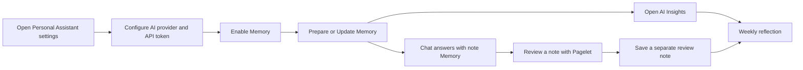
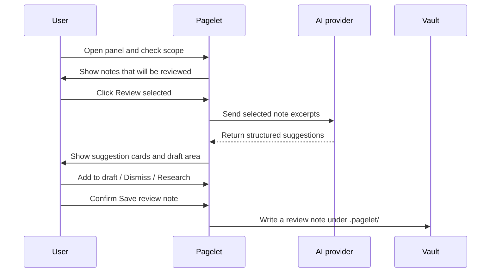
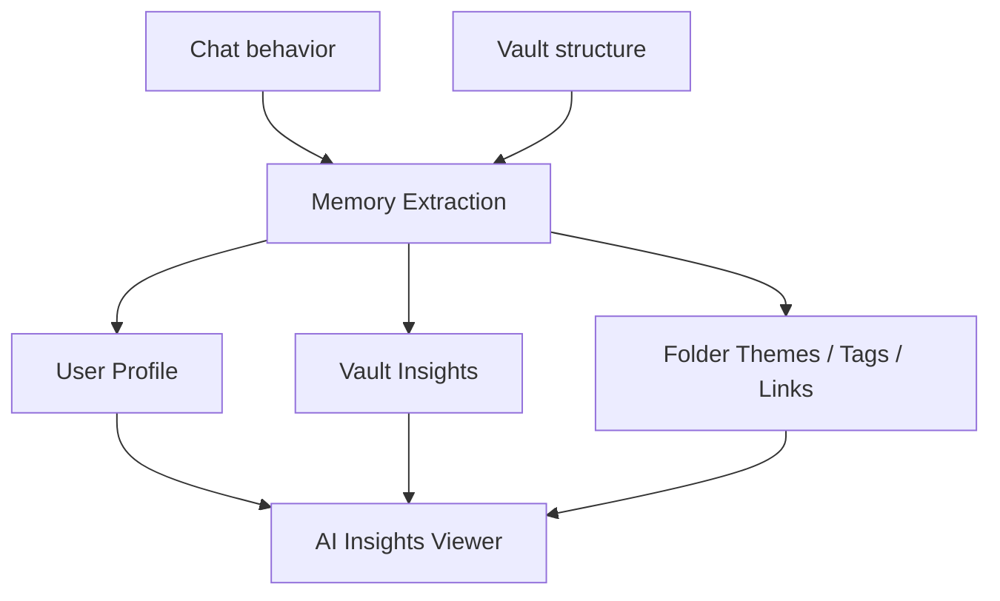
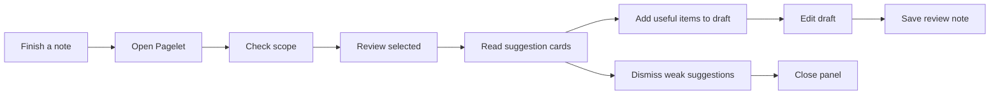

# v2.7 User Guide: AI Insights, Memory, and Pagelet Best Practices

[Chinese version](./v2.7-user-guide.md)

v2.7 turns Personal Assistant into a more complete "understand, review, and
reflect" workflow for your Obsidian vault:

- Chat answers the question in front of you.
- Memory lets Chat use prepared context from your notes after you approve it.
- AI Insights shows longer-term patterns from your conversations and vault.
- Pagelet reviews notes without rewriting the source note.
- Research and Action Mode help you check evidence, preview changes, and keep
  final control before anything is written.

This guide is written for everyday users. You do not need to understand VSS,
embeddings, OPFS, or other implementation details.

## Quick Start



Recommended first run:

1. Configure an AI provider, model, base URL, and API token in Settings.
2. Enable Memory and follow the prompt to prepare Memory from your notes.
3. Open a Markdown note you know well.
4. Run `Pagelet: Open Pagelet`.
5. Check the Pagelet scope before calling the AI provider.
6. Click `Review selected (1)`.
7. Ask Chat a question about the current note.
8. Run `Personal Assistant: Show AI Insights` and inspect User Profile and
   Vault Insights.

If you want to test safely first, start in a test vault or with one non-sensitive
note.

## Main Entry Points

| Goal | Entry point | Best used for |
| --- | --- | --- |
| Chat with AI | Left ribbon Personal Assistant icon / Open Chat | Ask about a note, summarize ideas, use Memory |
| Prepare Memory | Settings -> Memory -> Prepare Memory | First-time setup for note-aware Chat |
| Update Memory | Settings -> Memory -> Update memory now | After changing many notes |
| View AI Insights | Command palette `Show AI Insights` / Settings -> Memory | Review user profile, vault themes, tags, links, writing habits |
| Open Pagelet | `Pagelet: Open Pagelet` | Inspect scope before calling AI |
| Use Pagelet Pet bubble | Click the Pagelet Pet | Open prepared findings, review the current note, discover related notes, or generate a summary |
| Review current note | `Pagelet: Review current note` | Quick review for the note you just wrote |
| Research a suggestion | `Research` on a Pagelet suggestion card | Check evidence before acting |
| Save a review record | `Save review note` in the Pagelet preview | Keep a separate review note without editing the source |

The quickest way to find a feature is to search for `Memory`, `AI Insights`, or
`Pagelet` in the command palette.

## Visual Overview

### AI Chat and Memory

Personal Assistant Chat can use Memory from your notes after you approve the
setup. Before preparing Memory, the plugin explains what note text may be sent
to your configured AI provider and that provider calls may use credits.

<div align="center">
  
</div>

### Pagelet Review Flow

Pagelet is a review workflow, not an auto-rewriter. It reads the notes you
select, returns structured suggestions, and lets you decide whether to save a
separate review note.



For detailed Pagelet steps, see the [Pagelet user guide](./pagelet-user-guide.md).

### Existing Media Assets

These assets can be reused in README, release notes, or the release page:

- AI Chat / Personal Assistant demo: `docs/Personal-Assitant-With-AI.gif`
- AI featured image generation demo: `docs/featured-images-ai-generation.mp4`
- Historical workflow demos: `docs/personal-assistant-v1.3.6.gif`,
  `docs/personal-assistant-v1.3.3.gif`

The v2.7-specific release video has not been recorded yet. Keep the recording
plan and English subtitle sources with the final video assets, then link the
release to a real GitHub-hosted video once it exists.

## How to Use AI Insights

AI Insights is a normal user-facing Memory entry point in v2.7. It lets you
inspect long-term signals that the assistant has built from conversations and
vault analysis.

You may see:

- `User Profile`: durable preferences, goals, and working style from chats.
- `Vault Insights`: recurring themes and patterns across the vault.
- `Folder Themes`: what different folders appear to contain.
- `Tag Taxonomy`: how tags are being used.
- `Link Topology`: structure implied by links and backlinks.
- `Writing Habits`: patterns in how you capture and maintain notes.



Best practices:

- Open AI Insights during weekly reviews, not after every single chat.
- Treat insights as prompts for reflection, not as facts.
- If the viewer is empty, use Chat and Memory for a while first.
- Do not treat AI Insights as a WebSearch, Memory, or current-note switch; those capabilities still follow the current chat request and settings.
- Keep secrets, private credentials, and highly sensitive notes out of Memory.

## Memory Best Practices

Memory is useful when Chat should answer from your prepared notes instead of
only the current prompt.

Recommended habits:

- Start with a small vault or one topic folder if you are testing.
- Use Memory exclude paths for sensitive folders.
- Run `Update memory now` after a large writing or editing session.
- Use normal Chat answers for quick general questions that do not need your
  vault context.
- Read the Memory prompt carefully before approving provider calls.

Good prompts:

```text
Based on my recent project notes, summarize the three most important decisions this week.
```

```text
Only use Memory related to Pagelet. What follow-ups still look unresolved?
```

```text
Which ideas about AI Insights have appeared repeatedly in my recent notes?
```

Avoid prompts like:

```text
Clean up my whole vault automatically. Do not ask for confirmation.
```

Use a safer version:

```text
List the folders you would clean up and explain why. Do not modify notes yet.
```

## Pagelet Best Practices

Pagelet is most valuable as a second look after you finish writing.



Practical tips:

- Use `Current` for your first review. Do not start with `Last 7 days`.
- Always check `Included` and `Skipped` before calling the AI provider.
- Treat Pagelet suggestions as review material, not commands.
- Expand the preview before saving a review note.
- Review notes are saved separately under `.pagelet/` by default.
- v2.7 verified mobile basics, layout, and entry points, but final Pagelet
  confirm/save remains caveated. Use desktop for important saves.

## Discovery and Research

Discovery is best for finding connections and gaps. Research is best for taking
one suggestion and preparing a follow-up question in Chat.

| Scenario | Use | What to do |
| --- | --- | --- |
| Find related ideas | Discovery | Use the connection graph and click related-note nodes |
| Find missing evidence or next steps | Discovery | Read gap / follow-up cards |
| Check one suggestion with outside sources | Research | Let Chat prefill a research prompt, then review it before sending |
| Unsure whether the suggestion is right | Source / Related notes | Return to the original notes and decide yourself |

Research does not auto-submit Chat and does not modify notes. It prepares the
question so you can inspect it first.

## Weekly Review Workflow

Use the v2.7 features together:

1. Write normally during the week.
2. At the end of each day, run Pagelet on key notes.
3. Save useful review notes under `.pagelet/`.
4. On Friday, run `Update memory now`.
5. Open AI Insights and inspect User Profile and Vault Insights.
6. Ask Chat:

```text
Use this week's Memory and AI Insights to summarize the three themes I kept returning to.
For each theme, suggest the smallest next action.
```

7. Copy only the conclusions you accept into your weekly note or project note.

The core rule: AI helps surface patterns; you keep the judgment.

## Privacy, Cost, and Safety

Before using AI features, confirm:

- You trust the configured AI provider.
- You know which notes may be sent to that provider.
- Memory prepare/update and Pagelet review may consume API credits.
- Pagelet shows the target path and preview before saving.
- Write flows should be previewed and confirmed before they modify anything.
- Sensitive credentials and private IDs should not be placed in notes that
  participate in Memory or AI review.

## Release Video Script

Recommended length: 90 seconds or less.

| Time | Screen | Message |
| --- | --- | --- |
| 0-10s | Open Obsidian and Personal Assistant settings | v2.7 focuses on Chat, Memory, AI Insights, and Pagelet |
| 10-25s | Enable Memory and show Prepare / Update | Memory explains data flow and cost before approval |
| 25-40s | Open AI Insights Viewer | Inspect User Profile, Vault Insights, and Folder Themes |
| 40-60s | Open a note and run Pagelet | Check scope before Review selected |
| 60-75s | Show suggestion cards, Add to draft, Research | AI suggests; the user decides |
| 75-90s | Show Save review note preview | Save a separate review note without editing the source |

Recording notes:

- Use a test vault.
- Do not show API tokens, private notes, or sensitive paths.
- Keep each shot around 10-15 seconds.
- Only show paths that were covered by smoke evidence.
- Do not imply mobile final confirm/save is fully verified in v2.7.
- After recording, add the video file or GitHub attachment link to README and
  release notes.
- Prepare English `.srt` and `.vtt` subtitle files alongside the final video
  assets before linking the release video.

## FAQ

### Does AI Insights modify my notes?

No. AI Insights is a viewer for generated insights. It does not edit source
notes.

### Does Pagelet rewrite the current note?

No. Pagelet produces suggestions and optional review notes. The source note is
not modified by default.

### Why is AI Insights empty?

That is normal for a new setup. Configure AI, enable Memory Extraction, and use
Chat or vault analysis for a while before expecting durable insights.

### When should I use Memory instead of a normal answer?

Use Memory when the answer should depend on your notes. Use a normal answer for
general questions, quick rewrites, or tasks that do not need vault context.

### Which link should go in the release announcement?

For overseas users, link to this English guide first. The Chinese version is
available at [v2.7 用户指南](./v2.7-user-guide.md).
