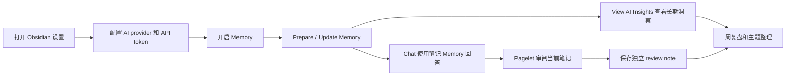
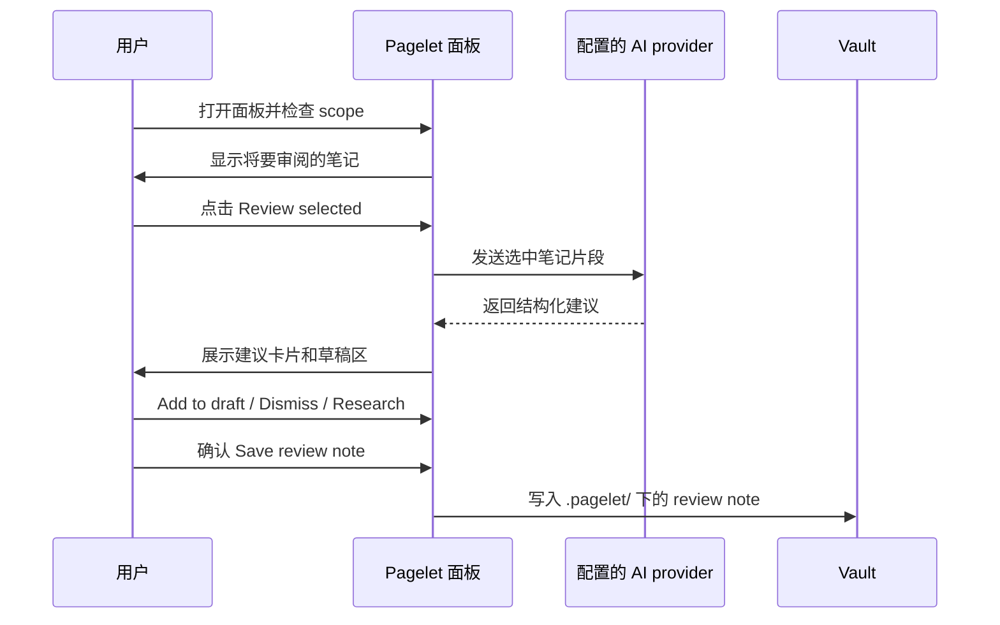
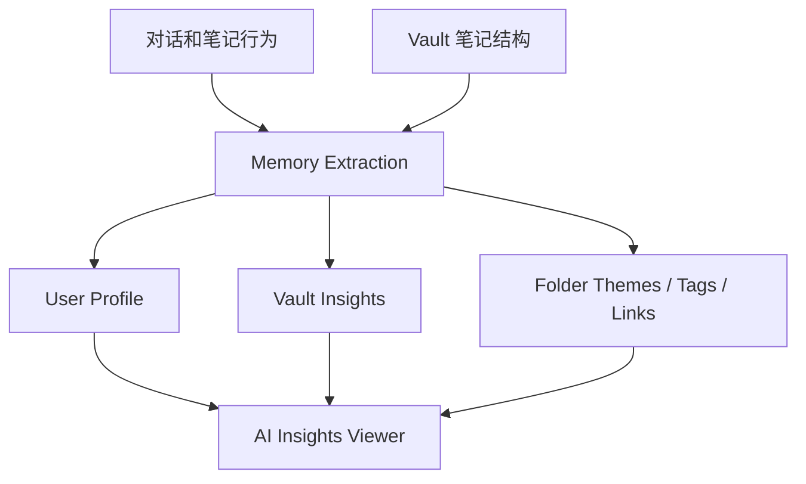
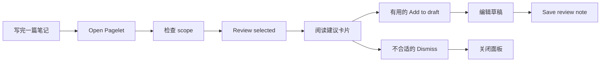

# v2.7 用户指南：AI Insights、Memory 与 Pagelet 最佳实践

[English version](./v2.7-user-guide-en.md)

v2.7 的重点不是多一个按钮，而是把 Personal Assistant 变成一个更完整的
“笔记理解 - 审阅 - 复盘”工作流：

- Chat 用来回答当下问题；
- Memory 让 Chat 能引用你已经准备过的笔记记忆；
- AI Insights 帮你查看助手从对话和 vault 中总结出的长期画像和主题；
- Pagelet 帮你在不改写原文的前提下审阅笔记、保存 review note；
- Research / Action Mode 让你先查证、预览、确认，再决定是否写入。

本指南面向普通用户，不需要理解 VSS、embedding、OPFS 或其它实现细节。

## 3 分钟快速上手



推荐第一次使用顺序：

1. 在 Settings 里配置 AI provider、模型和 API token。
2. 打开 Memory，并按提示准备 Memory。
3. 打开一篇你熟悉的 Markdown 笔记，运行 `Pagelet: Open Pagelet`。
4. 先检查 Pagelet 面板里的 scope，再点击 `Review selected (1)`。
5. 回到 Chat，问一个和当前笔记有关的问题。
6. 运行 `Personal Assistant: Show AI Insights`，查看 User Profile 和 Vault Insights。

如果你只想试功能，不想让助手读取太多内容，先用一个测试 vault 或一篇单独
笔记开始。

## 功能入口总览

| 你想做什么 | 推荐入口 | 适合场景 |
| --- | --- | --- |
| 和 AI 对话 | 左侧 Personal Assistant 图标 / Open Chat | 问当前笔记、整理想法、让助手引用 Memory |
| 准备笔记 Memory | Settings -> Memory -> Prepare Memory | 第一次让 Chat 使用笔记上下文 |
| 更新笔记 Memory | Settings -> Memory -> Update memory now | 改了很多笔记后，希望 Chat 用到新内容 |
| 查看 AI Insights | 命令面板 `Show AI Insights` / Settings -> Memory | 看用户画像、vault 主题、链接结构、写作习惯 |
| 打开 Pagelet 面板 | `Pagelet: Open Pagelet` | 先看 scope，再决定是否调用 AI |
| 使用 Pagelet 气泡 | 点击 Pagelet 角色 | 查看已准备的发现、审阅当前笔记、发现关联或生成近期总结 |
| 直接审阅当前笔记 | `Pagelet: Review current note` | 刚写完一篇笔记，想马上做审阅 |
| 查证某条建议 | Pagelet 建议卡片里的 `Research` | 某条建议需要证据或外部资料 |
| 保存审阅记录 | Pagelet preview 里的 `Save review note` | 保留一篇独立 review note，不修改源笔记 |

中文界面中，入口文案可能显示为 `AI Insights`、`Memory`、`拾页` 或对应的中文
翻译。以命令面板搜索关键词是最快方式。

## 图文速览

### AI Chat 和 Memory

Personal Assistant 的 Chat 可以在你确认后使用来自笔记的 Memory。准备 Memory
前，插件会说明数据、AI provider 和可能成本。

<div align="center">
  
</div>

### Pagelet 审阅笔记

Pagelet 是“先审阅、再由你决定是否保存”的工作流。它不会直接改写源笔记。
更详细的 Pagelet 操作步骤见 [Pagelet 使用指南](./pagelet-user-guide.md)。



### 已有视频素材

这些素材可以放在 README、Release Notes 或发布页中，帮助用户快速理解插件：

- AI Chat / Personal Assistant 演示：`docs/Personal-Assitant-With-AI.gif`
- AI 生成特色图演示：`docs/featured-images-ai-generation.mp4`
- 历史操作演示：`docs/personal-assistant-v1.3.6.gif`、`docs/personal-assistant-v1.3.3.gif`

v2.7 专属录屏建议见本文末尾的“发布视频脚本”。不要把脚本写成已经发布的视频；
只有真正录屏后，才在 README 或 Release Notes 里嵌入对应文件或链接。

## AI Insights 怎么用

AI Insights 是 v2.7 对普通用户最值得强调的新入口。它不是让 AI 直接改笔记，
而是让你查看助手已经整理出的长期洞察。

你可能看到的内容包括：

- `User Profile`：你在对话中表达出的长期偏好、目标和工作方式；
- `Vault Insights`：vault 中反复出现的主题、目录结构、笔记模式；
- `Folder Themes`：不同文件夹里的主题倾向；
- `Tag Taxonomy`：标签使用方式和潜在整理方向；
- `Link Topology`：链接和 backlink 暗示的知识结构；
- `Writing Habits`：写作节奏、记录方式和可改进点。



推荐用法：

- 每周打开一次 AI Insights，看它是否抓住了你最近真正关心的主题；
- 把不准确的洞察当作提醒，而不是事实；
- 如果你刚开始使用，empty state 是正常的，先进行几轮 Chat 和 Memory 使用；
- AI Insights 不是 WebSearch、Memory 或 current note 的工具开关；这些能力仍由当前对话请求和设置决定；
- 不要把密码、密钥、私人证件等敏感信息放进要参与 Memory 的笔记。

## Memory 最佳实践

Memory 的价值是让 Chat 能在你允许的前提下引用已准备过的笔记。

建议：

- 第一次使用时，先用较小 vault 或一个主题文件夹测试；
- 对隐私敏感目录使用 Memory exclude path；
- 大量修改笔记后，先运行 `Update memory now`，再问需要准确上下文的问题；
- 如果只是随便问一个常识问题，可以选择普通回答，不必每次都使用 Memory；
- 看到 Memory 需要准备或更新的提示时，先读清楚数据流和成本说明。

适合问 Chat 的问题：

```text
根据我最近的项目笔记，总结本周最重要的 3 个决策。
```

```text
请只基于 Memory 中和 Pagelet 有关的内容，列出还没有收口的 follow-up。
```

```text
我最近关于 AI Insights 的笔记里，哪些想法已经重复出现多次？
```

不适合直接问的问题：

```text
帮我自动整理整个 vault，不用确认直接改。
```

更好的说法：

```text
先列出你建议整理的文件夹和理由，不要修改笔记。等我确认后再继续。
```

## Pagelet 最佳实践

Pagelet 最适合做“写完后的第二视角”。

推荐流程：



实用建议：

- 第一次审阅先用 `Current`，不要一上来选 `Last 7 days`；
- 每次调用前看清 `Included` 和 `Skipped`，确认哪些笔记会被发送给 AI provider；
- Pagelet 的建议不是命令，先判断再采纳；
- 保存 review note 前展开 preview，看目标路径和 Markdown 内容；
- 审阅笔记默认放在 `.pagelet/`，它是审阅记录，不是源笔记替代品；
- 移动端 v2.7 已验证基础布局和入口，但 final confirm/save 仍有 caveat，重要保存操作建议先在桌面端完成。

## Discovery 和 Research 怎么配合

Discovery 更适合找“关联”和“缺口”，Research 更适合对某条建议继续查证。

| 场景 | 用什么 | 做法 |
| --- | --- | --- |
| 想知道当前笔记和哪些主题有关 | Discovery | 看关联图谱，并点击相关笔记节点 |
| 想知道缺什么证据或后续动作 | Discovery | 看 gap / follow-up 卡片 |
| 某条建议可能需要外部资料 | Research | 让 Chat 预填查证 prompt，确认后再发送 |
| 结果不确定 | Source / Related notes | 回到原始笔记人工判断 |

Research 不会自动提交 Chat，也不会自动修改笔记。它只是帮你把查证问题准备好。

## 一周复盘工作流

适合把 v2.7 的几个新能力连起来用：

1. 周一到周五正常写笔记。
2. 每天结束时，对当天关键笔记跑一次 Pagelet。
3. 有价值的建议保存成 `.pagelet/` review note。
4. 周五运行 `Update memory now`。
5. 打开 AI Insights，看这一周的 User Profile / Vault Insights 是否有变化。
6. 在 Chat 中问：

```text
请结合本周 Memory 和 AI Insights，总结我这个星期最常反复出现的 3 个主题，
并指出每个主题下一步最小行动。
```

7. 只把你认可的结论写回自己的周报或项目笔记。

这个流程的核心是：AI 帮你发现线索，你保留最终判断权。

## 隐私、成本和安全边界

使用 AI 功能前，先确认这几件事：

- 配置的 AI provider 是你信任的服务；
- 你知道哪些笔记内容会被发送；
- Memory prepare / update 和 Pagelet review 可能消耗 API 额度；
- Pagelet 保存前会显示目标路径和预览；
- Action Mode / write flow 应该先预览和确认，不要跳过人工判断；
- 不要把密钥、密码、证件号码等敏感内容放进会被 AI 读取的笔记。

## 发布视频脚本

建议录一个 90 秒以内的视频，作为 v2.7 Release Notes 或 README 的主视频。

| 时间 | 画面 | 旁白重点 |
| --- | --- | --- |
| 0-10s | 打开 Obsidian 和 Personal Assistant 设置 | v2.7 聚焦 Chat + Memory + AI Insights + Pagelet |
| 10-25s | 开启 Memory，展示 Prepare / Update 入口 | Memory 会先说明数据流和成本，由用户确认 |
| 25-40s | 打开 AI Insights Viewer | 查看 User Profile、Vault Insights、Folder Themes |
| 40-60s | 打开一篇笔记，运行 Pagelet | 先检查 scope，再运行 Review selected |
| 60-75s | 展示建议卡片、Add to draft、Research | AI 给建议，用户决定是否采纳或查证 |
| 75-90s | 展示 Save review note preview | 保存独立 review note，不直接改源笔记 |

录制注意：

- 使用测试 vault，不展示真实 API token、私人笔记或敏感路径；
- 每个镜头控制在 10-15 秒；
- 只展示已经 smoke 验证过的路径；
- 移动端 final confirm/save 仍有 caveat，不要在视频里暗示它已完整验证；
- 英文字幕和预热方案作为最终视频资产一起准备，不链接尚未创建的计划文件；
- 视频文件不提交到 `docs/`，录完后使用 GitHub attachment / release asset 链接更新 README。

## 常见问题

### AI Insights 是自动改我的笔记吗？

不是。AI Insights 是查看洞察的入口，不会自动修改源笔记。

### Pagelet 会不会直接重写当前笔记？

默认不会。Pagelet 生成建议和 review note，源笔记保持不变。

### 为什么我刚打开 AI Insights 看到 empty state？

这是正常情况。需要先配置 AI、启用 Memory Extraction，并有一定对话或 vault
分析结果，才会有可展示内容。

### 我应该什么时候用 Memory，什么时候普通回答？

如果问题需要引用你的笔记，用 Memory。如果只是普通知识问答或临时改写文本，
可以普通回答，减少不必要的上下文和 provider 调用。

### 发布前最应该给用户看的链接是什么？

如果只放一个链接，放本指南。它会继续跳转到 Pagelet 使用指南、README 中的
视频素材和 release checklist 中的 caveat。
