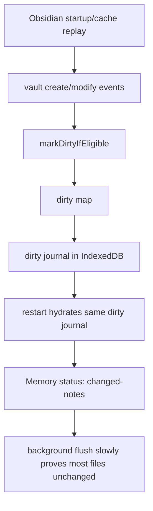
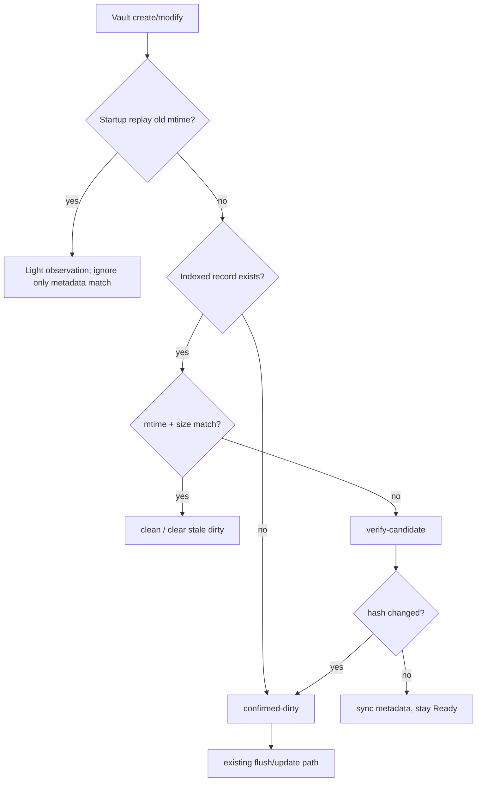

# VSS Dirty State Optimization Plan

## Purpose

Memory dirty state should mean "confirmed work that needs a Memory refresh", not "an Obsidian event happened". A real vault incident on 2026-06-24 showed `dirtyCount` and the persisted dirty journal both near the full vault size, while most sampled files already matched the local Memory index by `contentHash`, `mtime`, and `size`. The likely trigger was Obsidian startup/cache replay emitting many `create`/`modify` events for old files.

The optimization separates lightweight change candidates from confirmed dirty paths without adding a new persistent state table.

## Current Failure Mode

This is safe but noisy and inefficient: false dirty paths become durable local state, trigger user-visible changed-notes, and rely on refresh/flush to clean themselves up.

## Target State

Dirty state is split across existing runtime structures:

| State | Backing store | Meaning | User-visible status |
| --- | --- | --- | --- |
| Clean | SQLite file record | Current file metadata/hash is already represented | Ready |
| Verify candidate | In-memory `verifyQueue` | Metadata drift or suspicious event needs hash verification | Ready |
| Confirmed dirty | In-memory `dirty` + IndexedDB dirty journal | Missing index record or hash-confirmed content change needs refresh | Changed notes |

## Implementation Contract

- `vault.create` and `vault.modify` call `VSS.observeChangedFile()` instead of marking dirty directly.
- During the first 90 seconds after plugin load, `create`/`modify` events whose file `mtime` is more than 5 seconds older than plugin load are treated as startup replay, but they still pass through lightweight observation so missing indexed records and metadata drift are not lost. Metadata-matching startup replay events are ignored for Memory maintenance.
- Startup replay filtering does not apply to `rename` or `delete`.
- Memory extraction still receives vault events unless the existing Pagelet self-write guard returns early.
- `verifyQueue` remains process-local and is reconstructed by startup/resume/periodic reconcile. Vault-event verification may run under the default approval policy because it only performs local hash/metadata checks; provider-backed refresh still requires confirmed dirty state and the existing approval/auto-refresh policy.
- The dirty journal persists only confirmed dirty paths.
- Reconcile clears stale dirty entries when indexed metadata already matches the current vault file.
- Manual Update, Rebuild, Reset, and force refresh behavior remains unchanged.

## Acceptance Tests

- Metadata-matching startup replay observations return `ignored`, write no dirty journal, and do not call embeddings.
- Non-replay `vault.modify` observations are treated as strong write evidence and enter verification even when metadata still matches.
- Missing indexed records become `confirmed-dirty` and persist in dirty journal.
- Metadata drift becomes `verify-candidate`, keeps Memory readiness `ready`, and does not persist dirty state.
- Hash verification promotes candidates to dirty only when cleaned content hash changes.
- Reconcile removes stale dirty journal entries for files whose indexed metadata already matches current vault metadata.
- Startup replay bursts with old mtimes call VSS change observation but do not schedule maintenance for metadata matches or auto flush until a missing record or real content drift is confirmed.
- Fresh edits inside the startup window still enter the normal observation path.
- Rename/delete continue to use the existing maintenance paths.

## Validation

Focused verification:

- `npm test -- __tests__/vss.test.ts --runInBand`
- `npm test -- __tests__/memory-manager.test.ts --runInBand`
- `npm test -- __tests__/plugin-record-note.test.ts --runInBand`
- `npm run build`
- `git diff --check`

Runtime smoke for release confidence should deploy to the repo-local test vault and inspect Memory status through Obsidian CLI or app evidence before claiming real Obsidian validation.
