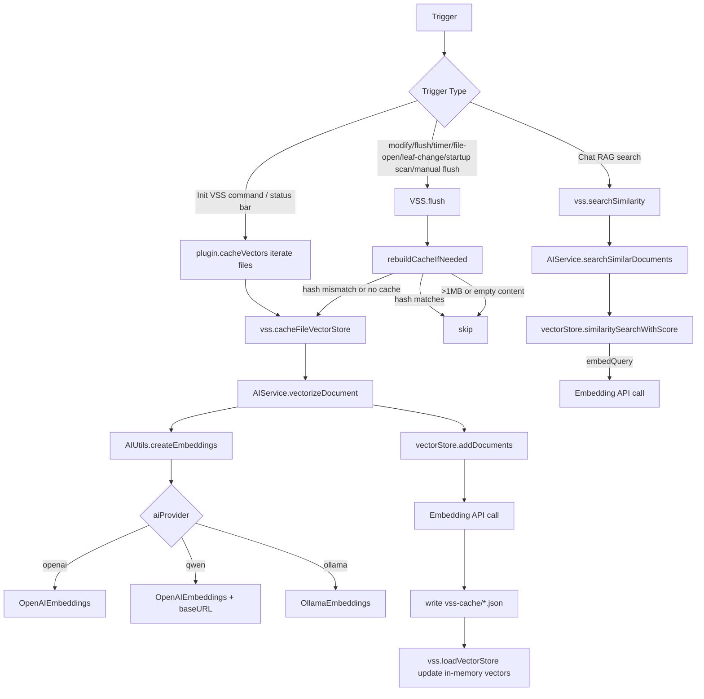
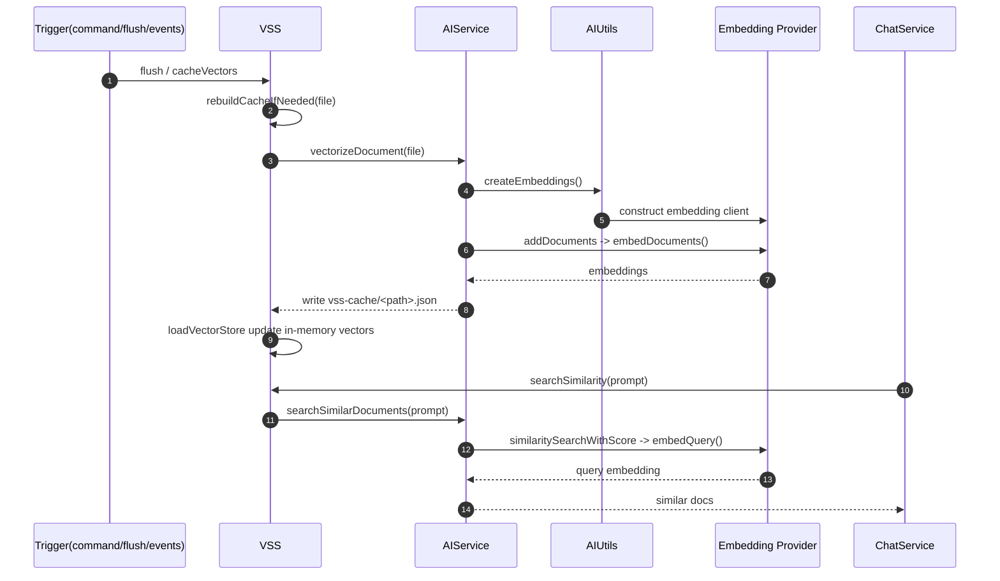

# VSS Embedding Flow

This document describes when the plugin calls the embedding API (OpenAI / Qwen / Ollama) and how file vectors are updated.

## Flowchart: All Embedding API Triggers

## Sequence Diagram: File Updates and RAG Query Embedding

