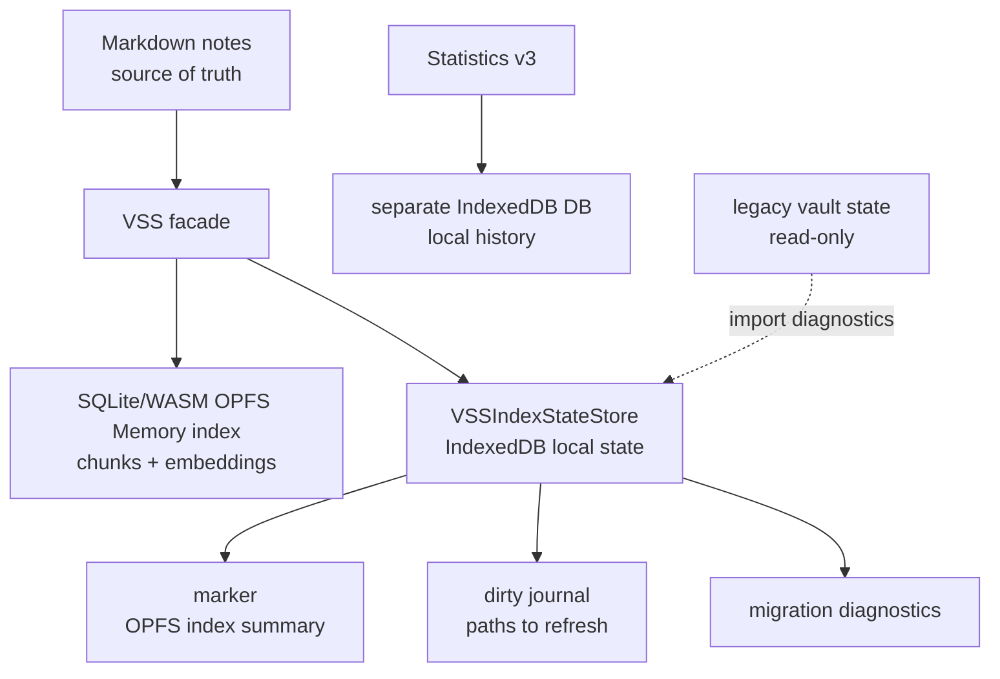

# VSS Local State Plan

## Purpose

VSS/Memory runtime state is device-local cache state. It must not create or update vault files by default. The Markdown vault remains the source of truth for user notes.

Two separate local storage layers are involved:

- **OPFS SQLite/WASM** stores Memory embedding/index data: file records, chunks, vectors, and search metadata used to answer with Memory.
- **IndexedDB local app storage** stores lightweight maintenance state. Statistics v3 uses its own IndexedDB database for local Statistics history. VSS uses a separate IndexedDB database for marker, dirty journal, and migration diagnostics that describe or queue work for the OPFS Memory index.

IndexedDB state is not the embedding index. Resetting or rebuilding IndexedDB state alone must not delete OPFS embeddings. A user-facing Memory reset may intentionally clear both the OPFS Memory copy and the VSS marker/dirty state because it is resetting the local Memory copy as a product action.

This replaces the older vault-written state files:

- `<vault.configDir>/plugins/personal-assistant/vss-index-state/<deviceId>/marker.json`
- `<vault.configDir>/plugins/personal-assistant/vss-index-state/<deviceId>/manifest.json`
- `<vault.configDir>/plugins/personal-assistant/vss-cache/dirty.json`

Existing legacy files are read-only compatibility artifacts. The plugin does not delete, rewrite, or update them automatically.

## Product Contract

| Area | Decision |
| --- | --- |
| Default VSS state writes | Local IndexedDB only |
| Default vault writes | No new or updated VSS runtime state files |
| Legacy JSON vector fallback | Removed |
| Legacy vault files | Never deleted automatically |
| IndexedDB unavailable | VSS may continue with in-memory maintenance state; persistence is retried later |
| User-facing vocabulary | Memory, Prepare memory, Update memory |
| Internal vocabulary | VSS, SQLite, OPFS, marker, dirty journal, fallback only in code/docs/diagnostics |

If local app storage is cleared, Memory may reconstruct the VSS marker from a valid OPFS index. If neither local state nor usable OPFS Memory exists, the user is asked to prepare Memory again. Notes are not modified or deleted.

## Storage Architecture

The IndexedDB database name is scoped like Statistics v3: plugin id, `statisticsVaultId`, vault config directory, and local vault path hash. The OPFS SQLite scope is unchanged in this migration; the current OPFS scope is recorded in the marker and marker reads are valid only when device id, profile signature, and OPFS scope match.

## Runtime Rules

- `VSSIndexStateStore.initialize()` is retried on update and status paths. A transient open failure must not block VSS; marker and dirty state stay in VSS memory until IndexedDB can be opened and updated.
- Production does not use the test-only memory state store as a durable backend. In-memory state is temporary process state used only while IndexedDB is unavailable.
- Dirty journal writes are serialized with VSS index operations or an equivalent ordered state-write chain.
- Memory reset clears the OPFS SQLite Memory index and the VSS marker/dirty state when each store is available, but preserves legacy vault files.
- IndexedDB maintenance-state reset/reconstruction does not delete OPFS embedding data.
- Legacy `dirty.json` is not imported into active dirty state because it is not device-scoped.
- Legacy `manifest.json` is not generated anymore and is not used for fallback decisions.
- Legacy `vss-cache/*.json` is not loaded for Memory fallback. Explicit cleanup may delete old cache files only after user confirmation.

## Migration

On first local-state initialization:

1. Read local IndexedDB marker and dirty journal.
2. If local marker is absent, try a cheap OPFS verify/open and reconstruct marker when the SQLite index is valid.
3. Optionally read legacy marker/manifest for diagnostics, but never override local state.
4. Ignore legacy dirty journal by default.
5. Do not delete legacy files.

## Acceptance

- Prepare/update/reset Memory creates no new `vss-index-state` files and no `vss-cache/dirty.json`.
- SQLite unavailable with old JSON cache present does not scan the cache, create query embeddings, or load `MemoryVectorIndex`.
- IndexedDB unavailable before prepare/update causes no vault state writes and does not block a user-approved Memory update; VSS uses temporary in-memory state and retries IndexedDB persistence on later update/status paths.
- Memory reset removes the local Memory copy from OPFS and clears VSS maintenance state without touching old vault files.
