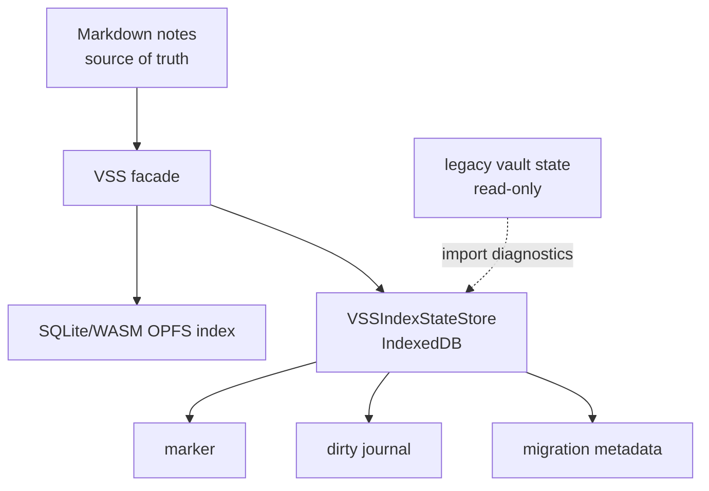

# VSS Local State Plan

## Purpose

VSS/Memory runtime state is device-local cache state. It must not create or update vault files by default. The Markdown vault remains the source of truth for user notes, while SQLite/WASM OPFS stores the local Memory index and IndexedDB stores the lightweight local state that lets the plugin reason about that index.

This replaces the older vault-written state files:

- `<vault.configDir>/plugins/personal-assistant/vss-index-state/<deviceId>/marker.json`
- `<vault.configDir>/plugins/personal-assistant/vss-index-state/<deviceId>/manifest.json`
- `<vault.configDir>/plugins/personal-assistant/vss-cache/dirty.json`

Existing legacy files are read-only compatibility artifacts. The plugin does not delete, rewrite, or update them automatically.

## Product Contract

| Area | Decision |
| --- | --- |
| Default VSS state writes | Local IndexedDB only |
| Default vault writes | No new or updated VSS runtime state files |
| Legacy JSON vector fallback | Removed |
| Legacy vault files | Never deleted automatically |
| IndexedDB unavailable | Memory unavailable; chat answers normally |
| User-facing vocabulary | Memory, Prepare memory, Update memory |
| Internal vocabulary | VSS, SQLite, OPFS, marker, dirty journal, fallback only in code/docs/diagnostics |

If local app storage is cleared, Memory may reconstruct the marker from a valid OPFS index. If neither local state nor usable OPFS Memory exists, the user is asked to prepare Memory again. Notes are not modified or deleted.

## Storage Architecture

The IndexedDB database name is scoped like Statistics v3: plugin id, `statisticsVaultId`, vault config directory, and local vault path hash. The OPFS SQLite scope is unchanged in this migration; the current OPFS scope is recorded in the marker and marker reads are valid only when device id, profile signature, and OPFS scope match.

## Runtime Rules

- `VSSIndexStateStore.initialize()` is a hard precondition for prepare/update/rebuild/reset paths that could read notes or call the embedding provider.
- Production never falls back to volatile memory state when IndexedDB is unavailable.
- Dirty journal writes are serialized with VSS index operations or an equivalent ordered state-write chain.
- Reset clears the OPFS SQLite index and local IndexedDB marker/dirty state, but preserves legacy vault files.
- Legacy `dirty.json` is not imported into active dirty state because it is not device-scoped.
- Legacy `manifest.json` is not generated anymore and is not used for fallback decisions.
- Legacy `vss-cache/*.json` is not loaded for Memory fallback. Explicit cleanup may delete old cache files only after user confirmation.

## Migration

On first local-state initialization:

1. Read local IndexedDB marker and dirty journal.
2. If local marker is absent, try a cheap OPFS verify/open and reconstruct marker when the SQLite index is valid.
3. Optionally read legacy marker/manifest for diagnostics, but never override local state.
4. Ignore legacy dirty journal by default.
5. Do not delete legacy files.

## Acceptance

- Prepare/update/reset Memory creates no new `vss-index-state` files and no `vss-cache/dirty.json`.
- SQLite unavailable with old JSON cache present does not scan the cache, create query embeddings, or load `MemoryVectorIndex`.
- IndexedDB unavailable before prepare/update causes no note reads and no embedding calls.
- Reset removes local Memory copy from OPFS and local state without touching old vault files.
