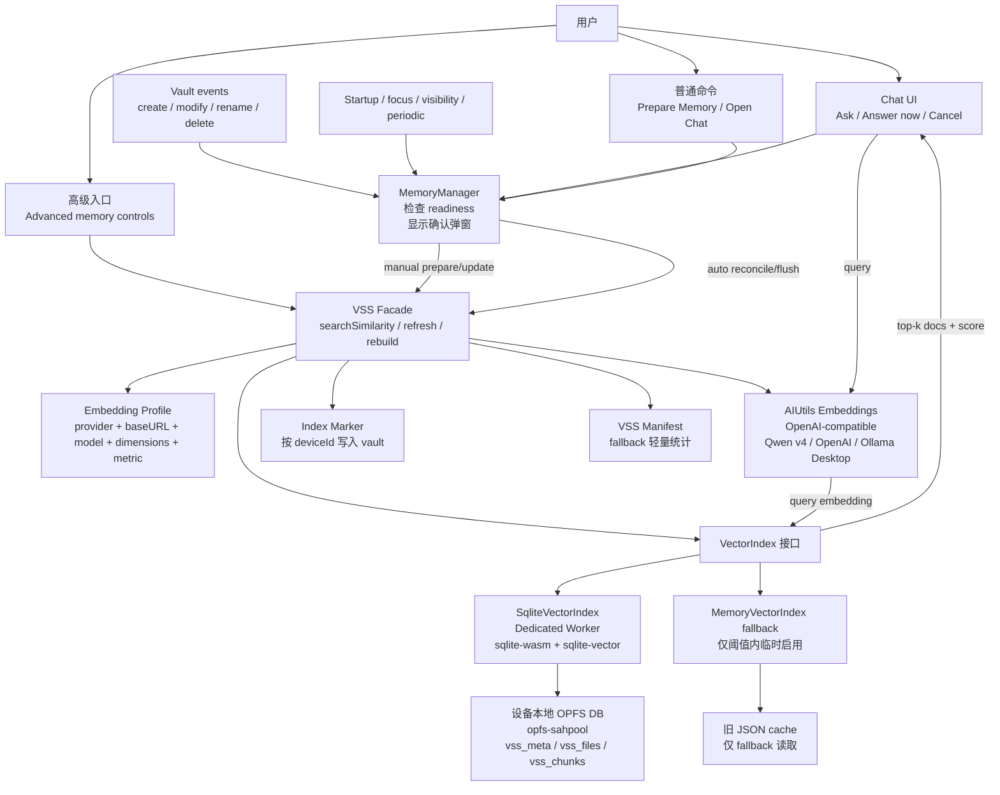
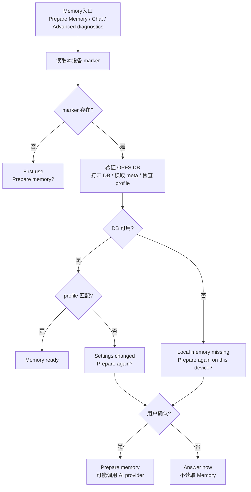
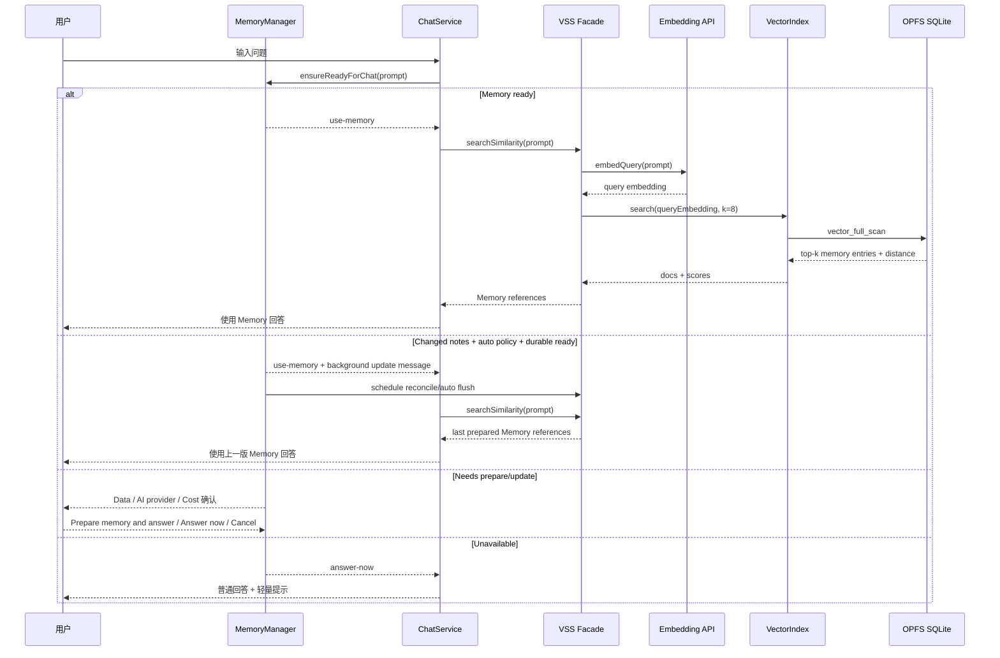
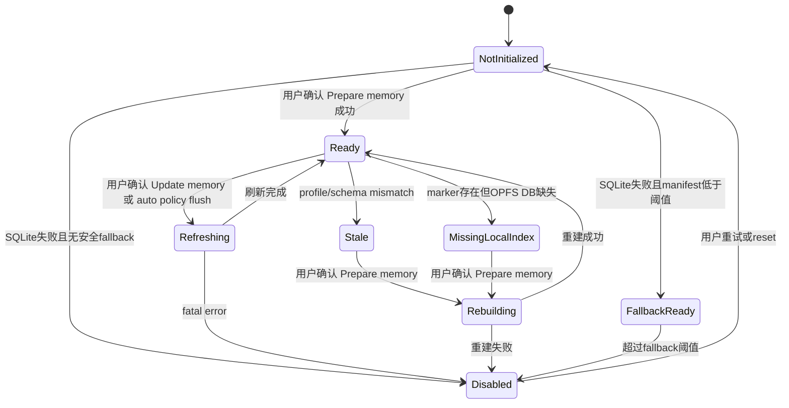

# VSS SQLite/WASM 架构设计

## 背景

重构前的 VSS 主路径是将 Markdown 笔记清洗、切块、生成 embedding 后，写入 vault 内的 JSON 缓存文件；插件启动或手动初始化时，再把这些 JSON 中的向量全部加载到 LangChain `MemoryVectorStore`。这个设计能避免重复调用 embedding API，但也带来几个问题：

- **内存压力**：所有向量和 chunk 内容会进入 JS heap。vault 变大后，Desktop 启动和 Mobile WebView 都可能承压。
- **移动端不友好**：iPhone、Pixel 等设备的内存、后台执行和 WebView 存储行为更受限制，不能依赖全量内存索引。
- **索引成本不可见**：向量索引是可重建缓存，但重建需要重新调用 embedding 模型，可能产生 token/API 成本。
- **缓存形态分散**：每篇笔记一个 JSON 文件，启动扫描和旧缓存清理都比较粗糙。

本设计将 VSS 从“JSON + 全量内存向量库”改为“设备本地 SQLite/WASM 向量索引”。SQLite 索引仍然是本机缓存，不是源数据；源数据仍然是 Markdown 笔记。

产品层不再把这套能力暴露为“索引维护”。普通用户看到的是 **Memory from your notes**：笔记是长期记忆，聊天前助手检查这份 Memory 是否准备好；首次 prepare、缺失本地索引、settings/profile stale 等可能产生大额 AI credits/API calls 的动作仍必须先解释数据流、服务商调用和成本，再获得用户确认。用户首次确认并成功准备 Memory 后，后续 changed notes 可以由后台自动维护。

## 目标

- 使用本地向量检索，不引入远程向量数据库。
- 降低常驻 JS 内存，避免启动时全量加载向量。
- 首次 prepare、missing local index、settings/profile stale 不自动重建；用户确认并成功准备 Memory 后，changed notes 可以在 durable SQLite/WASM ready 时自动后台刷新。
- 使用 Qwen `text-embedding-v4` + `1024` 维作为新安装默认 embedding profile。
- 对任何可能重新消耗 token 的动作进行显式提示和确认。
- 在 OPFS 被系统或 WebView 清理后，能检测并提醒用户，而不是静默自动重建。
- 保持业务层不绑定具体 vector backend，便于未来替换为 `sqlite-vec` 或其他本地后端。

## 非目标

- 不实现首次启动自动 prepare/rebuild，也不在 OPFS 丢失或 profile stale 时静默重建。
- 不在 `MemoryVectorIndex` fallback 下自动写入；fallback 只作为只读降级检索路径。
- 第一版不自动启用 ANN 或量化检索。
- 第一版不实现 DashScope 专用的 query/document、instruct、sparse embedding 能力。
- 第一版不保证 Mobile 与 Desktop 有完全一致的 VSS 能力；Mobile 先以手动可用和安全降级为目标。
- 不把 OPFS 索引作为用户数据源；索引丢失时通过手动 rebuild 恢复。

## 当前架构问题

当前 VSS 相关路径主要集中在 `src/vss.ts` 和 `src/ai-services/service.ts`：

- `AIService.vectorizeDocument()` 生成 `MemoryVectorStore`，再把 `memoryVectors` 序列化成 JSON。
- `VSS.loadExistingVectorStore()` 启动时扫描已有缓存文件。
- `VSS.loadVectorStore()` 读取 JSON 并合并进内存里的 `MemoryVectorStore`。
- `ChatService.streamLLM()` 通过 `plugin.vss.searchSimilarity(prompt)` 注入 RAG context。

主要问题是，JSON 缓存只解决“避免重复 embedding”，没有解决“检索时全量常驻内存”。当 chunk 数增长时，向量数组、metadata、pageContent 都会占用 JS heap。

## 新架构概览



新架构把具体索引实现收敛到 `VectorIndex` 接口。主实现为 `SqliteVectorIndex`，在 dedicated Worker 中加载 `@sqliteai/sqlite-wasm` 和 `sqlite-vector`，通过 OPFS `opfs-sahpool` 保存 SQLite DB。`MemoryVectorIndex` 只作为受阈值保护的 fallback，不再是默认主路径。

## Memory 产品层

`MemoryManager` 是普通用户体验的入口，包在 VSS 之上：

- 普通用户可见概念统一为 `Memory`、`Memory from your notes`、`Prepare memory`、`Update memory`、`Memory is ready`。
- 聊天前默认检查 Memory 是否准备好。
- `ready` 时直接使用 Memory 搜索。
- `first-use`、`changed-notes`、`local-memory-missing`、`settings-changed` 时显示专用确认弹窗。
- 用户选择 `Prepare memory and answer` 后执行 rebuild 或 refresh，并继续原问题；成功后将 `memoryApprovalPolicy` 升级为 `auto-refresh-after-prepare`。
- 后续 `changed-notes` 在 auto policy + durable SQLite/WASM ready 时不再弹窗，Chat 使用上一版 Memory 回答，同时后台排队 reconcile/flush。
- fallback 或非 durable 状态下不会执行自动写入，Chat 使用上一版 Memory 并提示后台更新暂不可用。
- 用户选择 `Answer now` 后本次跳过 Memory，聊天内显示 `Memory was not used for this answer.`。
- 用户选择 `Cancel` 后不发送问题，也不调用 LLM。
- 同一聊天视图内用户拒绝后 10 分钟不重复弹窗，直接普通回答并显示轻量提示。

确认弹窗必须从用户关心的三件事解释：

- **Data**：笔记不会被修改或删除。
- **AI provider**：准备 Memory 时，note text may be sent to the configured AI provider。
- **Cost**：可能使用 AI credits/API calls；未变化笔记尽量跳过。

技术词如 VSS、RAG、embedding、SQLite、OPFS、chunks、backend、stale、fallback、vector 只允许出现在内部文档、日志或 `Diagnostic details` 中，不进入普通聊天和普通设置文案。

## 核心组件

### VSS Facade

`VSS` 继续作为插件内部的统一入口，保持聊天调用方的主要行为稳定：

- `searchSimilarity(prompt)`：生成 query embedding，调用 `VectorIndex.search()`。
- `rebuild`：重置本设备本地 index，扫描 eligible Markdown，跨文件全局 batch 生成 embeddings，再按文件写入索引。
- `refresh`：手动或后台处理 dirty 文件，先按 `contentHash` 跳过 unchanged 文件；当前保持逐文件 refresh 路径，不共享 rebuild 的全局 batch pipeline。
- `reconcileLocalFiles`：批量读取 indexed metadata，与 vault 当前文件对齐；发现新文件、metadata mismatch、已删除 indexed path，并按预算分批 yield。
- `verify`：检查 profile、OPFS DB、marker、manifest 的一致性。
- `reset`：重置本机索引。
- `runExclusive`：统一串行化 flush、rebuild、reset、delete、rename 和 reconcile 写操作，避免多个入口并发写同一个 SQLite index。

### VectorIndex

`VectorIndex` 是后端抽象层，业务层不直接依赖 `sqlite-vector` 的 SQL/API：

```ts
interface VectorIndex {
  initialize(profile: EmbeddingProfile): Promise<VectorIndexStatus>;
  upsertFile(fileState: VSSFileState, chunks: VSSChunk[], embeddings: number[][]): Promise<void>;
  deleteFile(path: string): Promise<void>;
  listFilePaths(): Promise<string[]>;
  listFileRecords(): Promise<VSSFileRecord[]>;
  getFileRecord(path: string): Promise<VSSFileRecord | null>;
  search(queryEmbedding: number[], k: number): Promise<VectorSearchResult[]>;
  getStats(): Promise<VSSIndexStats>;
  verify(): Promise<VectorIndexStatus>;
  reset(): Promise<void>;
  dispose(): Promise<void>;
}
```

`listFilePaths()` 保留兼容旧 refresh 路径；`listFileRecords()` 用于 reconcile 批量读取 indexed metadata，避免逐文件 worker round-trip；`getFileRecord()` 用于按文件 `contentHash` 判断 unchanged 文件，避免无变更 refresh 继续消耗 embedding token。

### SqliteVectorIndex

主后端。它负责：

- lazy-load Worker 和 WASM assets。
- 打开 `opfs-sahpool` DB。
- 初始化 schema 与 `vector_init`。
- 写入 Float32 embedding BLOB。
- 执行 `vector_full_scan` 精确检索。
- 返回与旧 RAG 调用兼容的 `Document + score` 结果。

### MemoryVectorIndex Fallback

仅在 SQLite/WASM/OPFS 不可用、且 manifest 显示规模同时低于两个硬上限时启用：

- `chunkCount <= 5,000`。
- `estimatedMemoryBytes <= 128MB`。
- 任一条件超限即禁用 fallback，聊天跳过 RAG。
- 如果没有 manifest，不扫描旧 JSON 向量，不启用 fallback。

这样可以避免为了判断 fallback 是否安全而重新把旧缓存全量读进内存。

## 存储设计

### OPFS 与 opfs-sahpool

SQLite DB 存放在设备本地 OPFS 中，不进入 vault，也不参与 Obsidian Sync、iCloud 或 Git 同步。`opfs-sahpool` 是 SQLite WASM 的 OPFS VFS，特点是：

- 适合 SQLite/WASM。
- 不需要 COOP/COEP headers。
- 批量读写性能更好。
- 不支持多个同时连接。
- 没有普通文件系统透明性，底层文件由 VFS 管理。

因此实现上必须：

- 在 dedicated Worker 中操作 SQLite。
- 串行化 DB 操作，避免多连接竞争。
- 不把其他文件放进 `opfs-sahpool` 管理目录。
- 不依赖复制底层 OPFS 文件作为迁移或备份方式。

### SQLite Schema

```sql
CREATE TABLE IF NOT EXISTS vss_meta (
  key TEXT PRIMARY KEY,
  value TEXT NOT NULL
);

CREATE TABLE IF NOT EXISTS vss_files (
  path TEXT PRIMARY KEY,
  content_hash TEXT,
  mtime INTEGER,
  size INTEGER,
  status TEXT,
  updated_at INTEGER
);

CREATE TABLE IF NOT EXISTS vss_chunks (
  id INTEGER PRIMARY KEY,
  path TEXT NOT NULL,
  chunk_index INTEGER NOT NULL,
  content TEXT NOT NULL,
  metadata_json TEXT NOT NULL,
  embedding BLOB NOT NULL,
  content_hash TEXT NOT NULL,
  UNIQUE(path, chunk_index)
);
```

初始化后执行 `vector_init`：

- dimension: `1024`
- type: `FLOAT32`
- distance: `COSINE`

检索使用 `vector_full_scan`，返回 cosine distance 后转换为旧接口兼容的 similarity score。

### Index Marker

OPFS 可能被系统或 WebView 清理。为了检测“本机曾有索引但 OPFS DB 丢失”，需要在 OPFS 外保存轻量 marker。

marker 写入 vault 中按设备分片的路径：

```text
.obsidian/plugins/personal-assistant/vss-index-state/<deviceId>/marker.json
```

`deviceId` 复用现有 stats 的 `localStorage` device ID 机制。该文件随 vault 同步时只代表对应设备曾经建立过本机索引，不表示其他设备的 OPFS 索引可用。marker 包含：

- `deviceId`
- `indexId`
- `profileSignature`
- `backend`
- `schemaVersion`
- `chunkCount`
- `fileCount`
- `builtAt`
- `lastVerifiedAt`
- `storagePersisted`
- `estimatedDbBytes`
- `estimatedEmbeddingTokens`

### VSS Manifest

manifest 是 fallback 的轻量统计来源，避免 SQLite 不可用时扫描旧 JSON 向量。它与 marker 位于同一个设备子目录：

```text
.obsidian/plugins/personal-assistant/vss-index-state/<deviceId>/manifest.json
```

manifest 同样按设备分片；随 vault 同步后，只能用于该 `deviceId` 对应设备的 fallback 判断，不能代表其他设备的 OPFS 索引状态。manifest 记录：

- `fileCount`
- `chunkCount`
- `estimatedMemoryBytes`
- `profileSignature`
- `legacyJsonCacheBytes`

如果 SQLite 不可用且 manifest 缺失，则不启用 Memory fallback。

## Embedding 策略

新安装默认值：

- Qwen embedding model: `text-embedding-v4`
- dimensions: `1024`

旧用户策略：

- 不静默覆盖 `embeddingModelName`。
- 只有当旧值等于项目旧默认 `text-embedding-v3` 时显示推荐迁移。
- 自定义模型只显示 profile 状态，不主动劝迁移。

索引记录 profile signature：

```text
provider + baseURL + model + dimensions + distanceMetric
```

profile mismatch 时：

- 索引标记为 stale。
- 不混用旧向量。
- 不自动重建。
- 用户确认后才重新调用 embedding。

## 成本保护

VSS 索引是可重建缓存，但重建需要 API 成本，所以不能把它当作普通可随时清空的缓存。

### Persistent Storage

首次手动初始化 VSS 时，在主线程调用：

- `navigator.storage.persist()`
- `navigator.storage.persisted()`
- `navigator.storage.estimate()`

如果 persistent storage 不可用或返回 `false`，仍允许手动建索引，但普通 UI 提示 `This device may need to prepare memory again later.`，说明索引未来可能被系统或 WebView 清理。

### OPFS 丢失检测



检测到 local memory missing 时，只在 Memory 入口或聊天需要读取 Memory 时提示，不在插件启动时弹窗。

## 手动重建/刷新流程

```mermaid
flowchart LR
  Start["用户确认 Prepare/Update memory"] --> Persist["请求 persistent storage"]
  Persist --> Verify["验证 backend / profile / marker"]
  Verify --> Scan["扫描 eligible markdown"]
  Scan --> Hash["清洗内容并计算 contentHash"]
  Hash --> Changed{"hash 变化?"}
  Changed -->|否| Skip["跳过 unchanged"]
  Changed -->|是| Split["MarkdownTextSplitter\nchunkSize 4000\noverlap 80"]
  Split --> Queue{"操作类型"}
  Queue -->|Rebuild| GlobalBatch["跨文件全局 chunk batch\nQwen v3/v4 <= 10 texts"]
  Queue -->|Refresh| FileBatch["逐文件 batch\n下一阶段再共享全局 pipeline"]
  GlobalBatch --> Throttle["provider-aware throttle\nTPM 预算 + 最小间隔"]
  FileBatch --> Throttle
  Throttle --> Retry["可重试错误退避\n2s / 5s / 10s / 20s"]
  Retry --> Embed["调用 AI provider\n生成 Memory 表示"]
  Embed --> Blob["转换 Float32Array/BLOB"]
  Blob --> Tx["SQLite 事务\n删除旧 chunks\n写入新 chunks"]
  Tx --> Update["更新 vss_files / marker / manifest / stats"]
  Skip --> Update
  Update --> Done["Memory ready 或部分失败提示"]
```



## 后台维护与跨设备 Reconcile

后台维护只在用户已成功 prepare/update Memory 并启用 `auto-refresh-after-prepare` 后运行。它不负责首次建索引，也不负责 OPFS 丢失或 profile stale 后的自动重建。

发现变化的三层来源：

1. Vault events：`create` / `modify` 标记 dirty，`rename` 删除旧 path 并标记新 path，`delete` 直接删除 indexed row。
2. Reconcile scan：启动后 60s、prepare 后 5s、focus/visibility 恢复后 30s、每 60min 扫描一次 vault 当前文件和 indexed records。
3. Rolling hash verify：周期 reconcile 每小时最多校验 50 个 metadata 未变化文件的 hash，按游标轮转，用于发现跨设备同步中 mtime/size 未变化但内容变化的情况。

预算控制：

- `listFileRecords()` 一次批量读取 indexed metadata，避免逐文件 worker round-trip。
- reconcile 每批 250 个 metadata 项后 `sleep(0)` 让出主线程。
- 单轮最多扫描 2000 个 metadata 项；未完成时通过 `hasMore` 继续排队，cursor 会跨轮推进并最终收敛。

写入边界：

- 自动 flush 只调用非 force `flush({ silent: true, reason: "auto-refresh" })`，并遵守 30s quiet window 与 10min max delay。
- 手动 `Update memory now` 保留 force refresh，用于用户主动要求立刻更新。
- `MemoryVectorIndex` fallback 只读；自动维护不会向 fallback 写入。

### Embedding 调度与进度

`rebuildLocalIndex()` 内部维护全局 chunk queue。文件扫描、hash、清洗和 split 完成后，所有待更新 chunks 按 provider policy 组成 batch；embedding 返回后再按文件聚合，只有完整文件才调用 `VectorIndex.upsertFile()`。如果某个 batch 最终失败，涉及文件会标记为 failed，且该文件后续 chunks 不再继续排队，避免产生不会写入的额外 embedding 请求。

当前 provider policy：

- Qwen `text-embedding-v4` / `text-embedding-v3`：最多 10 texts/request，`maxConcurrency: 1`，按安全 TPM 预算平滑发送。
- OpenAI-compatible default：最多 8 texts/request，`maxConcurrency: 1`。
- Ollama：最多 3 texts/request，`maxConcurrency: 1`。

VSS 向产品层发出 `VSSProgressEvent`：

- `scanning`：扫描 notes 和当前文件。
- `embedding`：embedding chunks 总数和已完成数。
- `writing`：写入 SQLite index。
- `retrying`：展示退避等待时间。
- `ready`：准备完成。

`MemoryManager` 使用同一个长驻 Notice 显示 `Scanning notes`、`Embedding chunks`、`Writing index`、`Retrying in Ns`、`Ready`，并对普通 DOM 更新做节流，减少 UI 抖动。

## 聊天 Memory 检索流程



## 状态机



## 用户交互

普通状态必须在聊天或状态栏使用 Memory 文案：

- `Memory ready`
- `Memory needs update`
- `Preparing memory...`
- `Memory unavailable`
- `This device may need to prepare memory again later.`

确认弹窗必须说明：

- `Data`: `Your notes will not be changed or deleted.`
- `AI provider`: `To prepare memory, note text may be sent to your configured AI provider.`
- `Cost`: `This may use AI credits or API calls. Unchanged notes will be skipped when possible.`

旧 JSON 清理前必须显示：

- 将删除的 JSON 文件数。
- 估算大小。
- 明确不会删除用户笔记。

## 可观测性

VSS stats 作为产品状态保存和展示，不只写 debug log：

- `initDurationMs`
- `lastRefreshDurationMs`
- `lastSearchDurationMs`
- `chunkCount`
- `fileCount`
- `estimatedDbBytes`
- `storageUsage`
- `storageQuota`
- `storagePersisted`
- `fallbackMode`
- `lastErrorCode`

性能提示阈值：

- `chunkCount > 50k`：提示精确检索可能变慢。
- `chunkCount > 100k`：建议后续考虑量化检索，但不自动启用。

## 风险与缓解

| 风险 | 缓解 |
| --- | --- |
| `opfs-sahpool` 在 Obsidian WebView 不稳定 | Phase 0 PoC Gate 中 Desktop 是进入主实现的硬门槛；iOS/Android 是 Mobile 支持级别门槛，未通过只降级 Mobile 支持 |
| OPFS 被清理后重建产生 token 成本 | marker 检测 missing index，重建前必须确认 |
| fallback 重新引入内存压力 | 只基于 manifest 判断双硬上限；`chunkCount > 5,000` 或 `estimatedMemoryBytes > 128MB` 时禁用 fallback |
| Qwen v4 迁移静默消耗 token | 旧用户不自动改设置，profile mismatch 只标记 stale |
| 旧 JSON 被误删 | SQLite ready、chunkCount > 0、profile 匹配、无 fatal error、marker 写入成功后才提示清理 |
| `sqlite-vector` 许可证和包稳定性 | pin 精确版本，在 README/release notes 披露许可证边界，保持 `VectorIndex` 抽象干净 |

## 相关文档

- [VSS SQLite/WASM 实施计划](./vss-sqlite-wasm-implementation-plan.md)
- [VSS Embedding 刷新方案说明](./vss-embedding-refresh.md)：当前 SQLite/WASM Memory refresh、Rebuild batch、embedding throttle 和进度事件说明。
- [Obsidian 插件移动端网络兼容优化方案](./mobile-network-optimization-plan.md)：移动网络兼容背景文档；其中 VSS 自动/手动生命周期以本文和实施计划为准。
