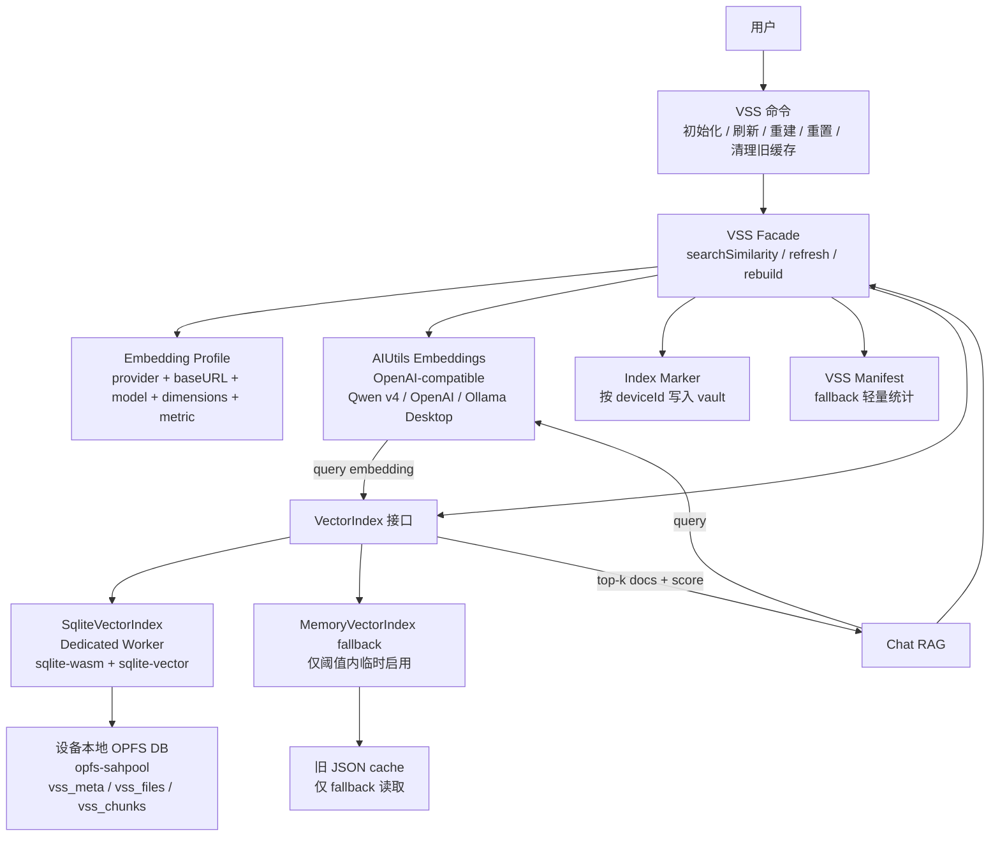
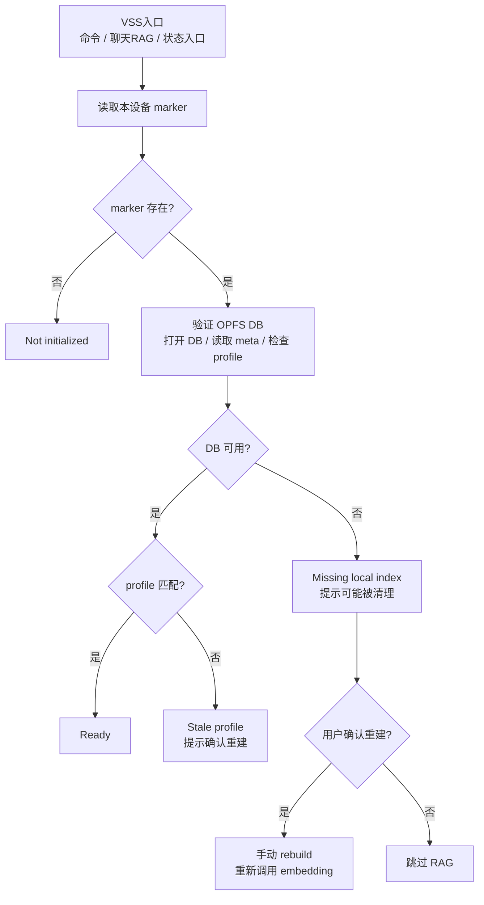
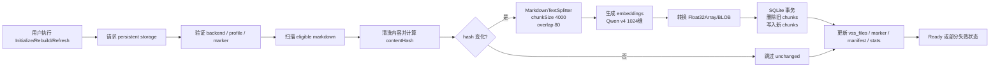
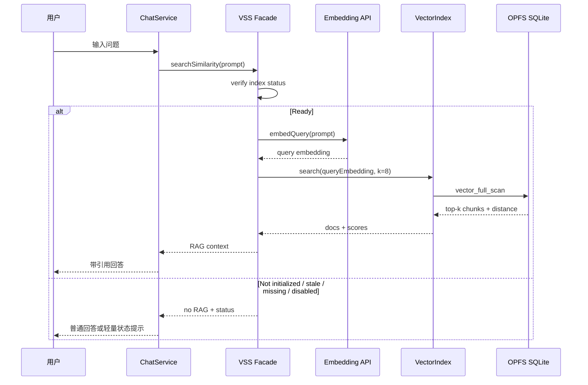
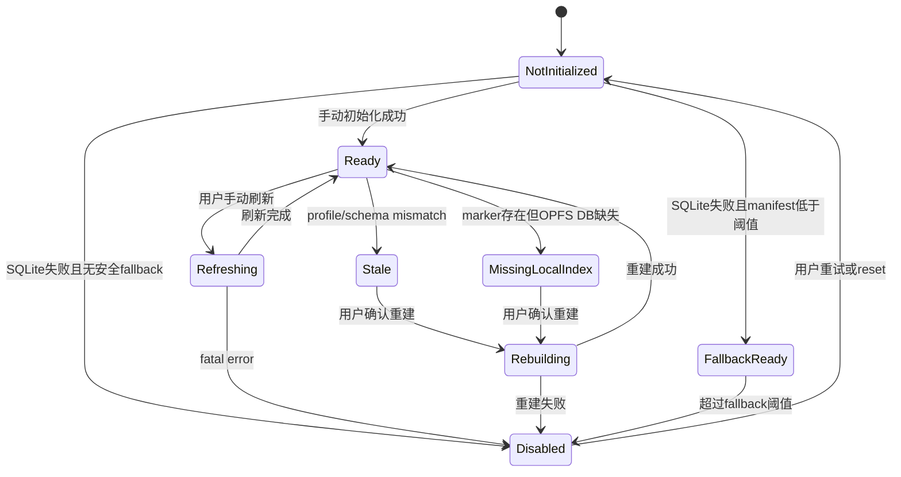

# VSS SQLite/WASM 架构设计

## 背景

当前 VSS 的主路径是将 Markdown 笔记清洗、切块、生成 embedding 后，写入 vault 内的 JSON 缓存文件；插件启动或手动初始化时，再把这些 JSON 中的向量全部加载到 LangChain `MemoryVectorStore`。这个设计能避免重复调用 embedding API，但也带来几个问题：

- **内存压力**：所有向量和 chunk 内容会进入 JS heap。vault 变大后，Desktop 启动和 Mobile WebView 都可能承压。
- **移动端不友好**：iPhone、Pixel 等设备的内存、后台执行和 WebView 存储行为更受限制，不能依赖全量内存索引。
- **索引成本不可见**：向量索引是可重建缓存，但重建需要重新调用 embedding 模型，可能产生 token/API 成本。
- **缓存形态分散**：每篇笔记一个 JSON 文件，启动扫描和旧缓存清理都比较粗糙。

本设计将 VSS 从“JSON + 全量内存向量库”改为“设备本地 SQLite/WASM 向量索引”。SQLite 索引仍然是本机缓存，不是源数据；源数据仍然是 Markdown 笔记。

## 目标

- 使用本地向量检索，不引入远程向量数据库。
- 降低常驻 JS 内存，避免启动时全量加载向量。
- Desktop 和 Mobile 第一版都采用手动 VSS，避免后台自动索引带来的启动、耗电和 token 风险。
- 使用 Qwen `text-embedding-v4` + `1024` 维作为新安装默认 embedding profile。
- 对任何可能重新消耗 token 的动作进行显式提示和确认。
- 在 OPFS 被系统或 WebView 清理后，能检测并提醒用户，而不是静默自动重建。
- 保持业务层不绑定具体 vector backend，便于未来替换为 `sqlite-vec` 或其他本地后端。

## 非目标

- 第一版不实现自动后台索引。
- 第一版不自动启用 ANN 或量化检索。
- 第一版不实现 DashScope 专用的 query/document、instruct、sparse embedding 能力。
- 第一版不保证 Mobile 与 Desktop 有完全一致的 VSS 能力；Mobile 先以手动可用和安全降级为目标。
- 不把 OPFS 索引作为用户数据源；索引丢失时通过手动 rebuild 恢复。

## 当前架构问题

当前 VSS 相关路径主要集中在 `src/vss.ts` 和 `src/ai-services/service.ts`：

- `AIService.vectorizeDocument()` 生成 `MemoryVectorStore`，再把 `memoryVectors` 序列化成 JSON。
- `VSS.loadExistingVectorStore()` 启动时扫描已有缓存文件。
- `VSS.loadVectorStore()` 读取 JSON 并合并进内存里的 `MemoryVectorStore`。
- `ChatService.streamLLM()` 通过 `plugin.vss.searchSimilarity(prompt)` 注入 RAG context。

主要问题是，JSON 缓存只解决“避免重复 embedding”，没有解决“检索时全量常驻内存”。当 chunk 数增长时，向量数组、metadata、pageContent 都会占用 JS heap。

## 新架构概览



新架构把具体索引实现收敛到 `VectorIndex` 接口。主实现为 `SqliteVectorIndex`，在 dedicated Worker 中加载 `@sqliteai/sqlite-wasm` 和 `sqlite-vector`，通过 OPFS `opfs-sahpool` 保存 SQLite DB。`MemoryVectorIndex` 只作为受阈值保护的 fallback，不再是默认主路径。

## 核心组件

### VSS Facade

`VSS` 继续作为插件内部的统一入口，保持聊天调用方的主要行为稳定：

- `searchSimilarity(prompt)`：生成 query embedding，调用 `VectorIndex.search()`。
- `refresh/rebuild`：手动扫描文件、计算 hash、生成 embedding、写入索引。
- `verify`：检查 profile、OPFS DB、marker、manifest 的一致性。
- `reset`：重置本机索引。

### VectorIndex

`VectorIndex` 是后端抽象层，业务层不直接依赖 `sqlite-vector` 的 SQL/API：

```ts
interface VectorIndex {
  initialize(profile: EmbeddingProfile): Promise<VectorIndexStatus>;
  upsertFile(fileState: VSSFileState, chunks: VSSChunk[], embeddings: number[][]): Promise<void>;
  deleteFile(path: string): Promise<void>;
  listFilePaths(): Promise<string[]>;
  getFileRecord(path: string): Promise<VSSFileRecord | null>;
  search(queryEmbedding: number[], k: number): Promise<VectorSearchResult[]>;
  getStats(): Promise<VSSIndexStats>;
  verify(): Promise<VectorIndexStatus>;
  reset(): Promise<void>;
  dispose(): Promise<void>;
}
```

`listFilePaths()` 用于手动 refresh 时清理已从 vault 删除的文件索引；`getFileRecord()` 用于按文件 `contentHash` 判断 unchanged 文件，避免无变更 refresh 继续消耗 embedding token。

### SqliteVectorIndex

主后端。它负责：

- lazy-load Worker 和 WASM assets。
- 打开 `opfs-sahpool` DB。
- 初始化 schema 与 `vector_init`。
- 写入 Float32 embedding BLOB。
- 执行 `vector_full_scan` 精确检索。
- 返回与旧 RAG 调用兼容的 `Document + score` 结果。

### MemoryVectorIndex Fallback

仅在 SQLite/WASM/OPFS 不可用、且 manifest 显示规模同时低于两个硬上限时启用：

- `chunkCount <= 5,000`。
- `estimatedMemoryBytes <= 128MB`。
- 任一条件超限即禁用 fallback，聊天跳过 RAG。
- 如果没有 manifest，不扫描旧 JSON 向量，不启用 fallback。

这样可以避免为了判断 fallback 是否安全而重新把旧缓存全量读进内存。

## 存储设计

### OPFS 与 opfs-sahpool

SQLite DB 存放在设备本地 OPFS 中，不进入 vault，也不参与 Obsidian Sync、iCloud 或 Git 同步。`opfs-sahpool` 是 SQLite WASM 的 OPFS VFS，特点是：

- 适合 SQLite/WASM。
- 不需要 COOP/COEP headers。
- 批量读写性能更好。
- 不支持多个同时连接。
- 没有普通文件系统透明性，底层文件由 VFS 管理。

因此实现上必须：

- 在 dedicated Worker 中操作 SQLite。
- 串行化 DB 操作，避免多连接竞争。
- 不把其他文件放进 `opfs-sahpool` 管理目录。
- 不依赖复制底层 OPFS 文件作为迁移或备份方式。

### SQLite Schema

```sql
CREATE TABLE IF NOT EXISTS vss_meta (
  key TEXT PRIMARY KEY,
  value TEXT NOT NULL
);

CREATE TABLE IF NOT EXISTS vss_files (
  path TEXT PRIMARY KEY,
  content_hash TEXT,
  mtime INTEGER,
  size INTEGER,
  status TEXT,
  updated_at INTEGER
);

CREATE TABLE IF NOT EXISTS vss_chunks (
  id INTEGER PRIMARY KEY,
  path TEXT NOT NULL,
  chunk_index INTEGER NOT NULL,
  content TEXT NOT NULL,
  metadata_json TEXT NOT NULL,
  embedding BLOB NOT NULL,
  content_hash TEXT NOT NULL,
  UNIQUE(path, chunk_index)
);
```

初始化后执行 `vector_init`：

- dimension: `1024`
- type: `FLOAT32`
- distance: `COSINE`

检索使用 `vector_full_scan`，返回 cosine distance 后转换为旧接口兼容的 similarity score。

### Index Marker

OPFS 可能被系统或 WebView 清理。为了检测“本机曾有索引但 OPFS DB 丢失”，需要在 OPFS 外保存轻量 marker。

marker 写入 vault 中按设备分片的路径：

```text
.obsidian/plugins/personal-assistant/vss-index-state/<deviceId>/marker.json
```

`deviceId` 复用现有 stats 的 `localStorage` device ID 机制。该文件随 vault 同步时只代表对应设备曾经建立过本机索引，不表示其他设备的 OPFS 索引可用。marker 包含：

- `deviceId`
- `indexId`
- `profileSignature`
- `backend`
- `schemaVersion`
- `chunkCount`
- `fileCount`
- `builtAt`
- `lastVerifiedAt`
- `storagePersisted`
- `estimatedDbBytes`
- `estimatedEmbeddingTokens`

### VSS Manifest

manifest 是 fallback 的轻量统计来源，避免 SQLite 不可用时扫描旧 JSON 向量。它与 marker 位于同一个设备子目录：

```text
.obsidian/plugins/personal-assistant/vss-index-state/<deviceId>/manifest.json
```

manifest 同样按设备分片；随 vault 同步后，只能用于该 `deviceId` 对应设备的 fallback 判断，不能代表其他设备的 OPFS 索引状态。manifest 记录：

- `fileCount`
- `chunkCount`
- `estimatedMemoryBytes`
- `profileSignature`
- `legacyJsonCacheBytes`

如果 SQLite 不可用且 manifest 缺失，则不启用 Memory fallback。

## Embedding 策略

新安装默认值：

- Qwen embedding model: `text-embedding-v4`
- dimensions: `1024`

旧用户策略：

- 不静默覆盖 `embeddingModelName`。
- 只有当旧值等于项目旧默认 `text-embedding-v3` 时显示推荐迁移。
- 自定义模型只显示 profile 状态，不主动劝迁移。

索引记录 profile signature：

```text
provider + baseURL + model + dimensions + distanceMetric
```

profile mismatch 时：

- 索引标记为 stale。
- 不混用旧向量。
- 不自动重建。
- 用户确认后才重新调用 embedding。

## 成本保护

VSS 索引是可重建缓存，但重建需要 API 成本，所以不能把它当作普通可随时清空的缓存。

### Persistent Storage

首次手动初始化 VSS 时，在主线程调用：

- `navigator.storage.persist()`
- `navigator.storage.persisted()`
- `navigator.storage.estimate()`

如果 persistent storage 不可用或返回 `false`，仍允许手动建索引，但 UI 标注 `best-effort storage`，提示索引未来可能被系统或 WebView 清理。

### OPFS 丢失检测



检测到 missing local index 时，只在 VSS 入口或聊天需要 RAG 时提示，不在插件启动时弹窗。

## 手动重建/刷新流程



## 聊天 RAG 检索流程



## 状态机



## 用户交互

VSS 状态必须在聊天或状态栏可见：

- `Not initialized`
- `Ready: N chunks`
- `Stale profile`
- `Missing local index`
- `Best-effort storage`
- `Fallback memory mode`
- `Disabled`

重建确认弹窗必须说明：

- 将重新调用 embedding 模型。
- 可能产生 token/API 成本。
- 预计文件数和 chunk 数。
- 当前模型和维度。

旧 JSON 清理前必须显示：

- 将删除的 JSON 文件数。
- 估算大小。
- 明确不会删除用户笔记。

## 可观测性

VSS stats 作为产品状态保存和展示，不只写 debug log：

- `initDurationMs`
- `lastRefreshDurationMs`
- `lastSearchDurationMs`
- `chunkCount`
- `fileCount`
- `estimatedDbBytes`
- `storageUsage`
- `storageQuota`
- `storagePersisted`
- `fallbackMode`
- `lastErrorCode`

性能提示阈值：

- `chunkCount > 50k`：提示精确检索可能变慢。
- `chunkCount > 100k`：建议后续考虑量化检索，但不自动启用。

## 风险与缓解

| 风险 | 缓解 |
| --- | --- |
| `opfs-sahpool` 在 Obsidian WebView 不稳定 | Phase 0 PoC Gate 中 Desktop 是进入主实现的硬门槛；iOS/Android 是 Mobile 支持级别门槛，未通过只降级 Mobile 支持 |
| OPFS 被清理后重建产生 token 成本 | marker 检测 missing index，重建前必须确认 |
| fallback 重新引入内存压力 | 只基于 manifest 判断双硬上限；`chunkCount > 5,000` 或 `estimatedMemoryBytes > 128MB` 时禁用 fallback |
| Qwen v4 迁移静默消耗 token | 旧用户不自动改设置，profile mismatch 只标记 stale |
| 旧 JSON 被误删 | SQLite ready、chunkCount > 0、profile 匹配、无 fatal error、marker 写入成功后才提示清理 |
| `sqlite-vector` 许可证和包稳定性 | pin 精确版本，在 README/release notes 披露许可证边界，保持 `VectorIndex` 抽象干净 |

## 相关文档

- [VSS SQLite/WASM 实施计划](./vss-sqlite-wasm-implementation-plan.md)
- [VSS Embedding 刷新方案说明](./vss-embedding-refresh.md)：旧 VSS JSON/`MemoryVectorStore` 刷新策略背景文档。
- [Obsidian 插件移动端网络兼容优化方案](./mobile-network-optimization-plan.md)：移动网络兼容背景文档；其中 VSS 自动/手动生命周期以本文和实施计划为准。
