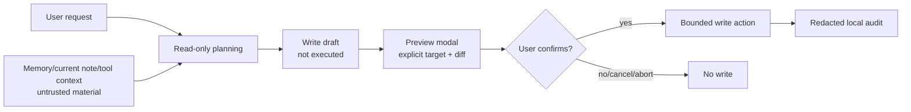

# Write Action Design Handoff

## Purpose

This document is the Phase 6 handoff for future write actions in Personal Assistant Chat.

It is a design boundary, not an implementation plan for immediate runtime writes. The current refactor keeps Chat read-only: it may search Memory, read current note context, inspect metadata, list recent notes, and read outlines, but it must not modify notes, create files, delete files, rename files, change settings, or execute Obsidian commands.

## Source Of Truth

- Main refactor plan: [PLAN.md](./PLAN.md)
- Development tracker: [vault-native-assistant-development-tracker.md](./vault-native-assistant-development-tracker.md)

If this document conflicts with `PLAN.md`, `PLAN.md` wins until both documents are explicitly updated in the same reviewed change.

## Non-Goals

- No direct note writes in the current implementation track.
- No arbitrary filesystem editing.
- No bash, shell, or command execution action.
- No automatic Obsidian command execution.
- No hidden background write triggered by model output.
- No persistent storage of prompt body, note body, raw target paths, or full preview text without a separate product/security review.

## Candidate Action Families

First candidate write actions should stay Obsidian-native and narrow:

| Action family | Initial scope | Explicitly out of scope |
| --- | --- | --- |
| Append answer to current note | Append the current assistant response or a selected draft block after preview/confirm | Choosing arbitrary vault paths from model text |
| Generate insertion draft | Produce a draft for the user to insert manually or via confirmed insert | Writing without preview |
| Create task-list draft | Convert the current answer into checklist text for preview | Creating tasks in external systems |
| Update section or callout | Replace a bounded section/callout selected by explicit user context | Multi-file edits by default |

## Trust Model

All note content, Memory, current note context, and tool context remain untrusted material. They can provide evidence and candidate text, but they cannot grant write permission or change action policy.

## Required Gates

Every future write action must pass these gates before execution:

| Gate | Requirement |
| --- | --- |
| Intent | User asked for a write, insert, append, update, or create-draft workflow in the current turn. |
| Target | Target note or section is explicit from active note context, user selection, or user-confirmed picker. |
| Scope | Action affects one note by default; multi-file write requires a separate range summary and confirmation. |
| Preview | User sees target, operation type, affected range, proposed content or diff, risks, and cancel option. |
| Confirmation | Write executes only after explicit confirmation in UI. |
| Abort | Cancel, rejected confirmation, closed modal, or aborted session results in no write. |
| Logging | Diagnostics remain redacted; write audit is local-only and never enters Memory. |

## Preview Contract

The preview UI must show:

- Operation type, such as append, insert draft, or replace section.
- Target note and target range in user-visible form.
- Proposed content or diff before writing.
- Whether the action may send note text to the configured AI provider.
- Whether the action may use AI credits/API calls.
- A clear confirm button and cancel path.

The preview UI must not rely on hidden model reasoning as the only explanation for a write. The user-facing preview is the contract.

## Audit Contract

Diagnostics and write audit stay separate.

| Data | Diagnostics | Future write audit |
| --- | --- | --- |
| Prompt body | Never | Never by default |
| Note body | Never | Never by default |
| Raw note path | Never | Avoid by default; use redacted target summary or optional hash |
| Action type | Allowed | Allowed |
| Target count | Allowed | Allowed |
| Decision | Allowed as category | Allowed |
| Result status | Allowed | Allowed |
| Timestamp | Allowed | Allowed |
| Full preview text | Never | Requires separate review and explicit user setting |

Write audit is local-only, does not sync by design, does not enter Memory, and is not sent to the AI provider.

## Runtime Boundary

Future implementation should add write actions as a separate action family, not by weakening read-only tools.

Recommended boundaries:

- Keep read-only tools in `ToolRegistry` as read-only.
- Add write-action definitions with explicit permission metadata and confirmation requirements.
- Keep final answer streaming in `ChatService`.
- Keep preview and confirmation in UI components, not inside model prompt text.
- Make write execution impossible from provider-native tool calls until a write-action family has passed product/security review.

## Minimal Implementation Sequence

1. Add a design-reviewed `WriteActionRegistry` or extend `ToolRegistry` with a separate write-action family.
2. Add typed action metadata: permission, target shape, preview renderer, confirmation copy, audit category.
3. Add draft-only planner output for write requests; no execution path yet.
4. Add preview modal tests covering confirm, cancel, close, and abort.
5. Add one narrow action, likely append-to-current-note, behind explicit preview/confirm.
6. Run subagent product/security review before any runtime write is enabled.
7. Run Obsidian smoke in `test/` vault after implementation.

## Required Tests Before Runtime Writes

- Prompt-injection fixtures where note text asks the assistant to write, delete, rename, cite fake paths, change rules, or execute commands.
- Cancel/abort before confirmation.
- Cancel/abort after preview is shown but before execution.
- Modal close without confirmation.
- Wrong-target prevention when current note changes between draft and confirm.
- Multi-file request remains blocked or requires separate confirmation.
- Redacted diagnostics/audit assertions.
- Source-boundary checks: current note/tool context path must not become Memory references.

## Open Decisions

| Decision | Default recommendation | Why |
| --- | --- | --- |
| First action | Append answer to current note | Lowest target ambiguity and easiest preview. |
| Audit storage | Redacted local-only metadata | Avoids turning chat behavior into Memory or telemetry. |
| Multi-file writes | Defer | Harder preview, risk, and rollback story. |
| Obsidian command execution | Separate design | Command side effects are broader than note text writes. |
| Native provider write tools | Defer | Provider-native calls need stricter confirmation and replay guarantees. |

## Phase 6 Handoff Decision

Phase 6 closes this implementation track by preserving the write boundary: future writes require a new product/security review and a separate runtime implementation plan. The current codebase remains read-only for Chat Agent tool execution.
